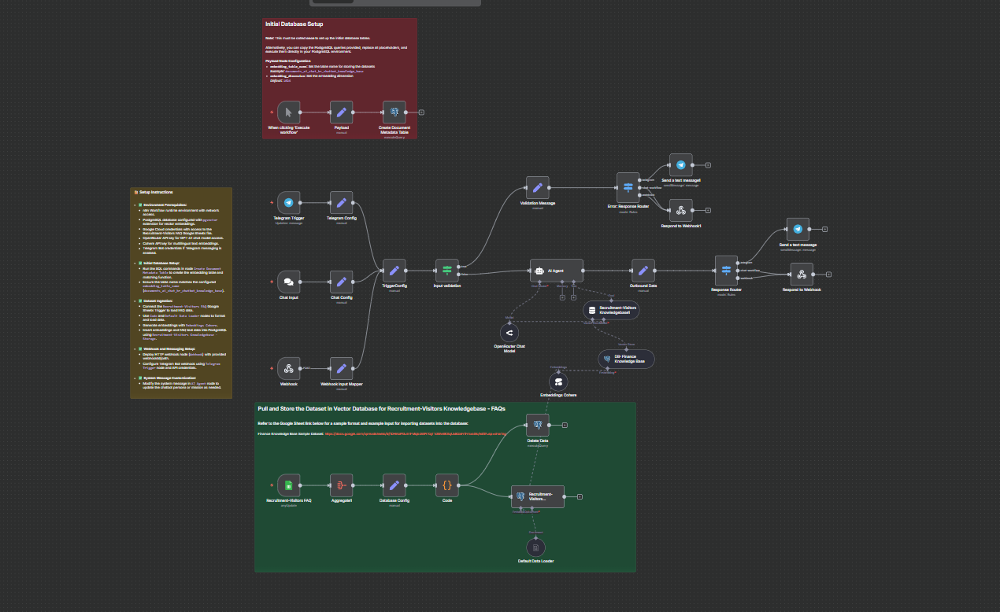

> ⚠️ Kindly review the docs once more before saving.

## AI Chat HR ChatBot  


AI Chat HR ChatBot is a professional, friendly, and witty chatbot agent designed specifically for NMS Philippines. It serves as the first-line support tool on the company’s website, providing prompt, accurate answers to recruitment and visitor-related inquiries by strictly referencing the official Recruitment-Visitors Knowledgebase dataset.



---

### 💡 Why Use AI Chat HR ChatBot?  
- Delivers instant, automated responses for recruitment-related FAQs on the company website.  
- Maintains a warm, witty, and professional tone that resonates with users.  
- Operates using a precise, curated knowledgebase ensuring factual and consistent replies.  
- Supports multilingual inquiries while preserving a consistent brand voice.  
- Reduces workload on human HR staff by serving first-line visitor queries.  
- Utilizes timezone-aware responses based on Manila timezone (GMT+8).  

---

### ⚡ Who Is This For?  
- HR teams looking to automate initial recruitment inquiries.  
- Website owners wanting a dedicated, intelligent FAQ assistant.  
- Developers implementing chatbot workflows integrated with Google Sheets and PostgreSQL.  
- Teams needing a custom NLP agent built on n8n and Langchain AI nodes.  
- Businesses aiming for professional but approachable AI conversational agents.  

---

### ❓ What Problem Does It Solve?  
Manually handling frequent HR and recruitment questions from visitors can be time-consuming and error-prone. This chatbot workflow automates first-contact responses by pulling answers directly from an authorized Recruitment-Visitors Knowledgebase, strictly validating input, and providing consistent, accurate, and polite replies to visitors. This enhances user experience and improves operational efficiency.  

---

### 🔧 How This Workflow Works  
1. **Input Reception:**  
   - Triggered via multiple channels: Website chat, Telegram messages, or custom webhook POST requests.  
   - Nodes: `Chat Input` (web chat trigger), `Telegram Trigger` (Telegram), and `Webhook`.  

2. **Input Configuration & Validation:**  
   - Incoming messages are mapped to internal keys: sessionId, prompt, and reference type via nodes such as `Chat Config`, `Telegram Config`, and `Webhook Input Mapper`.  
   - Decision logic in `input validation` node filters out incomplete queries (missing sessionId or prompt).  

3. **Routing Based on Input Type:**  
   - The `Error: Response Router` node handles invalid input by sending validation error messages to the user.  
   - Valid requests flow to the `AI Agent` node for processing.  

4. **AI Agent Processing:**  
   - The core `AI Agent` node named "Vee" receives validated prompts, using a custom system prompt to maintain a professional, friendly, and witty chatbot persona.  
   - It uses `OpenRouter Chat Model` (GPT-4.1) to generate responses.  
   - It references the `Recruitment-Visitors Knowledgebase1` vector store (loaded from a Google Sheets FAQ dataset), strictly answering only from this source.  

5. **Knowledge Base & Embeddings Setup:**  
   - The workflow includes nodes to load the FAQ dataset from Google Sheets (`Recruitment-Visitors FAQ` trigger).  
   - Data is processed with Cohere multilingual embeddings (`Embeddings Cohere`) and stored in PostgreSQL vector store (`Recruitment-Visitors Knowledgebase - Storage`).  
   - The database schema and search functions for embeddings are created and managed through PostgreSQL nodes.  

6. **Response Dispatch:**  
   - Replies are routed through output nodes:  
     - `Send a text message1` sends responses to Telegram users.  
     - `Respond to Webhook1` replies to HTTP webhook clients.  

---

### 🔐 Setup Instructions

- ✅ **Environment Prerequisites:**  
  - n8n Workflow runtime environment with network access.  
  - PostgreSQL database configured with `pgvector` extension for vector embeddings.  
  - Google Cloud credentials with access to the Recruitment-Visitors FAQ Google Sheets file.  
  - OpenRouter API key for GPT-4.1 chat model access.  
  - Cohere API key for multilingual text embeddings.  
  - Telegram Bot credentials if Telegram messaging is enabled.  

- ✅ **Initial Database Setup:**  
  - Run the SQL commands in node `Create Document Metadata Table` to create the embedding table and matching function.  
  - Ensure the table name matches the configured `embedding_table_name` (`documents_ai_chat_hr_chatbot_knowledge_base`).  

- ✅ **Dataset Ingestion:**  
  - Connect the `Recruitment-Visitors FAQ` Google Sheets Trigger to load FAQ data.  
  - Use `Code` and `Default Data Loader` nodes to format and load data.  
  - Generate embeddings with `Embeddings Cohere`.  
  - Insert embeddings and FAQ text data into PostgreSQL using `Recruitment-Visitors Knowledgebase - Storage`.  

- ✅ **Webhook and Messaging Setup:**  
  - Deploy HTTP webhook node (`Webhook`) with provided webhookId/path.  
  - Configure Telegram Bot webhook using `Telegram Trigger` node and API credentials.  

- ✅ **System Message Customization:**  
  - Modify the system message in `AI Agent` node to update the chatbot persona or mission as needed.  

---

### 📅 Payload

| Key              | Definition                                                   |
|------------------|--------------------------------------------------------------|
| sessionId        | Unique user/session identifier (e.g., Telegram chat ID).     |
| prompt           | User input message/question to the chatbot.                  |

**Example JSON Payload:**  
```json
{
  "sessionId": "telegram:123456789",
  "prompt": "What are the available job openings?",
  "ref": "telegram"
}
```

**Example cURL Test:**  
```bash
curl -X POST https://your-n8n-instance/webhook/c95ee520-5d39-47f1-8e76-d44fd496fa85 \
-H "Content-Type: application/json" \
-d '{"sessionId":"test-session","prompt":"Tell me about the recruitment process."}'
```

---

### 🔨 Tools/Node Used

| Node Name                          | Purpose/Role                                               |
|-----------------------------------|------------------------------------------------------------|
| Chat Input                        | Web chat trigger to accept user questions                  |
| Telegram Trigger                  | Capture Telegram messages to feed chatbot                   |
| Webhook                          | Accept external POST requests                               |
| Chat Config, Telegram Config, Webhook Input Mapper | Normalize input data to internal JSON keys                |
| input validation                 | Validate sessionId and prompt presence                       |
| AI Agent                        | Core chatbot engine running GPT-4.1 with Langchain          |
| OpenRouter Chat Model           | Language model for response generation                       |
| Recruitment-Visitors Knowledgebase1 | Langchain vector store linked to PostgreSQL vector embeddings |
| Embeddings Cohere               | Generate multilingual embeddings for FAQ data                |
| Recruitment-Visitors Knowledgebase - Storage | Insert/Query FAQ embeddings in PostgreSQL                  |
| Postgres Nodes                  | Manage database schema, insert data, execute vector queries  |
| Send a text message1            | Sends reply messages to Telegram                             |
| Respond to Webhook1             | Sends JSON responses back to web clients                     |
| Error: Response Router          | Routes errors and validation messages appropriately          |

---

### ⚙️ Reactive & Proactive Behavior

- **Reactive:** Triggered by real-time user inputs from chat, Telegram, or webhooks.  
- **Proactive:** Polls Google Sheets every minute to refresh FAQ data (`Recruitment-Visitors FAQ` trigger).  
- **Dynamic:** Updates embeddings and knowledge base as new data arrives to keep responses accurate and up-to-date.  

---

### 🐞 Error Handling

- **Input validation node:** Checks for missing `sessionId` or `prompt`. If invalid, returns instructive error messages.  
- **Knowledgebase fallback:** If no FAQ matches, politely declines with a preset polite message guiding user to official channels.  
- **Catch-all error response routing:** Separate channels for Telegram and Webhook responses ensure users always receive feedback, even on errors.  

---

### 🧩 Requirements

- n8n version compatible with Langchain nodes v1.7+  
- PostgreSQL database with `pgvector` extension enabled  
- Google Cloud credentials for Sheets API  
- OpenRouter API Key for GPT-4.1 model access  
- Cohere API key for embedding generation  
- Telegram Bot token (optional for Telegram integration)  
- Proper webhook URL configuration on n8n and Telegram developer setup  

---

### 📚 Resources

- [n8n Official Documentation](https://docs.n8n.io/)  
- [Langchain n8n Nodes Github](https://github.com/n8n-io/n8n-nodes-langchain)  
- [PostgreSQL pgvector Extension](https://github.com/pgvector/pgvector)  
- [Google Sheets API](https://developers.google.com/sheets/api)  
- [OpenRouter API](https://openrouter.ai/)  
- [Cohere API](https://cohere.ai/)  
- [Telegram Bots API](https://core.telegram.org/bots/api)  

---

### 🐞 Troubleshooting

- Ensure all credentials are correctly configured and authorized (Google Sheets, PostgreSQL, OpenRouter, Cohere, Telegram).  
- Validate that PostgreSQL `embedding_table_name` is created before data ingestion run.  
- Confirm `pgvector` extension is installed and vector column type matches embeddings dimension.  
- For Telegram, ensure webhook URL in Telegram Bot settings matches `Telegram Trigger` webhook URL.  
- If chatbot returns refusal message often, verify FAQ data in Google Sheets is correctly loaded and embeddings are refreshed.  
- Check for network/firewall issues blocking API calls to OpenRouter, Cohere, or Google Sheets.  
- Verify `prompt` and `sessionId` fields are always passed in input JSON to avoid validation errors.  
- If PostgreSQL queries fail, examine SQL logs for permission or syntax issues.  
- Gradually test workflow starting with the manual trigger node before activating chat or webhook triggers.  
- Monitor API rate limits for GPT-4 and embedding services to avoid throttling.  