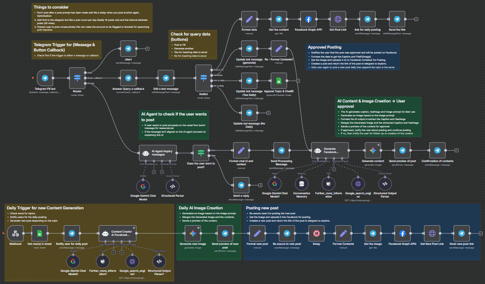

## FaceBook - AI


FaceBook - AI is an automated content creation and posting workflow using n8n integrated with Telegram, Google Gemini AI, and Facebook Graph API. This workflow automates the generation of Facebook posts including captions, hashtags, and images based on trending topics, facilitates user approval via Telegram, and handles posting to Facebook along with notifications and link sharing.



---

### 💡 Why Use FaceBook - AI?
- Automates content creation by leveraging AI for trend-based Facebook captions, hashtags, and images.
- Integrates seamlessly with Telegram for user interaction and approval workflows.
- Posts content automatically to Facebook and shares post links back to Telegram.
- Supports daily scheduling of posts with user control via Telegram callbacks.
- Incorporates AI-driven trend research using Google search and Wikipedia tools.
- Maintains conversation memory to keep context in user interactions.
- Handles images generation and uploads through Google Gemini and Facebook Graph API.
- Provides user-friendly inline keyboard buttons for easy approvals and commands.
- Prevents spam and manages posting intervals and limits for account safety.
- Logs topics and chat IDs on Google Sheets for record-keeping and management.

---

### ⚡ Who Is This For?
- Social media managers seeking AI-powered content automation.
- Digital marketers aiming to maximize Facebook engagement.
- Community managers wanting timely, trend-driven posts without manual effort.
- Telegram bot users requiring interactive approval and feedback loops.
- Developers or teams integrating AI content creation into social media workflows.

---

### ❓ What Problem Does It Solve?
Manual content creation and posting on Facebook can be time-consuming and inconsistent. FaceBook - AI uses AI to research trending topics, generate engaging captions and images, streamlines user approval through Telegram, and automates posting — saving time while increasing post quality and regularity.

---

### 🔧 How This Workflow Works
1. **Telegram Trigger:** Listens to user messages and callback button presses through the Telegram FB bot webhook.
2. **Message Routing & Analysis:** Uses a Switch node to determine the type of user interaction (start command, button callback, or message).
3. **AI Intent Detection:** AI Agent nodes analyze if the user intends to create Facebook content.
4. **Formatting Inputs:** Prepare chat IDs, captions, file IDs, and context data for processing.
5. **AI Content Creation:**  
   - Calls Google search engine and Wikipedia tools multiple times to research trending topics and hashtags.  
   - Uses Google Gemini AI to generate captions, hashtags, and an image prompt aligned with NMS brand colors.  
   - Structured output parsers extract key fields cleanly.
6. **Image Generation:** Requests Google Gemini image generation based on the prompt.
7. **Preview & Confirmation:** Sends a Telegram preview with caption, hashtags, and image, and requests user approval with inline buttons.
8. **Posting to Facebook:**  
   - Upon approval, retrieves the image from Telegram, uploads it to Facebook via Facebook Graph API, and creates photo posts with captions.  
   - Fetches the link to the posted content and sends it back to the user on Telegram.
9. **Daily Post Scheduling:**  
   - Uses Google Sheets to store topics and Chat IDs.  
   - Notifies users daily for new post creation and posting approval.
10. **User Interaction & Controls:** Manages user responses to confirm or decline daily posting setup.

---

### 🔐 Setup Instructions
- ✅ **Connect Telegram Bot Credentials:** Configure Telegram API with bot token for message and callback handling.
- ✅ **Google Palm API:** Provide credentials for Google Gemini AI for chat and image generation.
- ✅ **Facebook Graph API Token:** Set up access with necessary permissions for posting photos and retrieving post links.
- ✅ **Google Sheets OAuth:** Access the designated spreadsheet to track topics and user Chat IDs.
- ✅ **Google Custom Search API:** Configure for trend research with appropriate API key and search engine ID.
- ✅ **Webhook Setup:** Deploy the workflow webhook node enabling Telegram webhook to receive and process incoming messages.
- ✅ **Adjust Posting Limits:** Optionally configure Telegram bot limits (max posts/day, post intervals) to avoid spamming.
- ✅ **NMS Brand Colors Compliance:** Ensure image prompts include required color palette.
- ✅ **Timezone and Date Localization:** Confirm system date settings match expected locale for monthly trend queries.

---

### 📅 Payload
| Key               | Definition                                                     |
|-------------------|----------------------------------------------------------------|
| chatid            | Telegram chat identifier for messaging                         |
| captions          | AI-generated short Facebook post caption (text only)          |
| hashtags          | AI-generated string of 5-7 trending hashtags for the post     |
| image_prompt      | AI-generated image description prompt aligned with brand      |
| file_id           | Telegram file ID for the generated image                       |
| topic/prompt      | User topic saved in Google Sheets for daily posting            |
| callback_data     | Telegram inline button response to control bot behavior       |
| post_id           | Facebook post ID for retrieving post links                    |

**Example JSON Payload:**
```json
{
  "captions": "Discover the latest AI trends empowering your business today!",
  "hashtags": "#AI #Technology #Innovation #FacebookMarketing #SocialMedia #Trends",
  "image_prompt": "Dynamic illustration of AI-powered interfaces with flowing data streams. Vibrant red (#E52B2B) geometric frames with orange (#FF6B35) glowing tech elements on white background. Modern, high-energy Facebook-optimized composition.",
  "chat_id": "1234567890"
}
```

**Example cURL Test:**
```bash
curl -X POST https://your-n8n-instance/webhook/your-webhook-id \
-H "Content-Type: application/json" \
-d '{"message": "Create a post about AI innovation"}'
```

---

### 🔨 Tools/Node Used
- **Telegram FB bot (Telegram Trigger):** Captures incoming messages and button clicks.
- **Switch Node:** Routes based on message content or callback data.
- **AI Agent Nodes (Langchain Agent):** Detect user intent, create Facebook captions and hashtags, image prompts using Google Gemini.
- **Google Search Engine (HTTP Request Tool):** Performs multiple search queries for trend research.
- **Wikipedia Tool:** Provides background details to enrich content.
- **Structured Output Parsers:** Extract structured JSON fields from AI responses.
- **Google Gemini (Image Generation):** Creates images per AI-generated prompts.
- **Facebook Graph API Nodes:** Upload images and create posts to Facebook timeline.
- **Google Sheets Node:** Reads/writes topics and Chat IDs for daily automation.
- **Telegram Nodes (Send Message, Send Photo, Edit Message):** Manage user communication and confirmations.
- **Webhook Node:** Receives external HTTP calls, starts daily posting flow.
- **Delay Node:** Adds pauses to avoid spam posting.
- **Memory Buffer Window:** Maintains conversation context.

---

### ⚙️ Reactive & Proactive Behavior
- **Reactive:** Responds instantly to Telegram messages and inline button clicks.
- **Proactive:** Executes scheduled daily content generation and notifications using spreadsheet triggers.
- **Retry Mechanism:** Google Gemini content/image generation nodes are set to retry on failure, ensuring robustness.
- **Interactive Feedback:** Asks user approvals before posting, allows regenerate or post commands.
- **Live Updates:** Edits Telegram messages to inform users of ongoing processing.

### 🐞 Error Handling
- The workflow uses retries for AI generation nodes in case of transient failures.
- Fallbacks are not explicitly defined; failures may require manual intervention.
- Proper credential setup is essential; missing or expired tokens cause node errors.
- Message edits keep user informed even if background calls take time.
- Validation through structured parsers minimizes downstream issues with malformed AI outputs.

---

### 🧩 Requirements
- n8n instance version supporting Langchain nodes and Facebook Graph API nodes.
- Valid Telegram Bot token with webhook configured to point to the n8n webhook.
- Google Cloud project with access to Google Palm API (Google Gemini) for chat and image generation.
- Facebook developer app with permissions for pages and photos posting; access token.
- Google Custom Search Engine configured with API key for trend research.
- Google Sheets OAuth credentials authorized for accessing specified spreadsheet.
- Stable internet connection for API calls.
- Adequate API quotas in Google services and Facebook APIs to avoid rate limiting.

---

### 📚 Resources
- [n8n Official Documentation](https://docs.n8n.io/)
- [Telegram Bot API](https://core.telegram.org/bots/api)
- [Google Palm API / Gemini](https://developers.google.com/learn/palm)
- [Facebook Graph API](https://developers.facebook.com/docs/graph-api)
- [Google Custom Search API](https://developers.google.com/custom-search/v1/overview)
- [Google Sheets API](https://developers.google.com/sheets/api)
- [Langchain n8n Integration](https://docs.n8n.io/integrations/ai/)

---

### 🐞 Troubleshooting
- **Telegram messages not triggering workflow:** Confirm webhook URL correctly registered in Telegram bot and n8n webhook node active.
- **AI agent not generating content:** Verify Google Palm API credentials and quota, check retry logs.
- **Facebook posting fails:** Ensure Facebook token permissions are valid, page access is granted.
- **Google Sheet access denied:** Check OAuth2 credential validity for Google Sheets node.
- **Image generation returns errors:** Validate model IDs and prompt format, ensure credentials.
- **Inline keyboard buttons unresponsive:** Confirm Telegram API node settings and callback data mapping.
- **Rate limits or quota errors:** Monitor API usage on Google Cloud and Facebook.
- **Malformed outputs from AI:** Check structured output parsers for schema adherence.
- **Workflow hangs during processing:** Use Delay nodes and message updates to manage timing.
- **Content not posted immediately:** Facebook API can have slight delays; monitor response data.

---