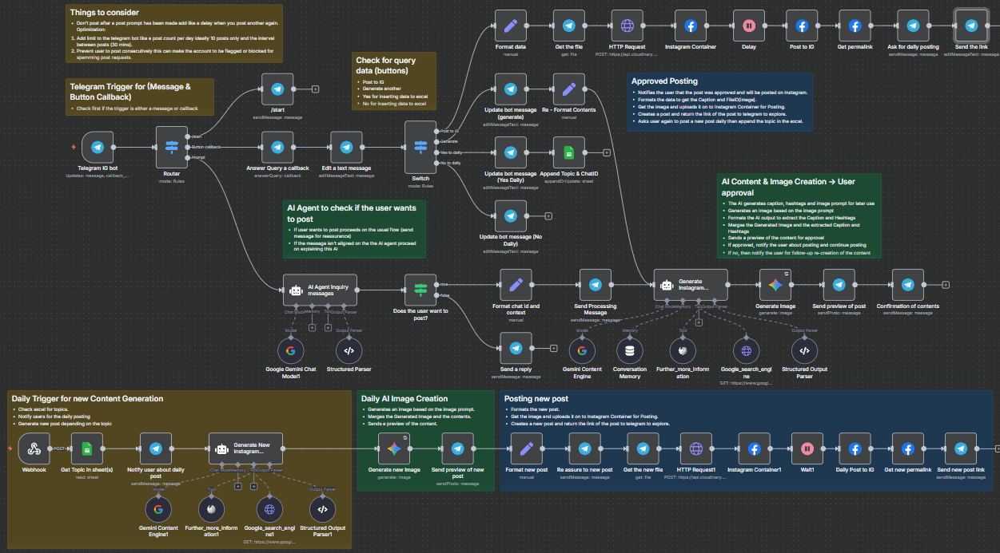

## IG - AI


An automation workflow designed for Instagram content creation, approval, and posting integration via Telegram interactions and AI-driven trend research. It leverages AI language models and image generators to produce trendy captions, hashtags, and images according to the NMS branding guidelines, delivering a seamless content approval and publishing experience.



---

### 💡 Why Use IG - AI?
- Automate Instagram post content creation leveraging AI trend research.
- Generate images aligned with brand colors and current Instagram trends.
- Facilitate content preview and user approval through Telegram bot.
- Enable scheduled daily content posting with dynamic topic sourcing.
- Manage Instagram media upload and publishing automatically.
- Maintain conversational context using session memory for better AI responses.
- Seamlessly integrate Google Search and Wikipedia tools for enriched content generation.
- Provide user-friendly interaction with inline buttons for posting decisions.
- Track and log daily posting topics into Google Sheets spreadsheet.
- Implements checks to avoid spamming and account blocking through posting limits.

---

### ⚡ Who Is This For?
- Social media managers aiming to streamline Instagram post creation.
- Content creators seeking an AI-powered assistant for trendy posts.
- Brands looking to maintain consistent and engaging Instagram activities.
- Telegram bot users who want quick Instagram post generation and approval.
- Developers integrating AI language models and image generation in workflows.
- Marketing teams wanting automated daily Instagram updates based on changing topics.

---

### ❓ What Problem Does It Solve?
This workflow addresses the challenge of creating engaging, trendy Instagram content regularly without manual labor. It ensures posts are optimized for current trends by performing extensive Google searches before generating captions and hashtags, making posts more relevant and appealing. The system includes user approval to maintain control over automated content and supports an automated daily posting schedule, integrating easily with Telegram for real-time user interaction and Instagram for publishing.

---

### 🔧 How This Workflow Works
1. **Telegram Bot Trigger** listens for user messages or button callbacks.
2. **Message Router** directs flow based on input type (new message, button press, or /start command).
3. For post creation requests, **AI Agent Inquiry** uses AI models to detect user intent.
4. If confirmed, **chat ID and text** are formatted for downstream actions.
5. **Send Processing Message** informs the user of ongoing content generation.
6. **Generate Content Agent** performs multiple Google searches to research trends, hashtags, and engagement tactics.
7. Using research context, AI generates:
   - Instagram captions (under 230 characters, no hashtags inside).
   - Hashtags (5–7, with # symbol).
   - Image prompt following specific brand colors (red #E52B2B, orange #FF6B35, white background).
8. **Generate Image Node** creates the visual post asset according to the prompt.
9. The content and image are sent to the user as a **Telegram post preview**.
10. User chooses to **post content to Instagram** or generate new content via inline buttons.
11. Upon approval:
    - Image is uploaded to **Instagram Container** (Facebook Graph API).
    - Post is created and published.
    - Instagram post permalink is retrieved.
    - Link is sent back to the user on Telegram.
12. User is optionally asked about daily posting preferences, which are recorded in **Google Sheets**.
13. A **daily trigger** (via scheduled webhook) fetches topics from Google Sheets, generates and posts content automatically.
14. Several safety and delay nodes handle posting intervals and reduce spam risks.

---

### 🔐 Setup Instructions
- ✅ **Telegram Bot API:** Configure Telegram bot credentials with appropriate permissions for messaging and callback query handling.
- ✅ **Google API:** Setup Google Custom Search API keys and CSE ID for trend research nodes.
- ✅ **Google Sheets OAuth2:** Provide OAuth2 credentials connected to a Google Sheet where posting topics are stored and logged.
- ✅ **Facebook Graph API:** Set up Instagram Business or Creator account tokens with permissions to post media and retrieve post info.
- ✅ **Google Palm API:** Connect credentials for Google Gemini AI language and image generation models.
- ✅ **Cloudinary Account:** Configure Cloudinary for hosting images before Instagram upload; preset "IGpost" required.
- ✅ **Webhook URL:** Deploy the workflow and expose the webhook endpoint for Telegram updates.

---

### 📅 Payload
| Key          | Definition                                                                                              |
|--------------|--------------------------------------------------------------------------------------------------------|
| chatid       | Telegram Chat ID of the user interacting with the bot                                                  |
| text         | User's input text to define Instagram post topic                                                       |
| captions     | AI-generated Instagram caption text (clean, no hashtags)                                              |
| hashtags     | AI-generated hashtags string (5-7 hashtags, separated by space, starting with '#')                     |
| image_prompt | AI-generated description for the image to be created, including brand colors and style                 |
| file_id      | Telegram file ID when retrieving images for posting                                                    |
| node         | Instagram container node ID for the Facebook Graph API media actions                                   |
| permalink    | URL link to the published Instagram post                                                              |
| UserwantsToCreatePost | Boolean flag from AI agent whether user intends to create a post                                |

**Example JSON Payload:**
```json
{
  "captions": "Excited to share the latest AI trends taking over Instagram this month!",
  "hashtags": "#AI #InstagramTrends #SocialMedia #ContentCreation #MarketingTips",
  "image_prompt": "Dynamic illustration featuring vibrant red (#E52B2B) and warm orange (#FF6B35) geometric shapes on a clean white background. Bold and energetic Instagram feed style.",
  "chat_id": "123456789"
}
```

**Example cURL Test:**
```bash
curl -X POST 'https://<n8n-webhook-url>/7649b07d-3dd7-42d5-8e33-7f2b79c2c3e2' \
-H 'Content-Type: application/json' \
-d '{"ChatID":"123456789","Topic / Prompt":"AI trends in 2024"}'
```

---

### 🔨 Tools/Node Used
- **Telegram Trigger:** Listens for incoming Telegram messages and callbacks.
- **Set Node:** Formats essential variables like chat ID and text content.
- **Langchain AI Agent (Generate Instagram Content):** Core AI node for generating captions, hashtags, and image prompts, including built-in search engine tools.
- **Google Gemini AI Models:** For both text conversation and image generation, connected through Langchain nodes.
- **HTTP Request:** Uploads generated images to Cloudinary.
- **Facebook Graph API Nodes:** For Instagram media upload, publishing, and retrieving post links.
- **Google Sheets Node:** Reads and writes topic prompts and user preferences for daily posting.
- **Switch & IF Nodes:** Handle conditional flow based on user interaction and AI agent outputs.
- **Telegram Nodes:** Send messages, edit messages, reply, and send photos, providing rich Telegram bot communication.
- **Wait/Delay Node:** Implement posting interval controls to avoid spam or flooding.
- **Webhook Node:** Receives external requests to trigger daily content generation flow.

---

### ⚙️ Reactive & Proactive Behavior
- **Reactive:** Responds to Telegram user commands or button presses prompting post creation or approval.
- **Proactive:** Supports scheduled daily topic retrieval from Google Sheets and autonomous post creation and posting on Instagram.
- **Adaptive:** Uses multi-step Google searches to dynamically tailor trending content and hashtags.
- **Conversational Memory:** Maintains session memory for richer, context-aware responses.

### 🐞 Error Handling
- Telegram nodes respond with informative messages if commands are unclear or the user does not intend to create posts.
- Delay nodes help prevent excessive posting frequency.
- AI agents are configured to retry or fallback on generation failures.
- Inline keyboard buttons guide users to valid actions and avoid invalid inputs.
- HTTP requests to Cloudinary and Facebook APIs include retries and status checking (implicit in node configurations).
- Switch nodes control flow paths based on user inputs or callback data for clear branching.

---

### 🧩 Requirements
- Active Telegram bot with API credentials.
- Google API keys for Custom Search and authorization for Google Sheets.
- Facebook Graph API access token for Instagram Business Account.
- Cloudinary account with upload presets.
- Google Palm API access for AI text and image generation.
- n8n instance capable of receiving webhooks publicly.
- Proper network access and environment variables configured.

---

### 📚 Resources
- [Telegram Bot API Documentation](https://core.telegram.org/bots/api)
- [Google Custom Search JSON API](https://developers.google.com/custom-search/v1/overview)
- [Google Sheets API](https://developers.google.com/sheets/api)
- [Facebook Graph API for Instagram](https://developers.facebook.com/docs/instagram-api)
- [Cloudinary Upload API](https://cloudinary.com/documentation/image_upload_api_reference)
- [Google Palm API (Gemini)](https://developers.generativeai.google/api/guides/text)
- [n8n Documentation](https://docs.n8n.io/)

---

### 🐞 Troubleshooting
- **Bot does not respond:** 
  - Check Telegram webhook settings and n8n webhook node URL.
  - Verify Telegram API credentials.
- **AI content generation fails or times out:**
  - Verify Google Palm API credentials and quota.
  - Check network connectivity to AI models.
- **Images do not upload or post on Instagram:**
  - Confirm Cloudinary upload preset and credentials.
  - Validate Facebook Graph API token permissions and Instagram account setup.
- **User commands not recognized or ignored:**
  - Check if the switch node routes are correct and callback data matches.
  - Ensure the AI agent correctly detects user intent.
- **Daily scheduled posts not triggering:**
  - Verify webhook trigger or cron setup.
  - Confirm the Google Sheet topic data is available and readable.
- **Posting frequency issues or account flagged:**
  - Use the implemented delay node and posting limit recommendations to space posts.
- **Google search tools return incomplete results:**
  - Check API key limits and CSE configuration.
- **Inline keyboard buttons not functioning:**
  - Validate callback_data matches switch node conditions.
- **Post preview captions include hashtags:**
  - Ensure AI agent prompt enforces caption without hashtags.
- **Link to Instagram post missing or incorrect:**
  - Verify API field mappings for permalink retrieval.

---