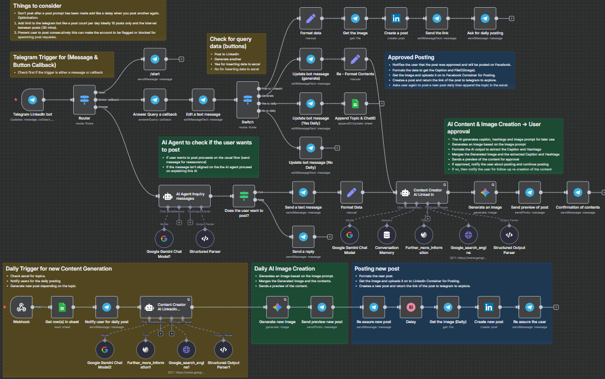

## LinkedIn - AI


An automated `n8n AI agent workflow` designed to generate high-quality LinkedIn content using AI models, manage user interactions via Telegram, and post content directly to LinkedIn. It incorporates context-aware AI-driven content creation, trend research, image generation, user approvals, and scheduling for daily posts.



---

### 💡 Why Use LinkedIn - AI?
- Automates LinkedIn content creation based on user requests via Telegram.
- Integrates Google Gemini AI for trend research and content generation.
- Supports image generation aligned with brand aesthetics.
- Allows user interaction and approval before posting content.
- Posts approved content directly to LinkedIn and shares links back via Telegram.
- Manages daily content topics from Google Sheets for scheduled posting.
- Limits spamming by managing post frequency.
- Provides a seamless chat interface for professional content creation.

---

### ⚡ Who Is This For?
- LinkedIn users wanting automated, AI-driven content creation.
- Social media managers looking to streamline LinkedIn posting.
- Marketers aiming to maintain daily professional posts effortlessly.
- Telegram bot users who interact to generate and approve LinkedIn posts.
- Businesses or individuals focusing on thought leadership and brand growth via LinkedIn.

---

### ❓ What Problem Does It Solve?
This workflow addresses the challenge of consistently generating relevant, trend-informed, and professionally-crafted LinkedIn posts. It reduces manual effort by leveraging AI for content and image creation while keeping users in control through approval steps. It also handles scheduling and avoids LinkedIn account flags by limiting post frequency, ensuring sustained engagement without spam risks.

---

### 🔧 How This Workflow Works
1. **Telegram Trigger**: Listens for incoming messages or button callbacks from users interacting with the Telegram LinkedIn Bot.
2. **Router Node**: Routes the input into commands (`/start` message, button callbacks, or content prompts).
3. **AI Agent Inquiry Messages**: Uses Google Gemini model to analyze if the user wants to generate LinkedIn content.
4. **If User Wants to Post**: Sends acknowledgement message and proceeds to format the user’s input.
5. **Content Creator AI LinkedIn**: Performs trend research via multiple Google Search queries combined with Wikipedia information, then generates LinkedIn post captions, hashtags, and image prompts.
6. **Generate Image**: Uses Google Gemini image generation based on the AI’s image prompt with brand-specific style requirements.
7. **Send Preview To User**: Sends a Telegram photo message with caption and hashtags for user approval.
8. **User Confirmation**: Provides inline keyboard buttons to post the content to LinkedIn or generate a new version.
9. **Create Post on LinkedIn**: Upon user approval, uploads image and post text to LinkedIn.
10. **Send Posting Link**: Notifies the Telegram user with a link to their LinkedIn post and asks if they want daily posts.
11. **Daily Posting Management**:
    - Retrieves daily post topics from Google Sheets.
    - Automatically generates content via AI and posts daily.
    - Notifies users before daily posts.
12. **Rate Limits & Anti-Spam Measures**: Includes logic to limit post counts per day and interval delays (~30 mins) to avoid spam flags.

---

### 🔐 Setup Instructions
- ✅ **Telegram Bot**: Configure and connect your Telegram bot credentials in `Telegram [Gabriel - PopAiLinkedin_Bot]`.
- ✅ **Google Gemini API**: Provide Google Palm API credentials with access to Gemini language and image generation models.
- ✅ **LinkedIn OAuth2**: Setup LinkedIn OAuth credentials for posting on behalf of users.
- ✅ **Google Sheets**: Connect Google Sheets API credentials for retrieving daily posting topics.
- ✅ **Google Custom Search JSON API**: Obtain API key and search engine ID for Google search tool integration.
- Configure environment variables or credential entries in n8n accordingly.
- Ensure webhook URLs from Telegram and n8n are properly set up and accessible.

---

### 📅 Payload
| Key                  | Definition                                  |
|----------------------|---------------------------------------------|
| chatId               | Telegram user chat ID                        |
| text                 | Message text or generated LinkedIn caption  |
| response             | AI-generated response to user query         |
| UserwantsToCreatePost | Boolean indicating if user requested post   |
| promptImage          | Generated image prompt description           |
| caption              | AI-generated LinkedIn post caption           |
| hashtags             | Relevant LinkedIn-style hashtags              |
| file_id              | Telegram file ID (for images)                 |
| topic                | Topic for LinkedIn post generation            |
| numImages            | Number of images to generate                  |
| url                  | URL of LinkedIn post                           |

**Example JSON Payload:**
```json
{
  "json": {
    "promptImage": "Modern LinkedIn image showing diverse professionals collaborating with AI-powered dashboards in a bright workspace. Vibrant red (#E52B2B) geometric shapes frame the scene with warm orange (#FF6B35) glowing from digital screens, all set against a clean white background. High-contrast, energetic composition emphasizing human-AI synergy.",
    "caption": "Exploring emerging AI trends for 2025 can help us stay ahead in our careers. How are you preparing for these shifts? Let me know your thoughts!",
    "hashtags": "#futureofwork #AI #careerdevelopment",
    "chatid": "123456789"
  }
}
```

**Example cURL Test:**
```bash
curl -X POST https://your-n8n-instance/webhook/f3287a72-e555-424a-b59f-d66e29ac4d3c \
-H 'Content-Type: application/json' \
-d '{"message": {"text": "Create a LinkedIn post about AI trends"}}'
```

---

### 🔨 Tools/Node Used
- **Telegram Trigger & Telegram nodes**: For user interaction through Telegram messages and callbacks.
- **Google Gemini Chat Model**: AI language model for post content creation and user intent analysis.
- **Google Gemini Image Generation**: AI model to generate images aligned with brand style.
- **AI Agents (Langchain)**: Agents perform multistep research, content generation, and parsing.
- **Google Sheets Node**: Fetches daily topics and posts triggers.
- **LinkedIn Node**: Posts content directly to LinkedIn.
- **HTTP Request Tools (Google Search API)**: Performs repeated, multi-keyword searches for trend analysis.
- **Memory Buffer**: Maintains conversational context.
- **Switch/If Nodes**: Direct execution based on user intent and button callbacks.
- **Set Nodes**: Data formatting and transfer between nodes.
- **Delay**: Controls posting intervals.
- **Sticky Notes**: Embedded documentation of workflow logic.

---

### ⚙️ Reactive & Proactive Behavior
- **Reactive**: Responds immediately to user inputs on Telegram (messages, button presses).
- **Proactive**: Scheduled daily content generation and posting based on Google Sheets topics without user prompt.
- **AI-driven**: Automatically researches and adapts posts based on trending data.
- **Error Resilient**: Retries image generation with backoff; uses conditional logic for flow control.
  
### 🐞 Error Handling
- **Image Generation Retry**: Configured to retry with delay on failures.
- **Switch & If nodes**: Manage unexpected user inputs by directing to fallback or explanations.
- **Post limits & delays**: Prevent spamming and API limits to avoid blocking.
- **API credential checks**: Ensure credentials are linked to avoid disruption.

---

### 🧩 Requirements
- **n8n** instance running version compatible with `@n8n/n8n-nodes-langchain` and Telegram nodes.
- Telegram bot credentials with appropriate permissions.
- Google Palm API keys and access to Gemini chat and image models.
- LinkedIn OAuth2 Application and tokens.
- Google Sheets API credentials with access to the designated spreadsheet.
- Google Custom Search API enabled with an active search engine ID.
- Stable internet connection and webhook exposure for Telegram and n8n.

---

### 📚 Resources
- [n8n Documentation](https://docs.n8n.io/)
- [Google Palm API Documentation](https://developers.generativeai.google/)
- [Telegram Bot API](https://core.telegram.org/bots/api)
- [LinkedIn Developer Documentation](https://docs.microsoft.com/en-us/linkedin/)
- [Google Custom Search API](https://developers.google.com/custom-search/v1/overview)
- [Langchain n8n Nodes](https://github.com/n8n-io/n8n-nodes-langchain)

---

### 🐞 Troubleshooting
- Check Telegram bot credentials and webhook URL if messages are not triggering.
- Confirm Google API keys have enabled billing and appropriate scopes.
- Verify LinkedIn OAuth credentials and token validity; refresh if expired.
- Inspect API rate limits on Google Search and Gemini services.
- Confirm Google Sheets document ID and sheet name are correct and accessible.
- Watch for errors in n8n logs indicating missing node credentials.
- Check for correct data mappings in Set nodes; malformed data can cause node failures.
- Monitor post frequency to prevent LinkedIn spamming restrictions.
- Debug failed image generation and enable node retries.
- For unclear user inputs, ensure AI Agent’s prompt is properly tuned.

---