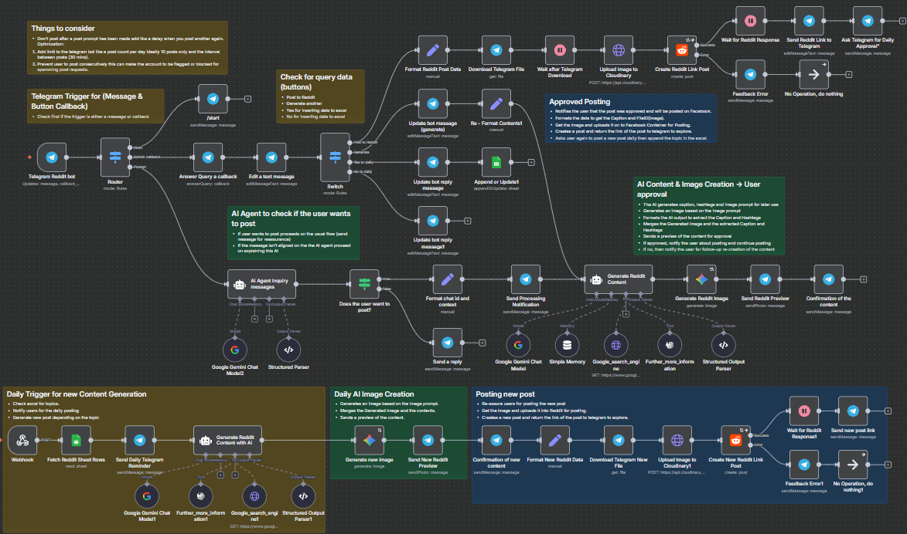

## Reddit - AI


An automated `n8n AI agent workflow` designed to create engaging Reddit posts with AI-enhanced content creation and seamless Telegram bot interaction. It generates trendy Reddit captions and images based on user prompts or scheduled topics, processes approvals via Telegram, and posts content to Reddit with feedback loops.



---

### 💡 Why Use Reddit - AI?
- Automatically generate trendy and engaging Reddit post captions using AI.
- Perform multiple Google trend searches for up-to-date topic research.
- Generate AI-powered images conforming to brand style guidelines.
- Manage content approval through an interactive Telegram bot interface.
- Schedule daily content posting from a maintained Google Sheet.
- Seamlessly upload and post content to Reddit including links and images.
- Store conversation context with memory buffers for better interaction.
- Handle errors and retries gracefully to ensure workflow stability.

---

### ⚡ Who Is This For?
- Social media managers looking to automate Reddit content creation.
- AI enthusiasts wanting to explore AI-driven post generation on Reddit.
- Telegram bot developers integrating conversational AI and Reddit posting.
- Content creators seeking to boost engagement with trendy captions.
- Marketing teams needing scheduled, consistent social media posting.
- Anyone familiar with `n8n` automation seeking an AI + social media integration.

---

### ❓ What Problem Does It Solve?
Manually researching trends, crafting content, generating images, and posting to Reddit can be time-consuming and inconsistent. This workflow automates the entire pipeline—leveraging AI to perform in-depth trend research, content creation, image generation, and allows user approval through Telegram before posting. It centralizes daily content management via Google Sheets and reduces human effort whilst maximizing engagement potential with fresh, on-trend Reddit content.

---

### 🔧 How This Workflow Works
1. **Trigger via Telegram bot**: User sends message or interacts via callback buttons.
2. **Intent Analysis**: AI agent determines if user wants to create a Reddit post.
3. **Formatting**: Extract and format chat ID and user prompt text.
4. **Notification**: Sends Telegram user a processing message.
5. **Trend Research & Content Generation**:
   - Performs at least 4 Google trend searches with varied keywords.
   - Analyzes search results and Wikipedia for background context as needed.
   - Generates clean, trend-aligned Reddit captions and image prompts.
6. **Image Generation**: AI generates a Reddit-themed image using Google Gemini model aligned with brand colors.
7. **Preview & Confirmation**: Sends preview (caption + image) to Telegram for user approval.
8. **If approved**:
   - Downloads image file from Telegram.
   - Uploads image to Cloudinary for hosting.
   - Creates a Reddit post as a link post in specified subreddit.
   - Waits for Reddit API response and then sends Reddit post link back to Telegram.
   - Asks user if they want daily content posting enabled.
9. **If new daily topics**:
   - Fetches topics from Google Sheets.
   - Sends daily reminders via Telegram.
   - Automatically generates, posts, and notifies new Reddit content daily.
10. **Memory Buffer**: Maintains session context for better conversation continuity.

---

### 🔐 Setup Instructions
- ✅ Create a Telegram bot and obtain Bot API key.
- ✅ Configure Google Palm API credentials for Gemini AI models (chat & image).
- ✅ Set up Google Custom Search API key and engine for trend searches.
- ✅ Prepare a Cloudinary account with an upload preset (e.g., "IGpost") for image hosting.
- ✅ Create a Reddit OAuth2 app and configure credentials for API postings.
- ✅ Prepare Google Sheets to manage daily topics with proper access.
- ✅ Import the workflow JSON into your `n8n` instance.
- ✅ Connect all credentials referenced by their IDs in the nodes.
- ✅ Configure webhook URLs in Telegram bot settings and `n8n` accordingly.
- ✅ Ensure the Telegram bot and webhook receive message and callback updates (`message` and `callback_query`).
- ✅ Adjust any node parameters such as subreddit name, message templates, or brand colors as needed.

---

### 📅 Payload  
| Key                | Definition                                              |
|--------------------|---------------------------------------------------------|
| chatid             | Telegram chat identifier for message routing and replies|
| text               | User's prompt or message text input for generating posts|
| captions           | Generated Reddit caption text (clean, no hashtags)      |
| image_prompt       | AI-generated prompt guiding Reddit-themed image styling |
| file_id            | Telegram file identifier for downloaded images          |
| url                | URL of uploaded image on Cloudinary                      |
| callback_query.data | Button callback values from Telegram inline keyboards   |

**Example JSON Payload:**
```json
{
  "captions": "Rediscover productivity hacks that are trending on Reddit now! Fun, casual, and engaging.",
  "image_prompt": "Dynamic illustration of AI-powered interfaces with flowing data streams. Vibrant red (#E52B2B) geometric frames with orange (#FF6B35) glowing tech elements on white background. Modern, high-energy Reddit-optimized composition.",
  "chat_id": "123456789"
}
```

**Example cURL Test:**
```bash
curl -X POST https://your-n8n-instance.com/webhook/af037b40-a59f-4d76-92af-4d74faebe4ae \
-H "Content-Type: application/json" \
-d '{"message": {"chat": {"id": 123456789}, "text": "Create a post about AI trends"}}'
```

---

### 🔨 Tools/Node Used
- **Telegram Trigger:** Listens to Telegram messages and button callbacks.
- **LangChain AI Memory Buffer (Simple Memory):** Stores session context for coherent conversations.
- **LangChain Google Gemini Chat Model:** AI model for generating text content.
- **LangChain AI Agent Nodes:** For analyzing user intent and structuring AI prompt/responses.
- **Google Search Engine HTTP Request Tool:** Performs multiple keyword Google searches for trend research.
- **Wikipedia Tool:** For additional background info during content generation.
- **Google Gemini Image Generation:** AI image creation for Reddit posts styled by brand guidelines.
- **Telegram Send & Edit Message Nodes:** Interact dynamically with the user for approvals and notifications.
- **Cloudinary Upload HTTP Request:** Hosts generated images online for Reddit linking.
- **Reddit API Node:** Posts content as link posts to subreddit.
- **Google Sheets Node:** Manages daily topics and schedules.
- **Switch & IF Nodes:** Control flow based on user interaction and AI decisions.
- **Wait and No Operation Nodes:** Add timing delays and graceful error handling.

---

### ⚙️ Reactive & Proactive Behavior
- **Reactive:** Responds on-demand to Telegram commands, messages, and button callbacks.
- **Proactive:** Scheduled daily content generation and posting via Google Sheets topics.
- Performs multi-stage AI-driven trend research before content production, optimizing post quality.
- Maintains session memory for ongoing conversations improving user experience.

### 🐞 Error Handling
- Errors posting to Reddit or uploading images trigger user feedback messages.
- Failures during image generation or content creation prompt “try again later” alerts.
- Uses ‘continueErrorOutput’ on critical nodes to prevent complete workflow halts.
- Implements wait nodes to avoid rate limits and respects API timing constraints.
- Fallback output options configured in Switch nodes to handle unexpected Telegram input.

---

### 🧩 Requirements
- `n8n` platform with support for custom & community nodes.
- Google API credentials:
  - Google Palm API for Gemini Chat & Image models.
  - Google Custom Search API key and Engine ID.
- Telegram Bot API token with webhook configured.
- Reddit OAuth2 credentials with posting permissions.
- Cloudinary account & upload preset configured.
- Google Sheets with daily topics and proper OAuth2 access.
- Stable internet access and accessible webhook endpoints.

---

### 📚 Resources
- [n8n Documentation](https://docs.n8n.io/)
- [Google Palm API](https://developers.generativeai.google/)
- [Telegram Bot API](https://core.telegram.org/bots/api)
- [Reddit API Overview](https://www.reddit.com/dev/api/)
- [Cloudinary Image Hosting](https://cloudinary.com/documentation)
- [Google Custom Search JSON API](https://developers.google.com/custom-search/v1/overview)
- [LangChain for n8n](https://github.com/n8n-io/n8n-nodes-langchain)

---

### 🐞 Troubleshooting
- **Bot does not respond**: Check Telegram webhook URL and API key setup.
- **API rate limits exceeded**: Add wait nodes and avoid rapid repeated calls.
- **AI content is off-topic or malformed**: Ensure Google Search node queries fire correctly, review AI prompt templates.
- **Image generation fails**: Verify Google Palm API credentials and image model configuration.
- **Reddit posting errors**: Validate Reddit OAuth2 token scopes and subreddit permissions.
- **Cloudinary upload issues**: Confirm upload preset name and Cloudinary API availability.
- **Memory buffer issues**: Ensure unique session keys are set correctly per chat.
- **Google Sheets update fails**: Check OAuth scope and sheet access permissions.
- **Buttons on Telegram don’t respond**: Verify correct callback_data and Switch node mappings.
- **Daily posting does not trigger**: Confirm webhook triggers and Google Sheets content presence.

---