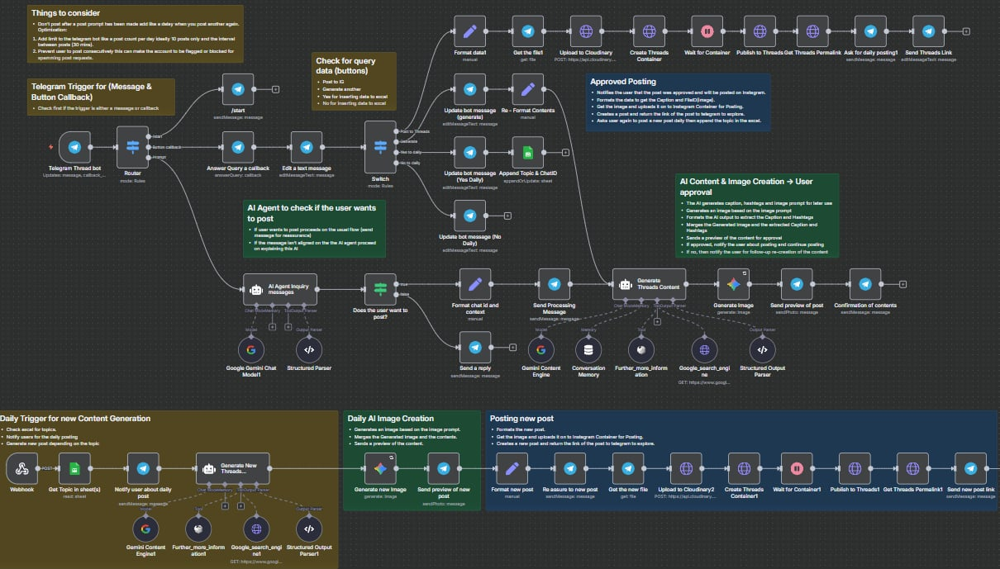

## Threads - AI


This **Threads - AI** workflow automates the creation, preview, and publishing of engaging social media Threads posts via Telegram interaction and AI content generation. It integrates Google Gemini language models for content generation, Google Search for trend research, and Telegram Bot API for messaging and user interaction. It also manages media uploads, post approval, and scheduling for daily automated posting.



---

### 💡 Why Use Threads - AI?
- Automate generation of trendy, conversational Threads posts based on user input.
- Utilize AI-powered research and language models for optimized content creation.
- Integrate seamlessly with Telegram to interact with users in real-time.
- Upload images and media automatically to Cloudinary for polished post creation.
- Manage post approval and publish directly to Threads with user confirmation.
- Schedule and send daily posts automatically, with user opt-in/out.
- Track user data and posts via Google Sheets integration.
- Provide responsive bot messages and interactive buttons in Telegram.
- Enhance social media engagement with relevant hashtags and conversation hooks.
- Keep posting within safe limits to avoid spam detection.

---

### ⚡ Who Is This For?
- Social media marketing professionals managing Threads accounts.
- Content creators seeking to automate social media post generation.
- Telegram bot users wanting AI-powered post generation assistance.
- Teams automating daily content posting with trend research.
- Users engaging with threads-style conversation-driven posts.
- Developers integrating AI into social workflows without coding.

---

### ❓ What Problem Does It Solve?
Manual content creation and publishing on Threads is time-consuming and requires trend research, hashtag selection, image design, and multiple platform interactions. This workflow automates the entire process triggered by user interaction on Telegram, from understanding user intent, researching trends, generating content and images, previewing, gaining approval, to posting and tracking the post, reducing workload and improving engagement with AI assistance.

---

### 🔧 How This Workflow Works
1. **Telegram Thread bot** listens for user messages or callback queries from Telegram.
2. **Router** node directs incoming data either to start commands, button callbacks, or AI message intent inquiry.
3. The **AI Agent Inquiry messages** node analyzes user input to decide if the user wants to create a post.
4. If post creation is desired:
   - Sends a processing message to the user.
   - Formats chat ID and context for key usage.
   - Generates post content using **Generate Threads Content** AI agent, which researches trends via:
      - **Google_search_engine** tool: performs multiple targeted Google searches for trends, hashtags, and engagement strategies.
      - **Further_more_information (Wikipedia)** tool for background context.
   - Outputs structured content JSON: post text, hashtags, and image prompt.
5. The **Generate Image** node uses Google Gemini to generate an image aligned with the content’s theme.
6. Sends post preview with image and caption to the user via Telegram.
7. User confirms or requests a new generation via button callbacks handled by the **Switch** node.
8. If confirmed:
   - Formats data and uploads images to Cloudinary.
   - Creates a Threads post container and publishes the post via Threads API.
   - Retrieves the permalink of the created Threads post.
   - Sends the post link back to the user.
   - Asks if user wants daily posting of similar content.
9. For daily posting:
   - Retrieves topics from a Google Sheet.
   - Notifies user for daily posting.
   - Generates new content and image automatically.
   - Posts and sends links as per the user’s confirmation.
10. Additional nodes add safeguards for post frequency and user limits to prevent spamming or blocking.

---

### 🔐 Setup Instructions
- ✅ **Telegram Bot**: Create a Telegram bot, obtain `telegramApi` credentials, and link to the workflow webhook.
- ✅ **Google Palm API Credentials**: Required for Google Gemini language and image models.
- ✅ **Google Custom Search Engine API Key & CX**: For trend research via Google Search API nodes.
- ✅ **Google Sheets**: Provide OAuth2 credentials and set up shared sheets for storing user chat IDs and posting topics.
- ✅ **Cloudinary Account**: For image upload and hosting with upload preset configured.
- ✅ **Threads API Access**: Provide `threads_user_id` and `threads_access_token` for posting to Threads.
- ✅ Configure webhook URLs and Telegram webhook IDs as per provided nodes.
- ✅ Ensure all API keys and tokens are secured and set in n8n credentials.

---

### 📅 Payload
| Key                          | Definition                                                                                   |
|------------------------------|----------------------------------------------------------------------------------------------|
| chatid                       | Telegram chat ID extracted from user messages                                                |
| text                         | User’s input or bot’s generated text                                                        |
| response                     | AI Agent’s text response message                                                            |
| UserwantsToCreatePost        | Boolean indicating if user wants to create a post                                           |
| post_text / captions         | Main content text to post on Threads (plain text, no markdown)                              |
| hashtags                     | String with 1-5 relevant hashtags with # prefix, space-separated                           |
| image_prompt                 | Visual description for AI image generation (brand-aligned color palette & style)            |
| file_id                      | Telegram file ID for media retrieval                                                        |
| threads_user_id              | Threads user identifier for API calls                                                       |
| threads_access_token          | Access token for Threads API                                                                 |
| permalink                    | URL link to the published Threads post                                                     |

**Example JSON Payload (from AI Agent output):**
```json
{
  "post_text": "Excited to explore AI trends in 2025! How do you think AI will change our lives? Share your thoughts below. #AI #TechTrends",
  "hashtags": "#AI #TechTrends",
  "image_prompt": "A bold and energetic scene featuring vibrant red and warm orange futuristic AI elements on clean white background.",
  "chat_id": "123456789"
}
```

**Example cURL Test:**
```bash
curl -X POST 'https://your-n8n-instance/webhook/1d2b7806-141a-48e8-b0fb-bdad7030ded6' \
-H 'Content-Type: application/json' \
-d '{"message":{"chat":{"id":123456789,"first_name":"User"},"text":"Create a Threads post about productivity tips"}}'
```

---

### 🔨 Tools/Node Used
- **Telegram Thread bot (Telegram Trigger)**: Receives Telegram messages and button callbacks.
- **Router**: Distributes workflow based on message types (start, callback, prompt).
- **AI Agent Inquiry messages**: Detects user intent to create a post.
- **Generate Threads Content (LangChain Agent)**: Generates Threads post text, hashtags, and image prompt leveraging Google Palm and tools.
- **Google_search_engine**: Performs automated Google queries for trending research.
- **Further_more_information (Wikipedia tool)**: Provides additional context for topic.
- **Generate Image (Google Gemini)**: Produces branded image based on prompt.
- **Send preview of post (Telegram)**: Shows user the AI-generated content and image.
- **Switch**: Handles user button callback choices.
- **Cloudinary Upload**: Uploads images for post container.
- **Create Threads Container / Publish**: Uses Threads API to post images and texts.
- **Get Threads Permalink**: Retrieves link to posted Threads content.
- **Google Sheets**: Stores user and topic data for daily post scheduling.
- **Wait nodes**: Introduce delays for API stability and rate limiting.

---

### ⚙️ Reactive & Proactive Behavior
- Reactive: Responds to user messages and callbacks from Telegram in real time.
- Proactive: Sends scheduled daily posts via Google Sheets-triggered content.
- Interactive: Provides inline keyboard buttons for user approvals and options.
- Adaptive: Regenerates content on demand via "Generate new one" button.
- Safe-guarded: Enforces posting rate controls to avoid spam flags.

### 🐞 Error Handling
- Retry enabled on image generation failures.
- Conditional checks for user intents with fallback messages.
- Delays (Wait nodes) ensure proper timing for Threads API processes.
- Telegram edit messages to reflect processing status.
- Fallback outputs and default switches provided.

---

### 🧩 Requirements
- n8n instance with access to external APIs
- Telegram Bot Token with webhook setup
- Google Palm API enabled with credentials
- Google Custom Search API Key + Custom Search Engine ID
- Google Sheets with read/write access and OAuth2 credentials
- Cloudinary account with upload preset configured for media upload
- Threads API credentials (`threads_user_id` and `access_token`)
- Proper webhook exposure (public URL) for Telegram and HTTP nodes
- Adherence to Telegram's rate limits and Threads API policies

---

### 📚 Resources
- [n8n Telegram Integration](https://docs.n8n.io/integrations/builtin/n8n-nodes-base.telegram/)
- [Google Palm API for n8n LangChain](https://cloud.google.com/vertex-ai/docs)
- [Google Custom Search API](https://developers.google.com/custom-search/v1/overview)
- [Cloudinary Image Upload API](https://cloudinary.com/documentation/image_upload_api_reference)
- [Threads API Documentation](https://developers.facebook.com/docs/threads-api/)
- [Google Sheets API](https://developers.google.com/sheets/api)
- [LangChain Documentation](https://python.langchain.com/en/latest/)
- [Telegram Bot API](https://core.telegram.org/bots/api)
- [n8n Workflow Documentation](https://docs.n8n.io/)

---

### 🐞 Troubleshooting
- If the Telegram bot does not respond, verify webhook URL and Telegram credentials.
- Ensure Google and Cloudinary API keys have correct permissions and quotas.
- Confirm Threads API tokens are valid and not expired.
- Check Google Sheets permissions and sheet IDs match those in the workflow.
- Verify Cloudinary's upload preset name matches the setting in the node.
- For AI generation failures, inspect LangChain credentials and retry configurations.
- Delays between posts can be tweaked in "Wait" nodes to reduce API rate limit errors.
- If buttons do not appear in Telegram, confirm inline keyboard markup format.
- Inspect execution logs for any unhandled errors or permission issues.
- Update dependencies and nodes in n8n to latest versions for compatibility.

---