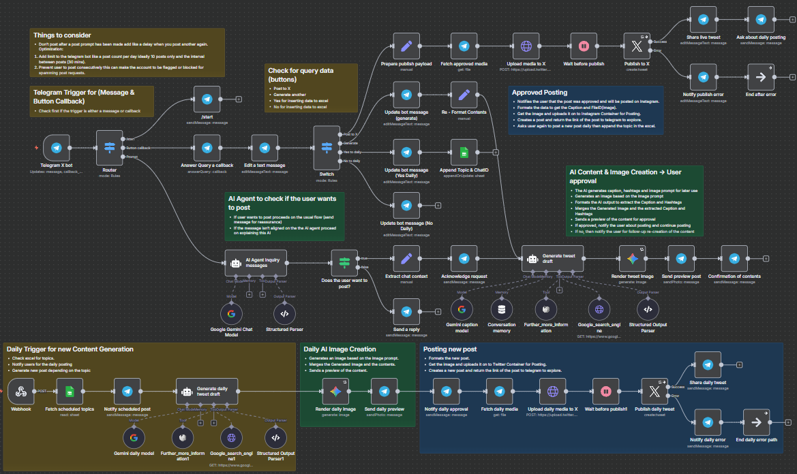

## X - AI


An automated **n8n AI agent workflow** designed to create, preview, and publish engaging Twitter (now "X") posts based on trending social media content. The workflow integrates Telegram bot interactions with powerful AI content generation, Google search trend research, and image generation, streamlining social media content creation and management in an automated and user-friendly manner.



---

### 💡 Why Use X - AI?
- Automate generation of trendy, engaging Twitter/X post captions leveraging AI and real-time trend data.
- Preview AI-generated posts including images before publishing.
- Seamlessly interface via Telegram bot for user commands, approvals, and feedback.
- Schedule and generate daily posts automatically based on predefined topics from Google Sheets.
- Utilize multimodal AI capabilities: trending topic research, text generation, and image rendering aligned with brand guidelines.
- Manage posting flow with error handling and retry mechanisms to ensure reliable operation.
- Simplify social media engagement with powerful AI-driven tools embedded into an easy-to-use workflow.
- Allow users to interactively decide on daily posting preferences.

---

### ⚡ Who Is This For?
- Social media managers seeking to automate daily content creation on Twitter/X.
- Content creators wanting AI-powered inspiration and draft generation.
- Telegram bot users looking for a conversational interface for social media.
- Developers automating social media marketing workflows.
- Teams wanting to streamline content approval and publication with AI assistance.

---

### ❓ What Problem Does It Solve?
This workflow addresses the challenge of consistently generating fresh, relevant, and engaging social media posts that connect with trending topics and audience interests on Twitter/X. It removes manual content research, caption writing, image creation, and posting processes, replacing them with an efficient automated pipeline that includes user interaction for approval and customization.

---

### 🔧 How This Workflow Works
1. **Telegram Bot Trigger**: Listens for messages or button callbacks from users to initiate actions (new post request, approval, daily post preferences).
2. **Intent Detection AI**: An AI Agent analyzes user messages to detect if the user wants to create a Twitter post.
3. **Chat Context Extraction**: Extracts user input and chat metadata for personalization.
4. **Acknowledge Request**: Sends a confirmation message to the user indicating content generation is underway.
5. **Trend Research (Mandatory)**: Performs multiple Google search queries using various keywords to gather trending topics, hashtags, and engagement strategies.
6. **Content Creation AI Agent**: Based on trend data, generates short, catchy captions (without hashtags), relevant hashtags (5-7), and a concise image prompt adhering to brand colors.
7. **Image Generation**: Calls Google Gemini AI to generate an image based on the AI-generated image prompt with brand palette and style guidelines.
8. **Send Preview Post**: Sends the user a Telegram preview of the generated tweet with image, caption, and hashtags.
9. **User Confirmation**: User can choose to post the tweet, generate a new draft, or opt in/out of daily posts via inline keyboard buttons.
10. **Posting Pipeline**:
   - Fetch media files approved by the user from Telegram.
   - Upload media to Twitter/X using OAuth1 API.
   - Post tweet with caption, hashtags, and attached media.
   - Edit Telegram messages to indicate success or provide error feedback.
11. **Daily Scheduled Posting**: A webhook triggers fetching scheduled topics from Google Sheets, generates daily drafts and images, previews them on Telegram, and posts upon confirmation.
12. **Error Handling**: Errors during posting trigger user notification messages and safe ending of workflow branches.

---

### 🔐 Setup Instructions
- ✅ **Telegram Bot Setup**: Configure and authorize your Telegram Bot credentials (`telegramApi`) in n8n.
- ✅ **Twitter/X API Credentials**:
  - OAuth1 API for media upload (`twitterOAuth1Api`).
  - OAuth2 API for post publishing (`twitterOAuth2Api`).
- ✅ **Google Sheets API**: Setup OAuth2 credentials `googleSheetsOAuth2Api` with access to the social media topics sheet.
- ✅ **Google Palm API / Gemini**: Provide credentials to use Google Gemini models for text and image generation (`googlePalmApi`).
- ✅ **Google Custom Search API**: API key and search engine CX configured for the node `Google_search_engine`.
- ✅ **n8n Webhook Configuration**: Ensure webhook URLs are properly set and reachable for triggering scheduled posts and Telegram webhooks.
- ✅ **Brand Guidelines for Image Prompts**: Familiarize with brand colors and styles to refine image prompts if customized.
- Configure retry policies and error handling according to your preferences.

---

### 📅 Payload
| Key               | Definition                                                                                     |
|-------------------|------------------------------------------------------------------------------------------------|
| `captions`        | AI-generated short catchy text for the tweet (no hashtags included)                            |
| `hashtags`        | String of 5-7 relevant hashtags with `#` symbol, separated by spaces                           |
| `image_prompt`    | 2-3 sentence concise image description including brand colors (vibrant red/ orange/ white)     |
| `chat_id`         | Telegram chat ID to personalize and route messages                                             |
| `media_id_string` | Twitter media ID string for media upload                                                      |
| `file_id`         | Telegram file_id of media to fetch                                                             |
| `callback_data`   | Inline keyboard callback data (e.g., "postX", "generate", "yesDaily", "no")                   |

**Example AI Agent JSON Output:**
```json
{
  "captions": "Excited to share the latest trends in AI innovation – stay ahead with smart tech insights!",
  "hashtags": "#AI #Innovation #TechTrends #MachineLearning #SmartTech",
  "image_prompt": "Dynamic illustration of AI-powered interfaces with flowing data streams. Vibrant red (#E52B2B) geometric frames with orange (#FF6B35) glowing tech elements on white background. Modern, high-energy X-optimized composition.",
  "chat_id": "123456789"
}
```

**Example Telegram Inline Keyboard Callback Data:**
```json
{
  "callback_data": "postX" // To approve posting the generated tweet
}
```

---

### 🔨 Tools/Node Used
- **Telegram Trigger & Telegram Nodes**: For receiving messages, sending replies, editing messages, and sending media previews.
- **Twitter OAuth1 & OAuth2 Nodes**: Upload media and post tweets to X/Twitter.
- **Google Sheets Node**: Fetch scheduled posting topics and append user data.
- **LangChain Nodes**:
  - AI Agents for content analysis and generation.
  - Memory buffer to keep conversational context.
  - Output parsers for structured JSON extraction.
- **Google Gemini Models**: For text caption creation and image generation aligned with brand.
- **HTTP Request & httpRequestTool Nodes**: For accessing Google Custom Search and Twitter media upload APIs.
- **Switch / If Nodes**: Logic branching based on user intents and callback data.
- **Wait Nodes**: Delays before posting to comply with platform policies.
- **NoOp Nodes**: Workflow termination points on error.
- **Sticky Notes (for documentation/notes)**

---

### ⚙️ Reactive & Proactive Behavior
- **Reactive**: Responds to Telegram user messages or inline keyboard button callbacks immediately.
- **Proactive**: Automatically triggers daily scheduled post creation based on Google Sheets topics and notifies users via Telegram.
- Uses AI to analyze and react appropriately based on user intent.
- Retries failed Twitter posts gracefully and informs users of errors.

---

### 🐞 Error Handling
- Errors on Twitter publish actions trigger Telegram notifications to the user to try again later.
- Workflow branches safely terminate after error notifications.
- Retry enabled on publishing nodes to mitigate transient failures.
- Users receive clear feedback on errors with option to retry or generate new content.

---

### 🧩 Requirements
- n8n instance with webhook access.
- Telegram Bot and API credentials.
- Twitter OAuth1 and OAuth2 credentials with media upload and post permissions.
- Google Cloud credentials for:
  - Custom Search API (Google Search Engine).
  - Google Palm API for Gemini language and image models.
- Google Sheets API credentials linked to the social media topics spreadsheet.
- Stable internet connection for API calls.
- Knowledge of brand color usage in prompts for image generation.

---

### 📚 Resources
- [Telegram Bot API](https://core.telegram.org/bots/api)
- [Twitter Developer API](https://developer.twitter.com/en/docs/twitter-api)
- [Google Custom Search JSON API](https://developers.google.com/custom-search/v1/overview)
- [Google Sheets API](https://developers.google.com/sheets/api)
- [Google Cloud Vertex AI / Gemini](https://cloud.google.com/vertex-ai)
- [n8n Documentation](https://docs.n8n.io/)
- [LangChain n8n Integration](https://docs.n8n.io/integrations/agents/langchain/)
- [Twitter X Rebranding Notes](https://blog.twitter.com/en_us/topics/company/2023/x-twitter-rebranding)

---

### 🐞 Troubleshooting
- Ensure all credentials are valid and authorized for API usage.
- Verify webhook URLs are exposed publicly and correctly configured in Telegram and n8n.
- Confirm Google Cloud APIs are enabled (Custom Search, Vertex AI).
- Check rate limits on Twitter API and Google Search API—consider usage costs.
- Confirm media file formats and sizes comply with Twitter/X policies.
- Review logs in n8n execution to identify faulty node or erroneous input.
- Test Telegram command `/start` to validate bot responsiveness.
- Clear conversation memory if unexpected context is retained.
- Monitor AI prompt outputs for structure validity; update parsers if API changes occur.
- Avoid rapid-fire post requests from users to prevent spamming flags by Twitter/X.

---