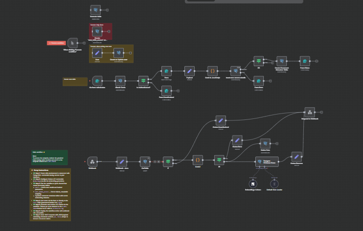

##  Archivist RAG Agent


The ** Archivist RAG Agent** is an `n8n` workflow designed to provide a Retrieval-Augmented Generation (RAG) capability by managing document ingestion, validation, embedding, and storage in a PostgreSQL vector database. It handles user authentication, token management, and secure API access, all integrated into a seamless AI-powered pipeline.



---

### 💡 Why Use  Archivist RAG Agent?
- Automate ingestion and validation of document data from incoming API/webhook requests
- Perform embedding of multi-language text documents to enable similarity search using PGVector with PostgreSQL
- Manage user authentication and token provisioning to restrict access on a per-table basis
- Dynamically create or update vector metadata tables for storing document embeddings
- Delete existing document data before inserting new entries to prevent duplication
- Provide a secure, token-authenticated API endpoint to interact with the service
- Simplifies the implementation of enterprise-ready RAG workflows integrated with PostgreSQL and Cohere embeddings

---

### ⚡ Who Is This For?
- Developers and data engineers building internal knowledge base and RAG AI services
- Teams requiring secure, tokenized API endpoints with database-backed document vector stores
- Organizations using PostgreSQL with PGVector for high-performance vector similarity search
- Users looking for seamless integration between n8n automation, AI embeddings, and DB storage

---

### ❓ What Problem Does It Solve?
This workflow addresses the complexity of building a secure, scalable, and automated RAG data pipeline that includes:
- Validating incoming document data for required fields
- Embedding document content using Cohere multilingual models
- Storing embeddings and metadata efficiently in PostgreSQL vector-enabled tables
- Managing user credentials and table-level tokens to control access
- Handling errors and unauthorized attempts with clear API responses

---

### 🔧 How This Workflow Works
1. **Webhook Listener** triggers on POST requests to `/archivist-rag` endpoint with data payload and API token header.
2. **Webhook - data** node extracts token and data for processing.
3. **GetTable** queries PostgreSQL to confirm the token's authorization and returns the target table name.
4. **If** node validates token existence:
   - If no token: responds 401 Unauthorized and aborts.
   - If valid: proceeds.
5. **Code2** runs JavaScript to validate each document item in the payload for presence of `id` and `text` keys.
6. **If1** checks validation:
   - On validation errors, returns 400 status with error message.
   - If valid, continues.
7. **Postgres PGVector Store** inserts document data, embeddings, and metadata into PostgreSQL table.
8. **Delete Data** node deletes existing entries in the target table matching incoming IDs to avoid duplicates.
9. **Status:Success** confirms successful data storage with API response.
10. **Embeddings Cohere** integrates Cohere Embed API for multilingual embedding generation.
11. **User Management Subflow:** Form submission triggers user sign-in. Credentials checked against the PostgreSQL `users` table.
12. Upon successful authentication, generates a unique token linked with a user's access to a specific data table via JavaScript code node.
13. Tokens stored in `user_table_access` table to authorize subsequent API calls.
14. There are also nodes to assist in setting up database tables (`user_table_access`, `users`, metadata document tables), including PostgreSQL queries to create, drop, or truncate these.

---

### 🔐 Setup Instructions
- ✅ **Step 1:** Ensure n8n environment is connected with PostgreSQL credentials having access to your database.
- ✅ **Step 2:** Configure Cohere API credentials (`cohereApi`) in n8n for embedding generation.
- ✅ **Step 3:** Run the workflow or parts thereof that create necessary tables:
  - `users` — Stores user emails and hashed passwords.
  - `user_table_access` — Stores tokens, user/table mapping.
  - Dynamic document metadata tables with vector embedding columns.
- ✅ **Step 4:** Add users via the form or directly to the `users` table (passwords hashed via `crypt`).
- ✅ **Step 5:** Generate and retrieve API tokens via the workflow. Tokens are to be included in the `X-API-TOKEN` header in API calls to `/archivist-rag`.
- ✅ **Step 6:** Deploy the workflow active with webhook URL accessible.
- ✅ **Step 7:** Send POST requests with JSON payload containing document records `{id, text}` arrays to indexed document tables.

---

### 📅 Payload
| Key    | Definition                           |
|--------|------------------------------------|
| id     | Unique identifier for each document |
| text   | Document textual content to embed  |
| token  | API token used to authorize request |
| name   | Username or user/role name          |
| table_name | Name of target PostgreSQL table for document insertion |

**Example JSON Payload:**
```json
{
  "data": [
    {"id": "doc1", "text": "Example document text 1"},
    {"id": "doc2", "text": "Example document text 2"}
  ]
}
```

**Example cURL Test:**
```bash
curl -X POST https://your-n8n-host/webhook/archivist-rag \
  -H "Content-Type: application/json" \
  -H "X-API-TOKEN: your_generated_token" \
  -d '{"data":[{"id":"doc1","text":"Example text 1"},{"id":"doc2","text":"Example text 2"}]}'
```

---

### 🔨 Tools/Nodes Used
- **Webhook:** Entry point for receiving document ingestion requests.
- **Set:** Extracts token from headers, formats payloads.
- **Postgres:** Executes SQL queries for user management, table creation, inserts, and deletes.
- **Code (JavaScript):** Validation, token generation, dynamic data transformation.
- **If:** Conditional logic to handle authentication, validation, error responses.
- **Respond to Webhook:** Sends success, error, or unauthorized responses.
- **Langchain Document Default Data Loader:** Loads documents into the vector store.
- **Langchain PGVector Store:** Inserts/updates document embeddings in PostgreSQL.
- **Cohere Embeddings:** Generates multilingual embeddings for document text.
- **Form nodes:** Accept user credentials and other inputs for user and token workflow.
- **Sticky Notes:** Documentation helpers within the workflow.

---

### ⚙️ Reactive & Proactive Behavior
- Reactive: Listens on webhook POST requests; responds instantly based on validation and DB state.
- Proactive: Generates authorization tokens after user authentication; manages user/table access persistently.
- Deletes old documents before inserting new ones to maintain up-to-date data.
- Provides immediate error or success feedback.

### 🐞 Error Handling
- Validation failure: Responds 400 with message "id and text "keys/column" are required."
- Unauthorized: Responds 401 with message "Unauthorized" or "Invalid email or password" on login attempts.
- PostgreSQL errors are caught by `onError: continueErrorOutput` to avoid breaks.
- Clear branching between success and failure cases for prompt diagnostics.

---

### 🧩 Requirements
- PostgreSQL Database with `pgvector` extension for vector search support.
- Cohere API key with access to multilingual embedding models.
- `n8n` environment capable of running JavaScript and handling form/webhook nodes.
- Properly configured PostgreSQL credentials with read/write permissions.
- Network access with HTTPS endpoints for webhook calls.

---

### 📚 Resources
- [n8n Documentation](https://docs.n8n.io)
- [Cohere API Documentation](https://docs.cohere.ai)
- [PostgreSQL pgvector Extension](https://github.com/pgvector/pgvector)
- [RAG - Retrieval Augmented Generation Concepts](https://blog.langchain.dev/rag/)

---

### 🐞 Troubleshooting
- Confirm `X-API-TOKEN` header is present and valid for all API requests.
- Ensure PostgreSQL tables exist and have correct schema per workflow SQL nodes.
- Validate that the embedding dimension (default `1024`) matches Cohere model output.
- Check users have corresponding entries in `user_table_access` with correct token.
- Monitor n8n execution logs for failed nodes or errors.
- Node 'If' conditions must reflect correct logic for `true/false` branching.
- Network issues with webhook URL can prevent triggering.
- Verify Cohere API key permissions and usage limits.
- Check SQL query compatibility and permissions in PostgreSQL server.
- Make sure the `pgvector` extension is installed and active in PostgreSQL.