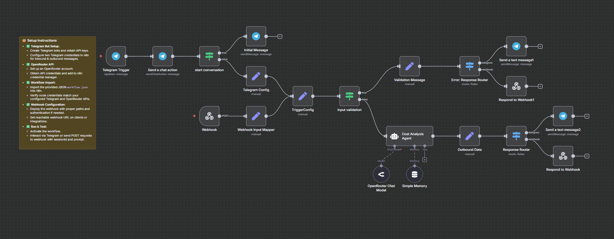

## Asset Value Analyst


The **Asset Value Analyst** is an AI-powered n8n automation workflow designed to analyze and estimate the value of physical assets in the Philippine market. It leverages an AI agent to provide asset valuation details such as acquisition cost, depreciation, and current market value based on user input from Telegram or webhook sources. The workflow enforces consistency and accuracy using defined business rules specific to asset types like laptops, phones, and furniture.



---

### 💡 Why Use Asset Value Analyst?
- Provides fast, structured asset valuation and market analysis
- Integrates seamless Telegram interaction for ease of use
- Applies realistic assumptions and local Philippine market context
- Follow strict evaluation and depreciation rules for asset consistency
- Offers customized responses for missing or incomplete data
- Supports greeting and unrelated chat handling with friendly AI replies

---

### ⚡ Who Is This For?
- Business owners and asset managers in the Philippines
- Financial analysts needing quick asset value estimations
- Telegram users seeking accessible AI-powered valuation support
- n8n users looking to create AI-integrated asset workflows
- Developers interested in combining Langchain AI agents with messaging triggers

---

### ❓ What Problem Does It Solve?
This workflow solves the problem of manually estimating asset values with inconsistent or incomplete data. It automates the valuation process using an AI trained with specific Philippine market rules, depreciation standards, and strict output formats — saving time while improving reliability and consistency.

---

### 🔧 How This Workflow Works
1. **Start Trigger:**  
   - Receives asset queries via Telegram messages or custom webhook POST requests.
2. **Initial Validation:**  
   - Validates session IDs and input messages for completeness.
3. **Send Initial Message (Telegram only):**  
   - Greets users and requests structured asset details (Item, Acquisition Cost, etc.).
4. **Memory Buffer:**  
   - Maintains context/session specific memory for the conversation.
5. **Cost Analysis Agent (AI Agent):**  
   - Processes input prompt using Langchain AI with defined system messages.
   - Applies business rules to determine asset existence, depreciation, and market value.
6. **Response Routing:**  
   - Routes AI output to Telegram or webhook responses.
7. **Send Response to User:**  
   - Returns estimation results or error messages in a concise bullet-list format.
8. **Handle Greetings & Non-Asset Queries:**  
   - Replies with friendly, relevant fallback messages for greetings or unrelated chats.

---

### 🔐 Setup Instructions
- ✅ **Telegram Bot Setup:**
  - Create Telegram bots and obtain API keys.
  - Configure two Telegram credentials in n8n for inbound & outbound messages.
- ✅ **OpenRouter API:**
  - Set up an OpenRouter account.
  - Obtain API credentials and add to n8n credential manager.
- ✅ **Workflow Import:**
  - Import the provided JSON `workflow.json` into n8n.
  - Verify node credentials match your configured Telegram and OpenRouter APIs.
- ✅ **Webhook Configuration:**
  - Deploy the webhook with proper paths and authentication if needed.
  - Set reachable webhook URL on clients or integrations.
- ✅ **Run & Test:**
  - Activate the workflow.
  - Interact via Telegram or send POST requests to webhook with sessionId and prompt.

---

### 📅 Payload
| Key               | Definition                                                  |
| ----------------- | ----------------------------------------------------------- |
| `sessionId`       | Unique identifier for the user session                      |
| `prompt` | User’s input describing the asset details or query         |

**Example JSON Payload for Webhook:**
```json
{
  "sessionId": "telegram:123456789",
  "prompt": "Item: Laptop, Acquisition Cost: 50000, Purchase Date: 2022",
  "ref": "webhook"
}
```

**Example cURL Test for Webhook:**
```bash
curl --location --request POST 'https://<your-n8n-instance>/webhook/c95ee520-5d39-47f1-8e76-d44fd496fa84' \
--header 'Content-Type: application/json' \
--data-raw '{
    "sessionId": "telegram:123456789",
    "prompt": "Item: Laptop, Acquisition Cost: 50000, Purchase Date: 2022",
    "ref": "webhook"
}'
```

---

### 🔨 Tools/Node Used
- **Telegram Trigger:** Listens for user messages via Telegram bot.
- **Telegram nodes (Send chat action & Send a text message):** Provides user-friendly interactions.
- **Webhook:** Accepts external API POST requests for asset analysis.
- **Set nodes:** Map and validate incoming payload data.
- **If / Switch nodes:** Route messages and responses based on content and source.
- **Langchain AI Agent ("Cost Analysis Agent"):** Core node executing asset valuation logic per detailed system prompt.
- **Memory buffer (Simple Memory):** Stores conversational context/session data.
- **OpenRouter Chat Model:** AI language model to interpret and generate responses.
- **Respond to Webhook:** Returns responses for webhook callers.

---

### ⚙️ Reactive & Proactive Behavior
- Reacts to user inputs through Telegram or webhook POST calls.
- Proactively sends onboarding instructions and clarifications.
- Applies self-check rules within the AI agent for output consistency.
- Filters greetings to respond accurately without asset processing.

### 🐞 Error Handling
- Validates mandatory `sessionId` and `message`; returns error via `Validation Message` node.
- Routes errors to relevant output channels (Telegram or webhook error responses).
- Provides fallback messages if asset product not found in the market or input is unrelated.
- Chat fallback messages for user greetings or unsupported queries.

---

### 🧩 Requirements
- n8n Automation Platform v3.x or higher.
- Telegram API credentials for interacting with users.
- OpenRouter API credentials for AI language model.
- Stable internet connection for webhook and messaging integrations.
- Proper webhook endpoint configuration (publicly accessible).

---

### 📚 Resources
- [n8n Official Documentation](https://docs.n8n.io/)
- [Telegram Bot API Documentation](https://core.telegram.org/bots/api)
- [Langchain AI Agent - n8n Integration](https://n8n.io/integrations/langchain)
- [OpenRouter API Documentation](https://docs.openrouter.ai/)
- Philippines Market Asset Pricing References (User should update source basis accordingly)

---

### 🐞 Troubleshooting
- Check Telegram bot tokens and chat IDs correctness if messages do not arrive.
- Ensure OpenRouter API key is valid and has quota.
- Validate webhook URL is publicly reachable and correctly configured.
- Review sessionId format conformity especially when mixing Telegram and webhook inputs.
- Check AI system prompt formatting if output does not follow bullet-list or lacks details.
- Confirm n8n’s node credentials are correctly assigned per environment.
- Validate payload completeness (missing purchase date or acquisition cost handled specially).
- Use workflow’s debug feature in n8n to trace data flow between nodes.
- Monitor rate limits on Telegram and OpenRouter to avoid throttling.
- Handle special user inputs explicitly per system message guidelines (greetings, "What do you do?", unrelated chats).