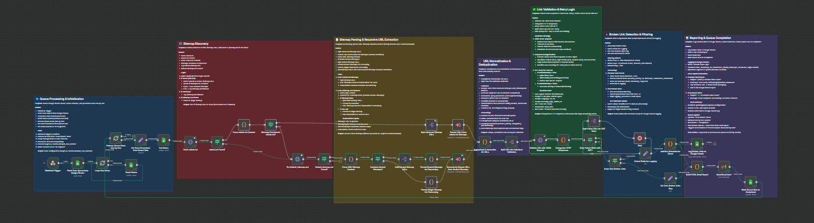

> ⚠️ Kindly review the docs once more before saving.

## Broken Link Checker AI Agent  


An automated n8n workflow designed to scan websites for broken links by discovering sitemaps through robots.txt or fallback mechanisms, extracting URLs recursively from nested sitemaps, validating each URL’s HTTP response status, and reporting detailed broken link analytics to Google Sheets and via email alerts.

  

---

### 💡 Why Use Broken Link Checker AI Agent?
- Automatically discovers sitemap URLs declared in robots.txt or falls back to a default sitemap.xml
- Recursively extracts URLs including nested sitemaps respecting a configurable maximum crawl depth
- Normalizes and deduplicates URLs to avoid redundant checks
- Validates URLs using HEAD requests and retries failed cases with GET requests to minimize false positives
- Categorizes link issues by priority for focused troubleshooting
- Logs results to Google Sheets and sends comprehensive HTML email reports to stakeholders
- Processes scan requests sequentially from a Google Sheets queue to manage workload effectively

---

### ⚡ Who Is This For?
- Website administrators and SEO professionals seeking automated link health audits
- Digital marketing teams tracking site quality and broken links over time
- Developers building integrations to scan and monitor URLs using n8n workflows
- Technical support teams needing detailed reporting with severity classifications
- Automation enthusiasts aiming to combine sitemap parsing and HTTP validation

---

### ❓ What Problem Does It Solve?
It identifies and reports broken links (4xx/5xx HTTP status codes and network errors) on target websites by leveraging sitemap info from robots.txt or default locations. This workflow prevents manual checking of large site link inventories, enabling quick detection and resolution of SEO and user experience issues caused by broken URLs.

---

### 🔧 How This Workflow Works

1. **Queue Processing & Initialization**  
   - Triggered by a webhook  
   - Fetches scan requests from a Google Sheets "Scan Queue" sheet  
   - Resets previous row statuses and loops over queue items one by one  
   - Extracts key scan parameters: `targetUrl`, `maxCrawlDepth`, `row_number`  
   - Marks current scan row as "In Progress"

2. **Sitemap Discovery**  
   - Requests `robots.txt` from the target URL domain  
   - If found (200 OK with content), parses `robots.txt` for sitemap URLs and crawl rules  
   - If no sitemaps declared or no robots.txt found, tries the default `/sitemap.xml`  
   - Parses the fallback as a single sitemap if found  

3. **Sitemap Parsing & Recursive URL Extraction**  
   - For each sitemap URL discovered from robots.txt or fallback:  
     - Recursively processes nested sitemap indexes (up to `maxCrawlDepth`)  
     - Parses XML content distinguishing between sitemap indexes and URL sets  
     - Gathers all URL entries and sitemap metadata  

4. **URL Normalization & Deduplication**  
   - Merges URLs across all sitemaps  
   - Resolves and canonicalizes URLs:  
     - Handles absolute vs relative URL conversions  
     - Sorts and normalizes query parameters  
     - Deduplicates via canonical URL representation  
     - Tags URLs as internal or external relative to target domain  

5. **Link Validation & Retry Logic**  
   - Splits URLs into individual validation requests  
   - Sends HTTP HEAD requests with browser-like headers for URL status  
   - Categorizes responses by status code (Critical 5xx, High 4xx, Redirect 3xx, Success 2xx)  
   - Flags broken links (status >= 400 or unreachable)  
   - For server errors or no response, retries with GET requests after a wait delay  
   - Keeps retrying as configured (retry limit 5 times for HEAD)

6. **Broken Link Detection & Filtering**  
   - Filters only broken URLs for reporting  
   - Prepares metadata including severity, priority, last modified date, source sitemap  
   - If no broken links found, creates a zero-results placeholder to continue workflow  

7. **Reporting & Queue Completion**  
   - Logs broken link data to a Google Sheets "Broken Links Logs" sheet (append/update by run ID)  
   - Generates an HTML email report summarizing the scan, highlighting critical issues and top 10 errors  
   - Sends email to configured recipients (default `gabriel@popai.agency`)  
   - Updates the scan queue row: sets status as "Completed" and logs total broken links found  
   - Loops back to next queue row if remaining requests exist  

---

### 🔐 Setup Instructions

- ✅ **Google Sheets Credentials:**  
  Connect n8n with Google Sheets OAuth2 API for reading the scan queue and logging broken link reports. Ensure appropriate sheet IDs and ranges correspond to the configured sheets:
  - Scan queue sheet (`Scan Queue`) to hold URLs and crawl depth parameters  
  - Broken links log sheet (`Broken Links Logs`) for appending results  

- ✅ **Gmail SMTP Credentials:**  
  Configure Gmail OAuth2 credentials to enable sending of alert emails summarizing broken link detection.

- ✅ **Webhook Configuration:**  
  Set the webhook URL for triggering the workflow with the required permissions to accept POST requests that initialize scanning.

- ✅ **Max Crawl Depth:**  
  Define the maximum sitemap recursion depth to prevent overly deep or infinite sitemap traversal (defaults to 5).

- ✅ **Email Recipient:**  
  Update email addresses (default is `gabriel@popai.agency`) in the "Send Email Alert" node to desired recipients.

- ✅ **Timeouts and Retries:**  
  Default HTTP request timeouts are 50 seconds, with retry configured on transient server errors.

- ✅ **Adjust User-Agent/Headers:**  
  The HTTP validation sends realistic browser headers. Adjust as needed for special target server requirements.

---

### 📅 Payload

| Key            | Definition                                                         |
| -------------- | ------------------------------------------------------------------|
| targetUrl      | The website URL to scan for broken links                          |
| maxCrawlDepth  | Maximum depth for recursive sitemap parsing (default 5)           |
| row_number     | Row number from the Google Sheets queue representing this scan job |
| sitemaps       | List of sitemap URLs discovered from robots.txt or fallback       |
| sitemapDepth   | Current recursion depth of sitemap extraction                      |
| robotsRules    | Parsed crawl rules from robots.txt used to filter URLs            |
| url            | Individual URL extracted for validation                            |
| statusCode     | HTTP status code received for URL validation                       |
| statusCategory | Categorized link severity based on status code                     |
| priority       | Priority classification for link issues (Critical, High, Medium)  |
| isBroken       | Boolean indicating if the link is broken                           |
| linkScope      | Scope categorization (internal or external link)                   |

**Example JSON Payload:**
```json
{
  "targetUrl": "https://example.com",
  "maxCrawlDepth": 5,
  "row_number": 2,
  "sitemaps": [
    "https://example.com/sitemap.xml"
  ],
  "url": "https://example.com/page1",
  "statusCode": 404,
  "statusCategory": "High Priority",
  "priority": "High",
  "isBroken": true,
  "linkScope": "internal"
}
```

**Example cURL Test:**
```bash
curl -X POST https://your-n8n-instance/webhook/a2c28d73-c456-44d2-94ae-f3b0efcad383 \
-H "Content-Type: application/json" \
-d '{"targetUrl":"https://example.com","maxCrawlDepth":5}'
```

---

### 🔨 Tools/Nodes Used

| Node Name                                | Purpose/Role                                           |
| ---------------------------------------|-------------------------------------------------------|
| Webhook Trigger                        | Starts workflow on external HTTP POST calls           |
| Fetch Scan Queue from Google Sheets    | Retrieves scan jobs queued in Google Sheets           |
| Loop Over Items                        | Iterates through rows for processing                   |
| Set Scan Parameters from Queue Row    | Extracts and sets scanning parameters                  |
| Fetch robots.txt                      | Downloads robots.txt file                               |
| robots.txt Found?                     | Checks if robots.txt was found (200 OK with content)  |
| Parse robots.txt Content              | Parses robots.txt for user-agent rules & sitemaps      |
| Sitemaps Declared in robots.txt?      | Verifies if sitemaps URLs declared in robots.txt       |
| Try Default /sitemap.xml              | Attempts to fetch default sitemap.xml fallback          |
| Parse XML Sitemap Content             | Parses sitemap.xml content XML for URLs                 |
| Contains Nested Sitemaps?             | Checks if sitemap index contains nested sitemaps       |
| Split Nested Sitemap URLs             | Splits child sitemaps URLs for recursion                |
| Format Single/Nested Sitemaps for Processing | Normalizes sitemap URLs for subworkflow recursion    |
| Recursively Extract URLs from Nested Sitemaps | Executes subworkflow to extract URLs recursively      |
| Deduplicate & Normalize All URLs      | Deduplicates and canonicalizes all URLs                 |
| Split URLs for Individual Validation  | Splits URLs for individual HTTP checks                   |
| Validate URL with HEAD Request        | Sends HEAD requests for HTTP status validation          |
| Categorize HTTP Responses             | Parses HTTP responses, classifies status severity       |
| Retry Failed HEAD with GET?           | Conditional retry logic for failed HEAD requests        |
| Keep Only Broken Links                | Filters and keeps only broken URLs                       |
| Select Fields for Logging             | Selects essential fields for reporting                   |
| Add Run Metadata for Sheet            | Appends scan metadata to logging data                    |
| Log Broken Links to Google Sheets     | Writes broken link details to Google Sheets              |
| Build HTML Email Report               | Generates an HTML summary email                           |
| Send Email Alert                     | Sends alert email with scan results                      |
| Mark Queue Row as Completed           | Updates scan row status and triggers next item processing |
| Wait                                | Delay node used to avoid rate-limiting during retries    |
| Reset Status                          | Resets status in scan queue before processing            |

---

### ⚙️ Reactive & Proactive Behavior

- **Reactive:**  
  Reacts to webhook POST triggers to start scanning; adapts flow based on robots.txt and sitemap availability.

- **Proactive:**  
  Automatically processes all queued scan requests sequentially; retries transient errors and maintains scan state in Google Sheets.

---

### 🐞 Error Handling

- Nodes like `Fetch robots.txt` and HTTP requests have `continueOnError` set to avoid workflow stoppage on unreachable URLs.  
- Built-in retry logic retries HEAD request failures with GET requests after delays.  
- Parsing nodes catch and report errors in JSON outputs for conditional handling.  
- Status codes and errors are categorized and logged for detail analysis.

---

### 🧩 Requirements

- n8n installation (cloud or self-hosted) with internet access  
- Google account with Sheets API credentials (OAuth2)  
- Gmail credentials configured for sending alerts via Gmail node  
- Target websites must have accessible `robots.txt` or `/sitemap.xml`  
- Proper webhook URL and permission setup for workflow triggering

---

### 📚 Resources

- [n8n Documentation](https://docs.n8n.io)  
- [Google Sheets API](https://developers.google.com/sheets/api)  
- [Gmail SMTP with OAuth2](https://developers.google.com/gmail/api)  
- [Robots.txt Specification](https://developers.google.com/search/docs/crawling-indexing/robots/intro)  
- [Sitemap Protocol](https://www.sitemaps.org/protocol.html)  

---

### 🐞 Troubleshooting

- **No robots.txt or sitemap found:** Ensure the target URL is correct and publicly accessible.  
- **Google Sheets authorization errors:** Re-authenticate Google Sheets credentials and ensure API access enabled.  
- **Emails not sending:** Verify Gmail OAuth2 setup and recipient email address correctness.  
- **Workflow stops unexpectedly:** Check node error logs; use `continueOnError` nodes to prevent stops.  
- **Timeouts during URL validity checks:** Adjust HTTP timeout settings in `Validate URL with HEAD Request` node.  
- **Duplicates or incorrect URL normalization:** Review URL canonicalization logic in the `Deduplicate & Normalize All URLs` node.  
- **Max Crawl Depth exceeded errors:** Increase `maxCrawlDepth` or simplify sitemap nesting if needed.  

---