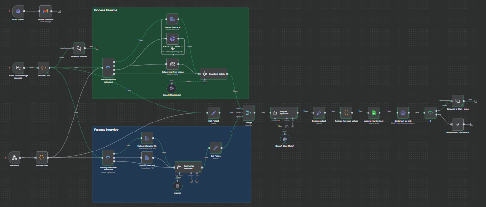

## Candidate Assessment


A comprehensive n8n AI agent workflow designed to **automate candidate evaluation** by processing resumes and interview transcripts, extracting important candidate details, summarizing interview performance, analyzing candidate-job fit, and finally recording and ranking the results in a Google Sheets document for structured HR review.



---

### 💡 Why Use Candidate Assessment?
- Automates the **validation and extraction** of resume and interview data (files or plain text).
- Speeds up candidate screening by centralizing analysis and ranking in a single tool.
- Extracts structured candidate details from various file formats including PDF, DOCX, images, text, and Excel.
- Uses **OpenAI's GPT models** to extract key candidate facts and summarize interview transcripts.
- Analyzes candidate fit against job requirements using a formal scoring system.
- Automatically appends detailed candidate evaluations with rankings to a Google Sheets document.
- Includes **error handling** and notification to HR teams for smooth operations.
- Supports multiple file formats and adapts processing flow based on input type.
- Enables consistent, unbiased candidate assessment through strict factual AI extraction.

---

### ⚡ Who Is This For?
- HR teams seeking **automated candidate evaluation**.
- Recruiters wanting to **streamline screening** and reduce manual work.
- Talent acquisition leaders requiring **structured, rank-based candidate summaries**.
- Developers implementing AI-enhanced workflows in recruitment platforms.
- Organizations handling large volumes of application files and interview data.
- Users of n8n looking to integrate advanced AI-powered document processing.
- Anyone needing **flexible input handling** for resumes and interviews (files or text).
- Teams requiring automated error alerts for critical workflow failures.
- Users looking to customize candidate evaluation using Google Sheets.
- Companies focusing on **data-driven hiring decisions**.

---

### ❓ What Problem Does It Solve?
Manual candidate assessment is time-consuming, inconsistent, and prone to data loss or human bias. This workflow:

- Validates and extracts candidate data from multiple input forms (files/text).
- Converts, analyzes, and summarizes content with AI to generate fact-based insights.
- Scores candidates objectively using a strict ranking formula based on skills, interview, and alignment.
- Automatically stores and sorts HR data for quick review and decision-making.
- Delivers notifications on workflow errors ensuring reliability.
- Ensures input versatility and error resilience for diverse recruitment workflows.

---

### 🔧 How This Workflow Works
1. **Webhook Node** receives incoming candidate data via POST with resume and interview as files or text.
2. **Validate Files Node** inspects inputs, validates presence and format of resume and interview data.
3. Conditional logic nodes **Identify resume extension** and **Identify interview extension** route files based on type (PDF, image, DOCX, text, Excel) for proper processing.
4. Various **Extract from File** or conversion nodes process files into textual content.
5. **Important details Node** applies AI extraction, pulling structured candidate facts (name, role, experience, skills, education).
6. Interview transcript is summarized by **Summarize Interview Node** using GPT to assess communication, attitude, and job knowledge.
7. Extracted data streams are merged for unified candidate profile.
8. The **Analyze Applicant Node** uses AI to produce a formal JSON summary with ranking based on skill-fit and interview quality.
9. **Arrange Keys and values Node** formats the output keys for Google Sheets compatibility.
10. **Append row in sheet Node** uploads the candidate evaluation to Google Sheets.
11. The sheet is then **Sorted by rank** to prioritize top candidates.
12. An **Error Trigger** linked to **Send a message Node** alerts HR by email if any error occurs during processing.

---

### 🔐 Setup Instructions
- ✅ Configure the **Webhook Node** with a publicly accessible URL for candidate data submissions.
- ✅ Set up credentials for:
  - **OpenAI API** (for AI model usage).
  - **Google Sheets OAuth2** to write evaluation results.
  - **Gmail OAuth2** for error notification emails.
- ✅ Provide the correct **Google Sheets spreadsheet ID** and **sheetName** in the Append row node.
- ✅ Ensure the Gotenberg service URL is accessible for DOCX to PDF conversions.
- ✅ Adjust input field names/format (resume, interview, job_title, skills_required) for integration source.
- ✅ Review and tailor the AI prompt templates inside LangChain nodes for domain-specific phrasing or data fields.
- ✅ Enable workflow active execution when ready to go live.
- ✅ Set valid email addresses for error notifications.
- ✅ Verify the schema mapping in Google Sheets Append row for any custom columns.
- ✅ Install required n8n community nodes like LangChain AI nodes if not present.
- ✅ Confirm all nodes are properly connected and tested in sequence.

---

### 📅 Payload
| Key                    | Definition                                                                                     |
| ---------------------- | ---------------------------------------------------------------------------------------------- |
| jobTitle               | Candidate’s target or applied job title                                                        |
| skillsRequired         | Job post’s key required skills                                                                 |
| backgroundSurveyData   | JSON data from candidate’s background survey                                                   |
| columns                | Comma-separated list of additional custom evaluation columns(optional)                         |
| resume_file            | Plain text resume content (if file not provided)                                               |
| interview_file         | Plain text interview transcript (if file not provided)                                         |
| resume_file            | Binary file object containing resume file info (if provided)                                   |
| interview_file         | Binary file object containing interview file info (if provided)                                |

**Example JSON Payload:**
```json
{
  "jobTitle": "Software Engineer",
  "skillsRequired": "JavaScript, Node.js, REST APIs",
  "backgroundSurveyData": {"educationLevel":"Bachelor's","languages":["English","Spanish"]},
  "columns": "managerial_exp,technical_background",
  "resume_file": "Resume.pdf",
  "interview_file": "Interview.txt",
}
```

**Example cURL Test:**
```bash
curl -X POST https://your-n8n-instance/webhook/91f26f26-bde3-4f76-b721-25402ad63af0 \
  -F "resume_file=@candidate_resume.pdf" \
  -F "interview_file=@interview_transcript.txt" \
  -F "job_title=Software Engineer" \
  -F "skills_required=JavaScript, Node.js, REST APIs" \
  -F "background_survey_data={\"educationLevel\":\"Bachelor's\",\"languages\":[\"English\",\"Spanish\"]}" \
  -F "columns=managerial_exp,technical_background"
```

---

### 🔨 Tools/Node Used
- **Webhook:** Receives candidate application POST data including files/text.
- **Code (Validate Files):** Validates presence and types of resume and interview inputs, detects file formats.
- **Switch Nodes (Identify resume/interview extension):** Branch processing based on file MIME type or extension.
- **Extract From File:** Converts PDFs, text files, Excel files to extract raw text content.
- **Gotenberg DOCX to PDF:** Converts DOCX resumes to PDF for standardized processing.
- **LangChain OpenAI Chat Model:** Performs AI-powered parsing, summarizing, and analysis of textual data.
- **Information Extractor:** Extracts structured candidate details (name, experience, skills) from extracted text.
- **Agent Node (Summarize Interview, Analyze Applicant):** Runs contextual AI summarization and scoring.
- **Set Nodes:** Format and assign data fields.
- **Merge Nodes:** Combine multiple data streams into unified candidate profile.
- **Google Sheets:** Append candidate data rows, and trigger sorting based on candidate rank.
- **Error Trigger** and **Gmail Send Message:** Detect errors and notify HR team immediately.

---

### ⚙️ Reactive & Proactive Behavior
- **Reactive:** Automatically triggers on new submissions via webhook; dynamically adapts file processing path based on file type detection.
- **Proactive:** Sends email alerts upon workflow errors for immediate human intervention; automatically sorts candidates by ranking to prioritize attention.
---

### 🐞 Error Handling
- If resume or interview files/text aren't provided or invalid, workflow throws an error and stops processing.
- Errors during any node execution trigger the **Error Trigger Node**.
- Email notification with error details is sent to configured HR email(s) for monitoring.
- Common issues include missing files, unsupported file formats, API key limits on OpenAI, or invalid Google Sheets 
credentials.

---

### 🧩 Requirements
- n8n instance with the following community nodes installed:
  - LangChain AI Nodes (openAi, agent, informationExtractor)
- Valid **OpenAI API key** with sufficient quota and access to GPT-4 or GPT-5 models.
- Google Sheets OAuth2 credentials linked to a sheet for evaluation result storage.
- Gmail OAuth2 configured for sending error notification emails.
- Publicly accessible webhook endpoint URL.
- Gotenberg service running or accessible for DOCX to PDF conversion.
- Proper schema for Google Sheets reflecting expected columns.
- Internet access for API calls.

---

### 📚 Resources
- [n8n Documentation](https://docs.n8n.io)
- [OpenAI API Docs](https://platform.openai.com/docs)
- [Google Sheets API](https://developers.google.com/sheets/api)
- [Gotenberg API](https://gotenberg.dev/)
- [LangChain n8n nodes](https://github.com/n8n-io/n8n-nodes-langchain)
- [n8n Community Plugins](https://community.n8n.io)

---

### 🐞 Troubleshooting
- **Webhook not triggering:** Check public URL, webhook path, and n8n webhook node status.
- **File format errors:** Ensure input files are one of supported formats PDF, DOCX, PNG, JPEG, TXT, XLSX.
- **AI node failures:** Confirm valid OpenAI API key and model availability, monitor usage limits.
- **Google Sheets write errors:** Verify OAuth2 tokens, correct spreadsheet ID and sheetName.
- **Email notifications not sent:** Confirm Gmail OAuth2 setup and recipient email correctness.
- **Gotenberg conversion issues:** Test external service availability and URL.
- **Rank output missing or zero:** Validate prompt correctness and input data completeness.
- **Merge node key mismatch:** Verify connections and data keys between merged nodes.
- **Data mapping errors:** Make sure Google Sheets columns match the JSON keys exactly.
- **Execution blocked on error:** Use error handling nodes to catch and report instead of halting workflow.

---
