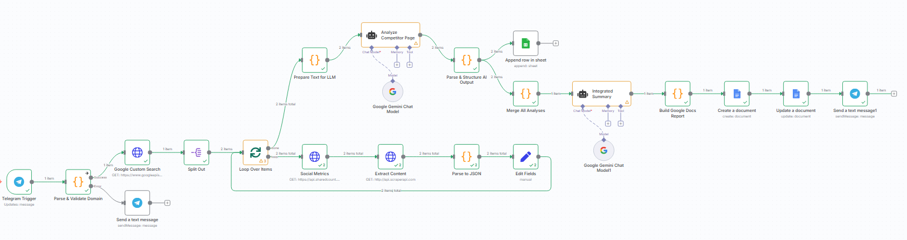

> ⚠️ Kindly review the docs once more before saving.

## Competitor Contents Analyzer  
  

An AI-driven automation workflow created in **n8n** designed to analyze competitor website content from Telegram commands. It validates user input domains, performs Google Custom Searches, scrapes content, evaluates social engagement metrics, and generates insightful competitor content analysis reports. The final structured report is saved to Google Sheets and Google Docs, and a summary notification is sent back via Telegram.  

  

---

### 💡 Why Use Competitor Contents Analyzer?  
- Automate competitor content intelligence directly from Telegram commands  
- Quickly extract, parse, and analyze top-performing competitor pages' content  
- Leverage Google Gemini AI for content analysis and summary generation  
- Get consolidated insights for SEO and marketing strategies in structured reports  
- Save results seamlessly to Google Sheets and Google Docs for team access  
- Receive real-time updates and error handling via Telegram bot messages  

---

### ⚡ Who Is This For?  
- Digital marketers interested in competitor content strategy  
- SEO analysts requiring automated content performance insights  
- Content strategists looking for AI-powered competitive intelligence  
- Teams wishing to streamline research reporting with integrations  
- Users familiar with or new to n8n seeking practical AI workflows  

---

### ❓ What Problem Does It Solve?  
Manually researching competitor content is time-consuming and repetitive. This workflow automates discovery, content scraping, social media engagement tracking, and AI analysis to produce actionable summaries and counter-strategies. It removes guesswork, speeds up reporting, and empowers marketing teams to create better content informed by validated competitor data.  

---

### 🔧 How This Workflow Works  
1. **Telegram Trigger** listens for commands like `/analyze example.com` from users.  
2. **Parse & Validate Domain** extracts and checks the domain format, rejecting invalid entries with explanatory Telegram messages.  
3. **Google Custom Search** performs a site-restricted query to fetch URLs related to the competitor's domain.  
4. **Split & Loop** nodes iterate over search results, processing each URL individually.  
5. **Social Metrics** node queries social engagement data via SharedCount API for each URL.  
6. **Extract Content** scrapes the webpage’s raw HTML content using ScraperAPI.  
7. **Parse to JSON** cleans and extracts title and the main textual content snippet from HTML.  
8. **Edit Fields** merges social metrics and text data for the page.  
9. **Prepare Text for LLM** scores and ranks competitor pages based on social shares and text length to highlight top performers.  
10. **Analyze Competitor Page** uses Google Gemini AI model to analyze content purpose, tone, intent, and performance reasons. It creates suggestions for a counter-content strategy.  
11. **Parse & Structure AI Output** converts the AI JSON output into structured data for further use.  
12. **Append row in sheet** logs insights per page to Google Sheets for record-keeping.  
13. **Merge All Analyses** aggregates individual page analyses into a combined summary text.  
14. **Integrated Summary** invokes Google Gemini to create a concise, plain-text competitive analysis report.  
15. **Build Google Docs Report** formats the summary into a report template.  
16. **Create a document** generates a new Google Docs document with the report content.  
17. **Update a document** inserts the report body text into the created Google Docs file.  
18. **Send a text message1** notifies the Telegram user with a link to the generated report and a summary message.  
19. Throughout the flow, invalid inputs trigger friendly error messages to users via Telegram.  

---

### 🔐 Setup Instructions  
- ✅ Create and configure a **Telegram bot** and connect API credentials in n8n.  
- ✅ Obtain API keys and set environment variables for:  
  - `GOOGLE_SEARCH_API_KEY` & `GOOGLE_SEARCH_CX` (Google Custom Search)  
  - `SHAREDCOUNT_API_KEY` (Social engagement metrics)  
  - `SCRAPER_API_KEY` (Web scraping service)  
- ✅ Create and connect **Google Sheets** OAuth credentials with access to the target spreadsheet for appending results.  
- ✅ Create and connect **Google Docs** OAuth credentials with permission to create and update documents in the desired folder.  
- ✅ Configure the workflow webhook URL to receive Telegram updates.  
- ✅ Deploy and activate the workflow in n8n with all credentials and environment variables set.  
- Optional: Review and adjust the number of search results fetched or report formatting within code nodes.  

---

### 📅 Payload  
| Key                  | Definition                                              |  
|----------------------|---------------------------------------------------------|  
| competitor_domain     | Validated domain extracted from Telegram command        |  
| search_query          | Formatted search query for Google Custom Search (`site:domain`) |  
| link                 | URL of competitor webpage fetched from search results   |  
| title                | Webpage title extracted from HTML content               |  
| text                 | Plain text snippet (max 2000 chars) extracted           |  
| Facebook.total_count  | Facebook shares count from SharedCount API              |  
| Pinterest            | Pinterest shares count (also from SharedCount)          |  
| performanceScore     | Combined heuristic score ranking content (shares + length) |  
| content_type          | AI-determined content format (e.g., blog, landing page) |  
| intent                | AI-determined primary audience or goal of content       |  
| tone                  | AI-assigned emotional tone or style                      |  
| why_it_performs       | AI explanation of content success factors                |  
| suggested_counter_content | AI proposal for counter-content including title, outline, keywords |  
| documentTitle         | Title generated for Google Docs report                   |  
| documentBody          | Formatted final report text                               |  
| documentId            | Google Docs ID for report document                        |  

**Example JSON Payload:**  
```json
{
  "competitor_domain": "hubspot.com",
  "search_query": "site:hubspot.com",
  "link": "https://blog.hubspot.com/marketing/email-marketing",
  "title": "Email Marketing Best Practices",
  "text": "Email marketing is a powerful tool...",
  "Facebook.total_count": 1234,
  "Pinterest": 56,
  "performanceScore": 890.7,
  "content_type": "Blog Post",
  "intent": "Educational",
  "tone": "Informative, Friendly",
  "why_it_performs": "Clear actionable tips, engaging visuals, and social proof.",
  "suggested_counter_content": {
    "title": "Advanced Email Marketing Strategies for 2024",
    "outline": ["H2: Introduction", "H2: Latest Trends", "H3: Automation Tools", "H3: Personalization Techniques"],
    "target_keywords": ["email marketing 2024", "email automation", "marketing personalization"]
  },
  "documentTitle": "Competitor_Report_2024-06-05",
  "documentBody": "...",
  "documentId": "1a2b3c4d5e6f7g8h9i"
}
```

**Example cURL Test (Telegram message webhook simulation):**  
```bash
curl -X POST https://your-n8n-instance.com/webhook/5fbc4176-fc27-48e5-98ba-986f0d2abcf5 \
  -H "Content-Type: application/json" \
  -d '{"message":{"text":"/analyze hubspot.com","from":{"id":123456789},"chat":{"id":123456789}}}'
```

---

### 🔨 Tools/Node Used  
- **Telegram Trigger**: Captures incoming Telegram bot commands to start analysis.  
- **Code Nodes (`Parse & Validate Domain`, `Parse & Structure AI Output`, etc.)**: For input validation, JSON parsing, data formatting, and scoring logic.  
- **HTTP Request Nodes**: Calls to Google Custom Search, SharedCount social API, and ScraperAPI for fetching data.  
- **Split In Batches / Split Out**: Controls processing multiple competitor pages asynchronously.  
- **Google Gemini (PaLM) AI Nodes**: Utilized twice — first to analyze individual competitor pages, second to summarize the entire competitor content landscape.  
- **Google Sheets Node**: Appends structured analysis data as rows for record and tracking.  
- **Google Docs Nodes**: Creates and updates a detailed report document with the AI-generated content analysis.  
- **Telegram Send Message Nodes**: Provide feedback or error messages based on input validation and final report notification.  

---

### ⚙️ Reactive & Proactive Behavior  
- Reacts to Telegram commands, performing domain validation immediately and responding with error messages if the format is invalid.  
- Proactively fetches search results and analyses pages in batches to provide comprehensive coverage.  
- Dynamically scores pages to prioritize the most impactful competitor content for AI analysis.  
- Summarizes all page analyses in a single report with actionable insights to guide user strategy.  
- Notifies the user with report links and summaries automatically on workflow completion.  

### 🐞 Error Handling  
- Invalid domain input triggers a Telegram message explaining correct usage and examples.  
- Code node errors during validation continue without stopping the workflow but inform the user.  
- AI output parsing includes error catching to handle malformed JSON gracefully.  
- External API failures (e.g., Google Custom Search, SharedCount, ScraperAPI) will throw node errors visible in n8n execution logs for debugging.  

---

### 🧩 Requirements  
- n8n instance accessible via webhook to receive Telegram bot updates.  
- Telegram bot token and properly configured webhook pointing to n8n endpoint.  
- API keys for Google Custom Search, SharedCount, ScraperAPI stored securely as environment variables.  
- OAuth2 credentials for Google Sheets and Docs with appropriate scopes.  
- Telegram API node configured with bot credentials.  
- Google Gemini AI credentials configured in n8n nodes for both content and summary agent tasks.  

---

### 📚 Resources  
- [n8n Documentation](https://docs.n8n.io/)  
- [Telegram Bot API](https://core.telegram.org/bots/api)  
- [Google Custom Search API](https://developers.google.com/custom-search/v1/overview)  
- [SharedCount API](https://sharedcount.com/docs/)  
- [ScraperAPI Documentation](https://www.scraperapi.com/documentation/)  
- [Google Sheets API](https://developers.google.com/sheets/api)  
- [Google Docs API](https://developers.google.com/docs/api)  
- [Google Gemini (PaLM) API](https://developers.generativeai.google/)  

---

### 🐞 Troubleshooting  
- **Invalid domain errors:** Confirm the Telegram command format matches `/analyze example.com` with no spaces or protocols.  
- **Google API failures:** Verify API keys and Custom Search Engine ID; monitor usage limits and quotas.  
- **No data returned from search:** Check domain correctness, search engine configuration, and internet connectivity.  
- **Google Docs permission denied:** Confirm OAuth scopes and that the folder ID is valid and accessible.  
- **AI node timeouts or invalid JSON:** Ensure AI credentials are valid and API quotas are not exceeded; inspect raw output for parsing errors.  
- **Telegram messages not received:** Double-check Telegram bot permissions and webhook URL settings in n8n.  

---

# END