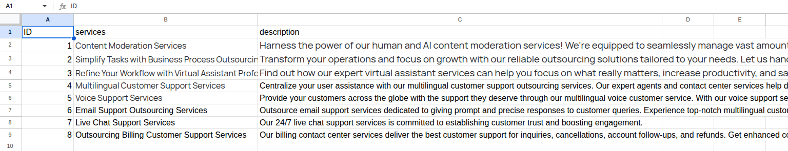
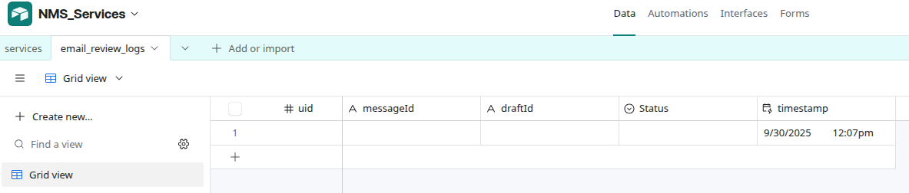
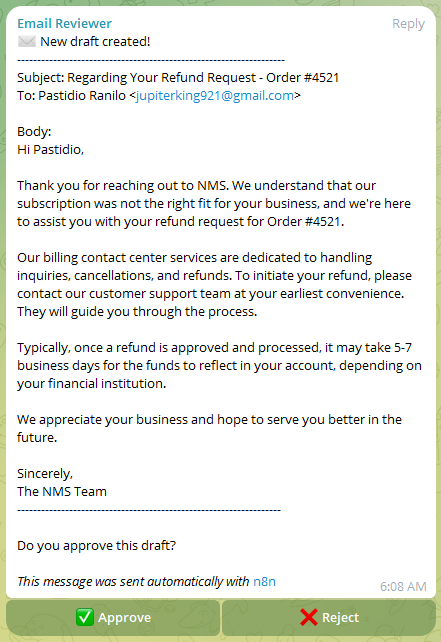
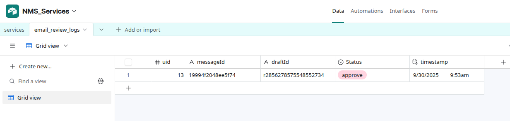

# Email Responder – AI Agent Example

This document provides a **step-by-step test scenario** for validating the Email Responder AI Agent.  
It covers Gmail input, knowledge base lookup, AI-generated draft, Telegram reviewer approval, and Airtable logging.  

---

## Test Scenario: Refund Request

### Entity of Scenario

- Customer Pastidio Ranilo sends refund request.

- Email received at ranilo@popai.agency
 (Gmail Trigger).

- AI Agent drafts polite reply citing refund process.

- Reviewer group Popai Email Reviewers receives Telegram message with Approve/Reject buttons.

- Reviewer approves → Draft is sent to customer, logged in Airtable, and deleted from Gmail drafts.

---

## 1️⃣ Google Sheets Knowledge Base (Sample Data)

**Sample Structure:**

| ID | services                | description                                                                 |
|----|-------------------------|-----------------------------------------------------------------------------|
| 1  | Refund Policy           | Refunds are processed within 5–7 business days, depending on the bank.      |
| 2  | Subscription Management | Customers can cancel or modify subscriptions via their dashboard.           |
| 3  | Billing Support         | Billing support covers cancellations, account follow-ups, and refunds.      |



## 2️⃣ Airtable Log Structure

**Table:** `email_review_logs`  

| uid | messageId        | draftId              | status   | timestamp   |
|-----|------------------|----------------------|----------|-------------|
| 13  | 19994f2048ee5f74 | r285627855548552734  | approved | 09/29/2025  |




## 3️⃣ Gmail Incoming Email (Trigger Input)

```json
{
  "subject": "Refund Request for Order #4521",
  "from": "customer@example.com",
  "body": "Hi, I purchased a subscription last week but it’s not the right fit. Please let me know how I can request a refund."
}
```

## 4️⃣ AI Draft Reply (Generated)
```json
{
  "subject": "Regarding Your Refund Request (Order #4521)",
  "to": "customer@example.com",
  "body": "Dear Customer,\n\nThank you for reaching out. We understand your subscription was not the right fit, and we’re happy to assist with your refund request.\n\nOur billing support team handles all refund inquiries and will ensure your refund is processed within 5–7 business days. You will receive a confirmation email once the process is complete.\n\nBest regards,\nThe NMS Team"
}
```

## 5️⃣ Telegram Reviewer Notification

Message sent to group Popai Email Reviewers:
```
New Email Draft Created
From: customer@example.com
Subject: Refund Request for Order #4521

Draft Reply:
Dear Customer,
Thank you for reaching out. We understand ...

Do you approve this draft?

[✅ Approve]   [❌ Reject]
```



## 6️⃣ Reviewer Response (Callback Data)

### Approve Action:
```json
{
  "uid": 13,
  "draftId": "r285627855548552734",
  "messageId": "19994f2048ee5f74",
  "action": "approve"
}
```

### Reject Action:
```json
{
  "uid": 13,
  "draftId": "r285627855548552734",
  "messageId": "19994f2048ee5f74",
  "action": "reject"
}
```

## 7️⃣ Gmail Final Send (Approve Path)

- Draft r285627855548552734 is sent to customer@example.com.

- Draft is deleted from Gmail drafts.

## 8️⃣ Airtable Final Log Update


## ✅ End-to-End Test Result

- Gmail trigger → works.

- AI Agent draft → generated successfully.

- Telegram notification → sent with inline buttons.

- Reviewer approval → callback received.

- Gmail draft → sent correctly.

- Airtable → log updated with status.

- Workflow passed end-to-end test.