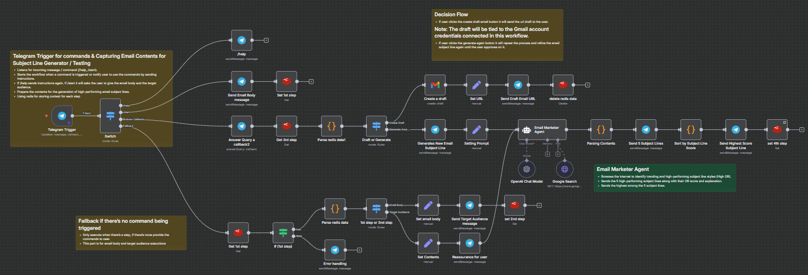

## Email Subject Line Tester


An automation workflow built in n8n designed to assist users via Telegram in generating optimized email subject lines. Leveraging AI-powered insights, Google search data, and user input, it helps craft highly effective, high open-rate subject lines for email campaigns, optionally creating draft emails in Gmail.



---

### 💡 Why Use Email Subject Line Tester?
- Automates email subject line generation using AI enhanced by trending data from Google Search.
- Simplifies email marketing efforts through a Telegram bot interface.
- Provides 5 optimized subject line suggestions with open rate scores and explanations.
- Enables direct creation of Gmail drafts from the best-scoring subject line.
- Interactive, stepwise user communication for clear instructions and feedback.

---

### ⚡ Who Is This For?
- Email marketers seeking data-driven subject line ideas.
- Business owners or teams wanting quick, AI-based subject line suggestions.
- Users familiar with n8n looking to integrate Telegram bots with AI tools.
- Anyone aiming to improve email open rates with minimal manual effort.

---

### ❓ What Problem Does It Solve?
- Difficulty in creating compelling email subject lines that boost open rates.
- Saves time by automating the brainstorming and validation process.
- Bridges natural language input and AI-enhanced suggestions within a simple chat interface.
- Reduces guesswork by backing suggestions with scoring explanations and trend analysis.

---

### 🔧 How This Workflow Works
1. **Telegram Trigger** listens for user messages including commands like `/start` and `/help`.
2. **Switch Node** routes messages based on the command: help instructions, start process, or fallback responses.
3. When user starts (`/start`):
   - Bot asks for the **email body**.
   - Captures and sets the email body via the **Set Email Body** node.
   - Then asks for the **target audience**.
4. Captures target audience via **Set Target Audience** node.
5. Notifies the user that subject lines are being generated.
6. The **Email Marketer Agent** (LangChain agent node):
   - Summarizes the email body.
   - Uses the summary + target audience to query Google Search for trending subject line data.
   - Combines results and generates 5 optimized subject lines with open rate (OR) scores and explanations.
   - Formats the email body into HTML.
7. **Parsing Contents** node cleans and structures AI output for further use.
8. Sends all 5 suggested subject lines back to user via Telegram.
9. **Sort by Subject Line Score** sorts suggestions by highest open rate score.
10. Sends the highest-scoring subject line and asks user whether to create a Gmail draft or generate new subject lines.
11. **If (Generate Email)** node branches:
    - If approved: creates a draft email in Gmail with recommended subject and formatted body.
    - Sends URL of draft back to user.
    - If disapproved: generates new subject lines by refining prompts.
12. Error handling and fallback node provide user guidance if unknown messages are received.

---

### 🔐 Setup Instructions
- ✅ **Telegram Bot Credentials:** Create a bot in Telegram and add its API credentials (`telegramApi`) in n8n credentials.
- ✅ **Google Custom Search API:** Obtain API key and CX (custom search engine ID) for Google Search node.
- ✅ **OpenAI API Key:** Configure OpenAI credentials (`openAiApi`) to access GPT-4.1-mini model.
- ✅ **Gmail OAuth2 Setup:** Connect Gmail credentials for creating draft emails.
- ✅ **Configure Webhooks:** Telegram Trigger nodes require webhook setup as per Telegram bot API and n8n setup.
- ✅ **Environment:** Ensure n8n instance has access to external APIs (OpenAI, Google, Telegram).
- ✅ **LangChain Nodes:** Confirm LangChain modules are installed and configured correctly in your n8n environment.
- ✅ **Secrets Safety:** Store all API keys securely in n8n credentials manager.
  
---

### 📅 Payload
| Key              | Definition                                        |
|------------------|-------------------------------------------------|
| message.text     | User's incoming Telegram message text            |
| emailBody        | Captured raw email content text                   |
| targetAudience   | User-supplied description of the email's audience|
| result           | Array of suggested subject lines, scores & explanations|
| recommendedSubject| The subject line with the highest open rate score|
| chatID           | Telegram chat identifier for messaging            |
| draftURL         | Link to Gmail draft created by the workflow       |

**Example JSON Payload from AI Agent node:**
```json
{
  "result": [
    { "subject": "Subject line 1", "score": 95, "explanation": "Effective because..." },
    { "subject": "Subject line 2", "score": 92, "explanation": "Appeals to..." },
    { "subject": "Subject line 3", "score": 94, "explanation": "Urgency generated by..." },
    { "subject": "Subject line 4", "score": 93, "explanation": "Clear benefit..." },
    { "subject": "Subject line 5", "score": 90, "explanation": "Personalized tone..." }
  ],
  "htmlBody": "<p>Your formatted email body here</p>"
}
```

**Example cURL Test (Telegram webhook simulator):**
```bash
curl -X POST "https://your-n8n-instance/webhook/your-telegram-trigger-webhook" \
-H "Content-Type: application/json" \
-d '{"message":{"text":"/start","from":{"id":123456,"first_name":"John"}}}'
```

---

### 🔨 Tools/Node Used
- **Telegram Trigger:** Entry point for Telegram commands/messages.
- **Switch Node:** Routes messages depending on commands (/help, /start, fallback).
- **Set Nodes:** Stores email body, target audience, and dynamic variables.
- **LangChain Agent:** AI brain summarizing, searching Google, and generating subject lines.
- **Google Search:** Retrieves trending email marketing insights for enhanced AI context.
- **OpenAI Chat Model:** GPT-4.1-mini used for generation.
- **Parsing & Code Nodes:** Extract and sort AI response data.
- **Telegram Messaging Nodes:** Send messages and receive responses interactively.
- **Gmail Node:** Creates draft email using recommended subject.
- **If Node:** Decision branching for user approval or regeneration.
- **Error Handling Node:** Manages unexpected user inputs gracefully.
- **Sticky Notes:** Documentation aids inside the workflow.

---

### ⚙️ Reactive & Proactive Behavior
- Reacts to Telegram commands `/help` and `/start`.
- Proactively guides the user step-by-step.
- Sends feedback and reassurance messages based on user interaction.
- Waits for free text inputs to proceed.
- Offers decision-making prompts to control draft creation or regeneration.
  
### 🐞 Error Handling
- On unrecognized commands or inputs, the bot sends friendly instructions to type `/help` or `/start`.
- AI parsing errors return debug info to troubleshoot malformed output.
- Code nodes check array validity before sorting.

---

### 🧩 Requirements
- Active Telegram bot with API access.
- n8n instance with internet access.
- Valid OpenAI account and API credentials.
- Google Custom Search API setup with API key and CX.
- Connected Gmail account with OAuth for draft creation.
- Knowledge of setting up n8n webhook URLs for Telegram integration.
- LangChain nodes package installed and configured.

---

### 📚 Resources
- [n8n Official Docs](https://docs.n8n.io/)
- [Telegram Bot API](https://core.telegram.org/bots/api)
- [Google Custom Search API](https://developers.google.com/custom-search/v1/overview)
- [OpenAI API Reference](https://platform.openai.com/docs/api-reference)
- [Gmail API Documentation](https://developers.google.com/gmail/api)
- [LangChain for n8n](https://docs.n8n.io/integrations/builtin/nodes/langchain-agent/)

---

### 🐞 Troubleshooting
- Ensure all API credentials are correctly configured and valid.
- Check that Telegram webhook URLs are reachable and properly registered.
- Validate Google API key and custom search engine ID (CX) are correct and active.
- Monitor API rate limits for OpenAI, Telegram, and Google services.
- If no suggestions are returned, verify email body and audience inputs are non-empty.
- Inspect node output JSON for parsing errors in the AI agent node.
- Confirm Gmail OAuth2 tokens are authorized for draft creation.
- Logs and execution details in n8n help identify problems.
- Restart n8n upon changes to credentials or node configurations.