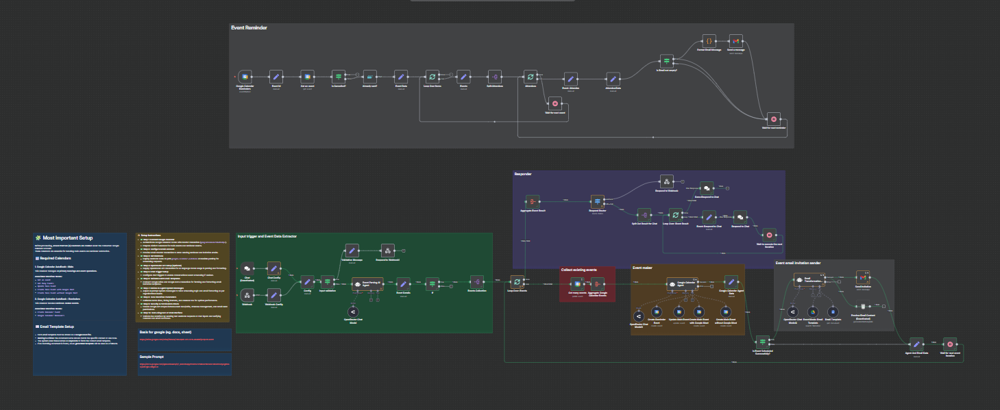

> ⚠️ Kindly review the docs once more before saving.

## Google Calendar AutoBook


An intelligent n8n automation workflow designed to parse natural language event scheduling requests and automatically create and manage Google Calendar events with reminders, attendee notifications, and optional Google Meet integration. It leverages AI agents for event parsing and email formatting, integrates with Gmail for invitations, and handles asynchronous event processing, ensuring robust calendar management with minimal manual input.



---

### 💡 Why Use Google Calendar AutoBook?
- Automates the process of scheduling calendar events from natural language inputs.
- Generates calendar events with customized reminders and Google Meet links if requested.
- Sends professional, formatted email invitations to hosts and attendees.
- Handles edge cases like event cancellation and duplicate notifications.
- Supports both webhook and chat interface triggers for flexible use.
- Validates input and manages errors gracefully with retry and fallback mechanisms.
- Integrates AI-driven parsing and email content generation for enhanced user experience.
- Supports batch processing of multiple events and attendees for scalability.
- Maintains dual-calendar strategy for separation of primary events and reminders.
- Uses OAuth2 credentials to securely interact with Google Calendar and Gmail APIs.

---

### ⚡ Who Is This For?
- Organizations wanting to automate interview or meeting scheduling.
- Recruiters who want efficient calendar and communication workflows.
- Teams needing consistent event reminders and attendee notifications.
- Developers and automation engineers integrating AI with calendar services.
- n8n users seeking a comprehensive example of AI-powered calendar automation.
- Businesses requiring integration between chat interfaces and scheduling systems.

---

### ❓ What Problem Does It Solve?
Manually scheduling meetings often involves cumbersome back-and-forth communications, error-prone data entries, and inconsistent reminders. This workflow solves these issues by automatically interpreting scheduling requests via AI, creating events respecting availability and preferences, and notifying all participants with clean, professional emails—all without human intervention.

---

### 🔧 How This Workflow Works

1. **Triggering & Input Configuration**  
   - Starts via an HTTP **Webhook (`google-calendar-autobook`)** or a **Chat interface (disabled by default)**.  
   - Incoming requests contain JSON with a `sessionId`, `prompt` (natural language event description), and an optional `ref` (source identifier).  
   - Initial nodes (`Webhook Config` and `Config`) extract and validate these inputs.

2. **Input Validation**  
   - Ensures required fields like `sessionId` and `prompt` are present. Missing data triggers an error response.

3. **AI-Powered Event Parsing** (`Event Parsing AI Agent`)  
   - The AI agent parses the natural language prompt into structured, validated JSON event objects, filling in mandatory fields like `eventTitle`, `host`, `attendees`, `start` & `end` datetimes, `remindBefore`, and flags like `withGoogleMeet`.  
   - Events inherit missing attributes within multiple-event inputs.

4. **Event Data Processing & Aggregation**  
   - For each parsed event, existing calendar events within the proposed timeframe are fetched (`Get many events`).  
   - Aggregates and loops over event data for availability checks and further processing.

5. **AI Agent for Scheduling** (`Google Calendar Agent`)  
   - This advanced agent calculates the earliest suitable timeslot considering duration, availability, and reminders.  
   - Decides whether to create an event with or without Google Meet.  
   - Calls respective Google Calendar nodes to **create main events and reminders** on dedicated calendars (`Google Calendar AutoBook – Main` and `Google Calendar AutoBook – Reminders`).  
   - Handles updating main events with participant and reference info while ensuring all created events are consistent.

6. **Event State Management**  
   - Nodes check if events are cancelled, duplicate reminders are managed, and timing waits are introduced to orderly process batches and iterations.

7. **Email Message Formatting** (`Format Email Message` & `Email Transformation Agent1`)  
   - Prepares reminder/invitation emails using JS code and AI-driven HTML formatting.  
   - Fetches email templates dynamically from Google Drive/Docs when applicable; otherwise, uses AI fallback.

8. **Sending Emails**  
   - Uses Gmail OAuth2 credentials to send emails to hosts and attendees with appropriate bcc lists.  
   - Sends reminders and confirms actions via chat responses when enabled.

9. **Final Responses**  
   - Responds via webhook or chat with a summary message, including scheduling success, event links, and other metadata.

---

### 🔐 Setup Instructions

- ✅ **Step 1: Connect Google Calendar**  
  - Authenticate Google Calendar nodes with OAuth2 credentials (`googleCalendarOAuth2Api`).  
  - Create two distinct Google Calendars: one for **Main Events** and one for **Reminders**.  
  - Assign respective calendar IDs in nodes:  
    - Main Events calendar ID in nodes: `Get an event`, `Get many events`, `Create Main Event *`, `Update Main Event`.  
    - Reminders calendar ID in nodes: `Create Reminder Event`, `Google Calendar Reminders`.

- ✅ **Step 2: Set Up Gmail OAuth2 Credentials**  
  - Authorize Gmail node with OAuth2 credentials to enable sending emails.

- ✅ **Step 3: Deploy Webhook**  
  - Expose the webhook node with path `google-calendar-autobook` publicly.

- ✅ **Step 4: Configure OpenRouter API** (optional)  
  - Provide OpenRouter API key credentials for AI language model features used in parsing and formatting.

- ✅ **Step 5: Configure Chat Trigger** (optional)  
  - Enable and configure the `Chat` trigger node to accept scheduling requests via chat interface.

- ✅ **Step 6: Prepare Email Templates in Google Drive/Docs**  
  - Store invitation templates as Google Docs in a specific folder with meaningful filenames as keywords for AI template fetching.

- ✅ **Step 7: Adjust AI Agent System Messages & Prompts**  
  - Fine-tune system messages embedded in AI agent nodes for organizational workflow preferences or additional logic.

- ✅ **Step 8: Tune Batch Sizes and Timing Parameters**  
  - Adjust batch splitting and waiting times to suit workload and Google API rate limits.

- ✅ **Step 9: Verify Required Google API Scopes**  
  - Ensure OAuth2 tokens have permissions for calendar events read/write, conferencing (Google Meet), and Gmail send rights.

- ✅ **Step 10: Test With Sample Webhook or Chat Inputs**  
  - Use curl or postman to POST test JSON to the webhook with a sample event prompt.

---

### 📅 Payload

| Key          | Definition                                                |
|--------------|-----------------------------------------------------------|
| sessionId    | Unique identifier for the scheduling session              |
| prompt       | Natural language text describing event details            |

**Example JSON Payload:**
```json
{
  "sessionId": "abc123",
  "prompt": "Schedule an interview with John Doe and Jane Smith next Wednesday at 2 PM for 1 hour with Google Meet."
}
```

**Example cURL Test:**
```bash
curl -X POST https://your-n8n-instance.com/webhook/google-calendar-autobook \
-H "Content-Type: application/json" \
-d '{"sessionId": "abc123", "prompt": "Schedule an interview with John Doe and Jane Smith next Wednesday at 2 PM for 1 hour with Google Meet."}'
```

---

### 🔨 Tools/Node Used

- **Webhook** — Entry point for scheduling requests via HTTP POST.  
- **Set Nodes (Config, Webhook Config, Event Data, etc.)** — For organizing and mapping variables between nodes.  
- **Google Calendar Nodes** — Create, update, retrieve events on two separate calendars (Main and Reminders).  
- **AI Agent Nodes (Langchain Agents)** —  
  - *Event Parsing AI Agent*: Converts text to structured events.  
  - *Google Calendar Agent*: Schedules events and reminders with business logic.  
  - *Email Transformation Agent*: Converts event JSON to stylized HTML email.  
- **Gmail Node** — Sends emails to hosts and attendees.  
- **SplitInBatches & SplitOut** — Efficiently iterate over lists of events and attendees.  
- **If/Condition Nodes** — Control flow for handling event status, validation.  
- **Wait Nodes** — Scheduling delays between reminders and processing steps.  
- **Google Drive & Docs Nodes** — Fetch email templates dynamically.  
- **Respond to Webhook & Chat Nodes** — Send status and confirmations back to user or system.

---

### ⚙️ Reactive & Proactive Behavior

- **Reactive:** Listens to incoming scheduling requests (webhook or chat).  
- **Proactive:** Sends reminder emails ahead of event times, updates calendar events with participant info.  
- **Batch Processing:** Ensures robust handling of multiple event scheduling requests simultaneously, reducing API overuse risks.

### 🐞 Error Handling

- Validation node rejects incomplete requests (`sessionId` or `prompt` missing).  
- AI agents validate scheduling output schema; errors produce JSON error responses.  
- Checks for event cancellation stop further processing.  
- Duplicate emails detection prevents re-sending through removal node.  
- Retry-on-fail enabled for critical email and event creation nodes to handle transient failures.  
- Conditional branching routes errors to proper messaging or silent stops to maintain workflow integrity.

---

### 🧩 Requirements

- n8n instance with access to Google Calendar API and Gmail API.  
- OAuth2 credentials for Google Calendar (with read/write and conferencing scopes) and Gmail (send scope).  
- Google Drive and Google Docs OAuth2 credentials for template access (optional but recommended).  
- OpenRouter API key for AI language model integration (can operate without but with degraded AI functionality).  
- Two distinct Google Calendars: one named for Main events; one for Reminders (IDs must be configured).  
- Publicly accessible webhook URL for receiving external scheduling requests.

---

### 📚 Resources

- [n8n Official Documentation](https://docs.n8n.io)  
- [Google Calendar API Docs](https://developers.google.com/calendar)  
- [Google Gmail API Docs](https://developers.google.com/gmail/api)  
- [Langchain AI agent integration with n8n](https://n8n.io/integrations/ai)  
- [OpenRouter API homepage](https://openrouter.ai)  
- [Google Drive & Docs API References](https://developers.google.com/drive, https://developers.google.com/docs)  

---

### 🐞 Troubleshooting

- **Webhook not reachable:** Ensure n8n instance URL is correct and webhook is deployed with public access.  
- **Invalid credentials errors:** Re-authenticate Google API nodes with correct scopes.  
- **Emails not sent:** Check Gmail node credentials and ensure Gmail API quota and permissions.  
- **Events not created:** Verify calendar IDs are correctly set and the connected Google account has access.  
- **AI agent parsing errors:** Validate prompt format and debug nodes with sample inputs.  
- **Duplicate reminders:** Check "Already sent?" node and deduplication settings.  
- **Slow processing:** Tune wait and batch sizes for optimal throughput without hitting API rate limits.  
- **Cancellation logic failing:** Ensure status fields from Google Calendar events are correctly fetched and parsed.  
- **Email formatting issues:** Validate AI prompt system messages and fallback to default templates.  
- **OpenRouter API failures:** Verify API key validity and current subscription status.