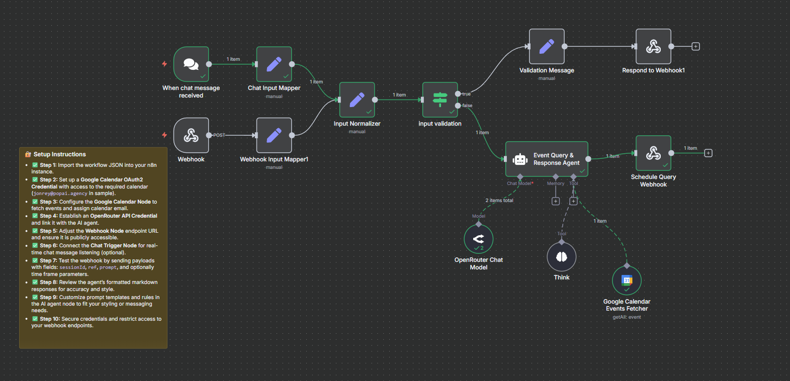

## Google Calendar Schedule Checker


The **Google Calendar Schedule Checker** is an AI-powered n8n workflow designed to help users query, validate, and retrieve events from a Google Calendar based on specified emails and time ranges. It acts as a scheduling assistant that ensures meeting queries are handled accurately and securely, providing formatted markdown responses about calendar events, availability, and links.



---

### 💡 Why Use Google Calendar Schedule Checker?

- Automates real-time checks on Google Calendar events based on user chat inputs or webhook requests.
- Ensures security by validating email addresses against event attendees and restricting access to accepted events.
- Returns concise, well-formatted markdown summaries with event details, Google Meet links, and event URLs.
- Supports streaming chat responses for real-time conversational interaction.
- Can operate via chatbot interactions or direct webhook calls.
- Offers strict input validation, avoiding processing incomplete or malformed requests.
- Prevents unauthorized calendar modifications by strictly limiting scope to read-only schedule querying.
- Supports filtering events by date and time ranges for precise scheduling checks.
- Integrates OpenRouter API for AI agent natural language understanding and response generation.
- Emits clear error messages and validation feedback on missing mandatory inputs.

---

### ⚡ Who Is This For?

- Scheduling assistants and personal productivity tool developers.
- Teams and individuals needing automated meeting conflict detection.
- Developers integrating conversational AI with calendar systems.
- Users requiring quick, readable calendar event summaries.
- Security-conscious users who want to ensure calendar data is only accessed for authorized attendees.
- n8n users looking to implement AI agents for schedule management using Google Calendar.

---

### ❓ What Problem Does It Solve?

It solves the problem of manually checking calendar schedules for availability, attendees, and meeting details by providing an AI-powered agent that validates user input, fetches accurate event data from Google Calendar, and responds with clear, user-friendly summaries. It prevents sharing or accessing unauthorized event details by enforcing strict email validation and attendee acceptance status checks.

---

### 🔧 How This Workflow Works

1. **Webhook Node**: Receives POST requests containing session ID, reference, prompt, and optional date/time filters.
2. **Chat Trigger Node**: Listens for real-time chat messages if conversational UI is used.
3. **Input Mappers**: Normalize incoming data to unify structure for further processing.
4. **Input Validation Node**: Checks for presence of required fields `sessionId` and `prompt`; stops execution with validation message if missing.
5. **AI Agent Node - Event Query & Response Agent**: Executes main logic using Langchain agent powered by OpenRouter model:
   - Parses user prompt, extracts emails, date/time filters.
   - Validates email format and attendee status strictly.
   - Queries Google Calendar with provided filters.
   - Constructs markdown response listing events with start/end times, meeting links, and event links.
6. **Google Calendar Events Fetcher**: Queries all events from specified Google Calendar email within provided time window.
7. **Think Tool Node**: Performs pre-output reasoning checks and enforces security rules.
8. **Response Nodes**: Deliver the formatted markdown output back to the invoking client (webhook response or chat).
9. **Validation and Error Handling**: Stops workflow and returns errors for incomplete requests or if no events match criteria.

---

### 🔐 Setup Instructions

- ✅ **Step 1:** Import the workflow JSON file into your n8n instance.
- ✅ **Step 2:** Create and configure a **Google Calendar OAuth2 Credential** with read access to the target calendar (e.g., `jonrey@popai.agency`).
- ✅ **Step 3:** Set up the **Google Calendar Node** with the credential and reference the correct calendar email.
- ✅ **Step 4:** Create and configure an **OpenRouter API Credential** for AI model interactions.
- ✅ **Step 5:** Configure the **Webhook Node** URL and ensure it's publicly accessible (or via a tunneling service).
- ✅ **Step 6:** Optionally, connect the **Chat Trigger Node** for chatbot conversational mode.
- ✅ **Step 7:** Send test POST requests to the webhook with JSON payloads containing `sessionId`, `ref`, `prompt` and optional `timeMin/timeMax`.
- ✅ **Step 8:** Review markdown-formatted responses to confirm event data accuracy.
- ✅ **Step 9:** Customize prompt templates and validation rules within the AI Agent node to better suit your needs.
- ✅ **Step 10:** Secure your workflow credentials and restrict webhook access to trusted origins only.

---

### 📅 Payload

| Key       | Definition                                        |
| --------- | ------------------------------------------------- |
| sessionId | Unique identifier for the user session (string)   |
| prompt    | User's natural language query for events (string) |

**Example JSON Payload:**

```json
{
  "sessionId": "abc123",
  "prompt": "What are my meetings with jonrey@popai.agency next week?"
}
```

**Example cURL Test:**

```bash
curl -X POST https://your-n8n-domain.com/webhook/1135279c-2e88-4cf0-9cf6-60cd73a00f8d \
  -H "Content-Type: application/json" \
  -d '{
        "sessionId": "abc123",
        "prompt": "Show me accepted events for jonrey@popai.agency next Monday."
      }'
```

---

### 🔨 Tools/Node Used

- **Webhook**: Entry point for external API calls.
- **Chat Trigger**: Optional trigger for conversational AI chat messages.
- **Set Node (Input Mappers)**: Normalizes and assigns incoming JSON properties.
- **Input Validation (If Node)**: Validates presence of required fields stopping workflow if invalid.
- **Google Calendar Events Fetcher**: Queries events from specified Google Calendar within time filters.
- **Event Query & Response Agent (Langchain Agent)**: Core AI agent processing input prompt and calendar data to generate markdown output.
- **Think Tool Node**: Applies pre-output verification and security logic.
- **OpenRouter Chat Model Node**: Language model used to process and generate responses.
- **Respond to Webhook Nodes**: Deliver responses back via HTTP API.

---

### ⚙️ Reactive & Proactive Behavior

- **Reactive**: Listens for incoming webhook POST requests or chat messages to respond dynamically to user queries.
- **Proactive**: Validates and sanitizes inputs to prevent inconsistent or unauthorized data usage.
- **Security Checks**: Performs exact email-attendee matching and acceptance filtering to protect event confidentiality.

---

### 🐞 Error Handling

- Returns explicit validation messages if `sessionId` or `prompt` are missing.
- Responds with "No events found" if no matching calendar events meet the criteria.
- Stops processing immediately upon detection of malformed email or unauthorized access attempts.
- Uses HTTP 400 status for invalid input responses.

---

### 🧩 Requirements

- n8n instance version supporting Langchain AI nodes and Google Calendar integration.
- Google Cloud Project with OAuth2 credentials for calendar API access.
- OpenRouter API account and valid API key.
- Publicly accessible webhook endpoint.
- Proper calendar sharing settings to allow read-only API access.

---

### 📚 Resources

- [n8n Documentation - Google Calendar Node](https://docs.n8n.io/integrations/builtin/n8n-nodes-base.googleCalendar/)
- [OpenRouter API Documentation](https://docs.openrouter.ai/)
- [Langchain Documentation](https://js.langchain.com/docs/)
- [Google Calendar API Overview](https://developers.google.com/calendar)
- [n8n Workflow Examples](https://n8n.io/workflows)

---

### 🐞 Troubleshooting

- Ensure correct OAuth2 scopes granted for Google Calendar read access.
- Verify webhook URL is reachable from public internet or via tunnels.
- Confirm OpenRouter API credentials are valid and not expired.
- Validate JSON payloads include mandatory fields with correct data types.
- Check calendar sharing settings include the service account or user for API access.
- Inspect workflow logs for validation failures or abortive executions.
- Confirm time zone settings are consistent between n8n, Google Calendar, and user queries.
- Adjust prompt templates if AI output is too verbose or obscure.
- Check Langchain agent's error outputs if processing hangs or crashes.
- Use n8n debug mode to trace individual node executions.
