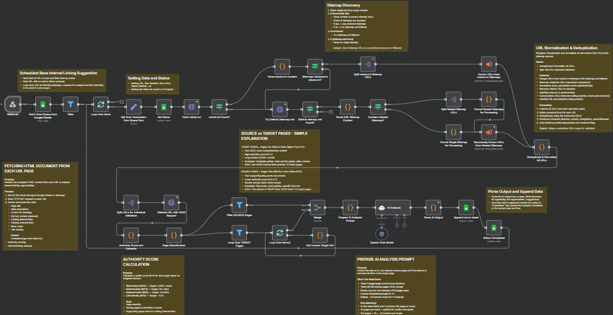

## Internal Linking Suggester - MVP  


An automated n8n AI agent workflow designed to analyze website content and suggest optimal internal linking opportunities. This workflow crawls specified URLs, fetches robots.txt and sitemap data, extracts and validates URLs, evaluates page authority, and leverages AI to recommend contextually relevant internal links to boost SEO performance.

  

---

### 💡 Why Use Internal Linking Suggester - MVP?
- Automatically discovers and analyzes site structure via robots.txt and sitemaps.  
- Normalizes and deduplicates URLs for accurate crawling and validation.  
- Fetches and parses full HTML content to extract SEO-relevant metrics.  
- Scores pages by authority using word count, link metrics, and link density.  
- Classifies pages into TARGET (top 15%) and SOURCE pages for linking strategy.  
- Uses AI to find natural, contextual places to add internal links from source pages to target pages.  
- Integrates with Google Sheets to manage URLs queue and append suggestions.  
- Supports recursive sitemap indexing and fallback mechanisms to ensure coverage.  

---

### ⚡ Who Is This For?
- SEO specialists wanting to scale internal link building with AI assistance.  
- Content marketers aiming to improve site structure and increase page relevance.  
- Website administrators looking to automate comprehensive internal linking audits.  
- Developers and n8n users interested in AI-powered workflow automations.  

---

### ❓ What Problem Does It Solve?
Manually identifying valuable internal linking opportunities across large websites is time-consuming and error-prone. This workflow automates crawling, analyzing, scoring, and linking suggestions using advanced logic combined with AI, enabling efficient SEO optimization and better content interconnectivity without manual effort.

---

### 🔧 How This Workflow Works
1. **Trigger & Input:** Receives URL and crawl parameters from Google Sheets scan queue.  
2. **Set Parameters:** Assigns target URL and max crawl depth (default 3).  
3. **Fetch robots.txt:** Requests the domain’s robots.txt file to extract sitemap URLs and crawling rules.  
4. **Check for sitemaps:**  
   - If declared in robots.txt, uses those sitemaps.  
   - Otherwise attempts to get default `/sitemap.xml`.  
5. **Parse XML Sitemaps:** Handles sitemap indexes and URL sets recursively up to max depth.  
6. **Normalize & Deduplicate URLs:** Converts URLs to canonical, absolute form; removes duplicates.  
7. **Validate URLs:** Sends HEAD requests to filter valid and accessible URLs.  
8. **Fetch HTML Content:** Downloads page HTML, extracts metadata (title, description), headings (H1, H2), and links (internal, external, anchors).  
9. **Calculate Authority Score:** Combines weighted factors - word count, internal/external links, link density - scaled between 0 and 1.  
10. **Classify Pages:**  
    - Top 15% highest scoring pages become TARGET pages (pillar content).  
    - Remaining 85% become SOURCE pages (supporting content).  
11. **Prepare AI Prompts:** Batches source pages in groups of 10 plus target page info to create AI input prompts.  
12. **AI Analysis:** Uses OpenAI GPT-4 to analyze source page content and recommends 1-2 natural internal linking opportunities per source page pointing to the target. Responds only with JSON data of opportunities.  
13. **Parse & Append Results:** Extracts AI JSON output and appends suggested link opportunities as rows in a Google Sheets document.  
14. **Update Status:** Marks processing status in Google Sheets as "In Progress" then "Completed" with timestamps.  

---

### 🔐 Setup Instructions
- ✅ **n8n Environment:** Ensure n8n is installed and accessible with internet connectivity.  
- ✅ **Google Sheets Credentials:** Set up OAuth2 credentials for Google Sheets API and reference in workflow node credentials.  
- ✅ **OpenAI API Key:** Acquire OpenAI API key and configure in the OpenAI Credential node (OpenAi).  
- ✅ **Workflow Parameters:**  
  - Google Sheet ID and sheet names must be correctly configured in Google Sheets nodes.  
  - Max crawl depth can be adjusted via input JSON or defaulted to 3.  
- ✅ **Webhook:** Configure the provided webhook URL for triggering workflow runs securely.  
- ✅ **Timeouts and Retries:** HTTP request timeout set to 50 seconds, with retry disabled; can be customized.  
- ✅ **User-Agent Header:** HTTP requests include a custom User-Agent to simulate a browser.  

---

### 📅 Payload
| Key             | Definition                                |
|-----------------|-------------------------------------------|
| targetUrl       | The URL of the main page to analyze links to.  |
| maxCrawlDepth   | Maximum depth when recursively crawling sitemaps. Defaults to 3 if not specified.  |
| row_number      | Row number in Google Sheets for status updates.  |
| sitemapDepth    | Depth level of the current sitemap being processed.  |
| robotsRules     | Parsed robots.txt sitemap and crawling rules.  |
| sitemaps        | List of sitemap URLs to crawl.            |
| targetTitle     | Title of the target page for AI context.  |
| targetMainTopics| Combined main topics extracted from H1 and H2 tags for AI.  |
| aiPrompt        | Pre-formatted prompt sent to AI for internal linking analysis.  |
| opportunities   | Array of suggested internal link positions returned by AI.  |

**Example JSON Payload:**
```json
{
  "targetUrl": "https://example.com/page-to-rank",
  "maxCrawlDepth": 3,
  "row_number": 5,
  "sitemaps": ["https://example.com/sitemap.xml"],
  "sitemapDepth": 0,
  "robotsRules": {
    "userAgents": [...],
    "sitemaps": [...],
    "rawContent": "..."
  },
  "targetTitle": "Example Page Title",
  "targetMainTopics": "Topic1, Topic2, Topic3",
  "aiPrompt": "TARGET PAGE TO LINK TO: ...",
  "opportunities": [
    {
      "sourceUrl": "https://example.com/source-page",
      "sourceTitle": "Source Page",
      "anchorText": "natural phrase",
      "contextSnippet": "...context sentence...",
      "suggestedInsertion": "...<a href='url'>anchor</a>...",
      "confidence": 85,
      "reasoning": "adds user value and SEO relevance"
    }
  ]
}
```

**Example cURL Test:**
```bash
curl -X POST https://n8n.popapps.ai/webhook/701964d2-db97-403a-9d54-33ceaae6e881 \
  -H "Content-Type: application/json" \
  -d '{"URL": "https://example.com/page-to-rank", "maxCrawlDepth": 3}'
```

---

### 🔨 Tools/Node Used
- **Webhook:** Entry point for triggering the workflow with scan URL parameters.  
- **Google Sheets Nodes:**  
  - *Fetch Scan Queue from Google Sheets* - Retrieves list of URLs to analyze.  
  - *Append row in sheet* - Writes AI suggested internal linking opportunities.  
  - *Set Status / Status Completed* - Updates status tracking for each URL.  
- **HTTP Request Nodes:**  
  - Fetch `robots.txt`, `/sitemap.xml`, and page HTML content with retry and custom headers.  
- **Code Nodes:**  
  - Custom parsing of `robots.txt`, sitemap XML, and HTML content extraction.  
  - Authority score calculator based on content and link metrics.  
  - URL normalization and deduplication logic.  
  - AI prompt preparation and AI output parsing.  
  - Page classification logic for TARGET vs SOURCE pages.  
- **If Nodes:** Conditional branching based on sitemap availability or HTTP success status.  
- **Split Nodes:** For breaking sitemaps and URLs into individual items for processing.  
- **Merge Node:** Combining SOURCE pages with TARGET for AI batching.  
- **Filter Nodes:** Separate SOURCE and TARGET pages logically for internal linking strategy.  
- **Langchain AI Agent Node:** Uses OpenAI GPT-4 to analyze and suggest internal linking opportunities automatically.  

---

### ⚙️ Reactive & Proactive Behavior
- **Reactive:** Responds to manual or scheduled invocations via webhook, dynamically adjusting to new URLs input through Google Sheets.  
- **Proactive:** Automatically parses discovered sitemaps recursively, deduplicates URLs, fetches content, and analyzes pages before calling AI to produce actionable suggestions.  
- **Batch Processing:** Handles large numbers of pages efficiently by batching source pages for AI processing without hitting token limits.  

### 🐞 Error Handling
- Uses continue on error in HTTP requests and parsing nodes to avoid stops on unreachable URLs or invalid data.  
- Logs parsing errors from robots.txt and sitemap XML content and returns appropriate success flags to downstream nodes.  
- Skips or marks pages with HTTP errors or missing content in authority scoring, avoiding invalid data propagation.  
- Validates AI output strictly, handling cases with empty or malformed suggestions gracefully.  
- Google Sheets node updates status with timestamps to track workflow progress and failures.  

---

### 🧩 Requirements
- **n8n Version:** Recommended latest stable release for compatibility with all used nodes and Langchain features.  
- **Credentials:**  
  - Valid Google Sheets OAuth2 credentials with read/write access to target sheets.  
  - Valid OpenAI API key with permissions for GPT-4 or equivalent model access.  
- **External Services:** Stable internet access for external HTTP calls to sites, Google API, and OpenAI.  
- **Google Sheets:** Preconfigured sheets with appropriate columns and permissions.  
- **JavaScript:** Node.js environment for custom Code nodes supporting ES6 features.  

---

### 📚 Resources
- **n8n Official Docs:** https://docs.n8n.io/  
- **Google Sheets API:** https://developers.google.com/sheets/api/quickstart/nodejs  
- **OpenAI API Documentation:** https://platform.openai.com/docs/api-reference  
- **Robots.txt Specification:** https://developers.google.com/search/docs/advanced/robots/intro  
- **Sitemap Protocol:** https://www.sitemaps.org/protocol.html  
- **Langchain for n8n:** https://github.com/n8n-io/n8n-nodes-langchain  

---

### 🐞 Troubleshooting
- **Google Sheets Access Denied:**  
  - Check if OAuth2 credentials are valid and authorized for your Google Sheets domain.  
  - Confirm sheet ID and named ranges are correct in node parameters.  
- **OpenAI Errors or Quotas:**  
  - Verify API keys and subscription plan allow GPT-4 usage.  
  - Watch for rate limits or token limits exceeding batch sizes.  
- **Workflow Hang or Timeout:**  
  - Adjust timeout settings on HTTP Request nodes; consider retry strategies on transient network failures.  
  - Reduce batch sizes in AI prompt preparation if token limits cause failures.  
- **No Sitemaps Discovered:**  
  - Confirm robots.txt URL is correct.  
  - Check if robots.txt disallows crawling or sitemap declarations.  
  - If no sitemap found, ensure sitemap.xml fallback URL is reachable.  
- **Malformed AI Output:**  
  - Inspect AI prompt formatting in the "Prepare AI Analysis Prompt" node.  
  - Verify Langchain node system messages enforce strict JSON output only.  
- **URLs Not Being Classified Properly:**  
  - Review "Authority Score and Contents" node’s logic and formula weights.  
  - Ensure word count and links extraction regex patterns correctly capture data.  

---