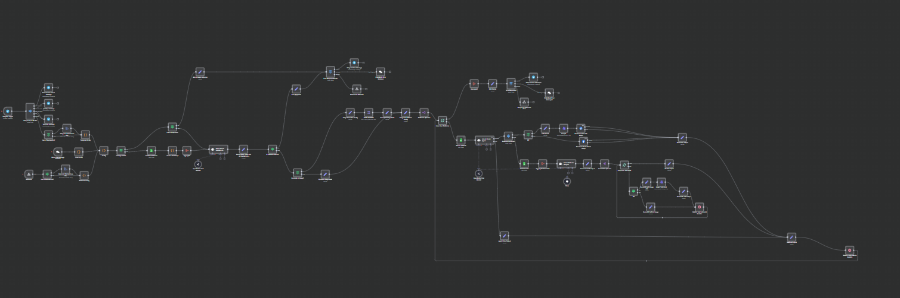

## Smart Job Ad Poster AI Agent


An advanced n8n workflow designed to automate and streamline the process of converting user-submitted job posts into polished, platform-compliant advertisements. It integrates AI validation, formatting, multi-platform posting, and feedback handling, with special support for Telegram, Facebook, Reddit, and webhook inputs.



---

### 💡 Why Use Smart Job Ad Poster AI Agent?

- Automate job post validation ensuring accuracy and policy compliance before publishing.
- Transform raw job data into recruiter-friendly Markdown and JSON formats.
- Dynamically select and validate multiple posting platforms from a managed Google Sheets list.
- Post job messages across multiple social platforms (Facebook, Reddit) with or without images.
- Provide instant feedback on posting success or failure per platform.
- Support rich Telegram integration including welcome, goodbye, and error notifications.
- Generate professional hiring advertisement banners automatically via AI image generation.
- Seamless handling of input from webhooks, chat messages, or Telegram with dynamic routing.
- Graceful error handling with contextual messaging specific to the input source.
- Highly extensible architecture using n8n nodes combined with AI agents and LangChain integration.

---

### ⚡ Who Is This For?

- Recruitment agencies seeking automation to scale postings.
- HR teams wanting consistent job advertisements across multiple channels.
- Platform moderators desiring upfront content validation to avoid policy violations.
- Developers and automation engineers building AI-powered workflow integrations.
- Businesses aiming to improve candidate engagement through tailored job announcements.
- Social media managers automating repetitive task flows for job distribution.

---

### ❓ What Problem Does It Solve?

Users often face challenges creating engaging, compliant job ads, adapting formats for different platforms, and verifying validity before posting. This workflow eliminates manual error-prone steps by smartly validating, formatting, and distributing job ads while generating engaging graphics and notifying users of post results in real time.

---

### 🔧 How This Workflow Works

1. **Input Capture:** Accepts job submission via webhook, Telegram chat, or chat-trigger node.
2. **Message Routing:** Routes incoming Telegram events to proper response (welcome, goodbye, or process).
3. **File Handling:** Checks for uploaded images; extracts and validates file types.
4. **Platform Loading:** Fetches available posting platforms from Google Sheets with filters.
5. **Job Validation Agent:** Uses AI LangChain agent (`Smart Job Ad Validation & Extraction Agent`) to:
   - Parse and validate required and optional job data.
   - Return failure JSON if essential fields are missing or invalid.
6. **Image Generation (Optional):** AI agent generates a professional banner if requested.
7. **Platform Loop:** For each platform:
   - Load platform-specific details from Google Sheets.
   - Use `Job Ad Poster Agent` to convert the job info into platform-specific Markdown post.
   - Post to Facebook (with or without image) or Reddit based on platform routing.
8. **Subreddit Finder:** An AI agent determines best subreddits for posting jobs, posts to Reddit.
9. **Output Feedback:** Collects success or error results from each posting, waits, and aggregates.
10. **User Notification:** Sends Telegram or webhook response messages with posting outcomes.
11. **Error and Edge Handling:** Uses conditional nodes and error routers for fallback messages.

---

### 🔐 Setup Instructions

- ✅ **n8n Environment:** Install latest n8n stable with support for custom nodes and LangChain integration.
- ✅ **Credentials:**
  - Telegram API: Add bot credentials (`the_bottler_bot [cris]`, `Telegram jonrey@pawcoder_job_ad_poster_bot`).
  - OpenRouter API: Required for OpenAI GPT-5 Nano and Gemini image generation.
  - Google Sheets API: OAuth2 credentials for reading platforms and subreddit configurations.
  - Facebook Graph API: For posting job ads on Facebook.
- ✅ **Google Sheets:** Prepare the job platforms and subreddit spreadsheets referenced by IDs:
  - Platforms Sheet: Must include platform name, availability, additional validation.
  - Subreddit Sheet: List active subreddits for job postings with descriptions.
- ✅ **Webhook Setup:** Configure webhook node for external inputs (e.g., from web apps).
- ✅ **Telegram Webhook:** Set Telegram webhook for Telegram trigger to receive updates.
- ✅ **OpenRouter Models Config:** Ensure models for chat and image generation are correctly referenced.
- ✅ **Error Handling:** Configure fallback messages for error nodes with Telegram and webhook responses.
- ✅ **Permissions:** Check bot and app permissions for posting and reading chats.
- ✅ **Optional:** Tune wait timers for platform and subreddit loops for rate limiting.

---

### 📅 Payload

| Key         | Definition                                                                    |
| ----------- | ----------------------------------------------------------------------------- |
| `sessionId` | Unique chat or session ID from Telegram or webhook input.                     |
| `prompt`    | Raw user message or job post input content.                                   |
| `file`      | Optional image file data submitted with job post (base64 encoded, mime type). |

**Example cURL Test:**

```bash
curl --location 'https://n8n.popapps.ai/webhook-test/job-ad-poster' \
--form 'file=@"/C:/Users/ITD/Desktop/556835113_1148039570789541_3118869871807641939_n.jpg"' \
--form 'sessionId="123-123"' \
--form 'prompt="can you post a job ad?
Role: Customer Support Representative
Workplace: Remote
Job type: Full-time

Salary: PHP 18,000 – 22,000 per month

Day-to-day:
- Assist customers via email, calls, moderation, and live chat
- Ensure timely and accurate responses to queries
- Record and maintain customer interactions in the database
- Maintain up-to-date knowledge of products and services
- Adhere to department and company policies
- Strive to meet or exceed customer satisfaction and service targets
- Flexible and committed attendance is essential

Requirements:
- Minimum 1 year customer support or service experience
- Excellent written and spoken English (neutral, American, or British accent preferred)
- Familiarity with Google Sheets
- Above-average typing speed is a plus
- Able to work rotating shifts, weekends, or holidays if required
- Strong problem-solving skills and customer-focused mindset
- Ability to work independently in a fast-paced, team-oriented environment
- Good time management and multitasking

Perks & Benefits:
- Health insurance
- Learning allowance
- Performance bonuses

platforms: Reddit"'
```

---

### 🔨 Tools/Node Used

- **Telegram Trigger & Telegram API Node:** Capture chat messages and send responses (welcome, goodbye, errors).
- **Webhook Node:** Accept external job post requests with optional file upload.
- **Code Node:** Custom JS scripts for processing inputs and preparing data.
- **Google Sheets Node:** Load platform and subreddit data with filter conditions.
- **Aggregate & Split Nodes:** Manage batch processing and data aggregation.
- **LangChain Agents:**
  - `Smart Job Ad Validation & Extraction Agent`: Validate job data and produce structured output.
  - `Job Ad Poster Agent`: Format job ads per platform style rules.
  - `Subreddit Finder AI Agent`: Identify suitable subreddits for posting.
- **HTTP Request (OpenRouter):** Call OpenAI models for text completions and image generation.
- **Facebook Graph API Node:** Post job ads on Facebook feeds or photos.
- **Wait & If Nodes:** Synchronize posting cycles and conditional branching.
- **Error Handling Nodes:** Send error messages back to users via Telegram or webhook.

---

### ⚙️ Reactive & Proactive Behavior

- Proactively validates incoming job data before processing to avoid ineffective posts.
- Reactively splits job postings across dynamic lists of platforms and subreddits.
- Automatically generates visual banners if requested or uses user-uploaded images.
- Notifies users of success or failure per platform immediately after processing.
- Uses AI reasoning tools to match job posts to appropriate subreddit communities conservatively.
- Fall-through error messaging ensures users always receive understandable status feedback.

---

### 🐞 Error Handling

- Extraction fails → trigger error response with clear failure reason.
- Image validation rejects non-image uploads with explanatory Telegram notification.
- Posting failures on platforms output detailed messages including HTTP header errors for debugging.
- Error response routers segregate errors per input source (Telegram/chat/webhook).
- Retry on LangChain agent failures with graceful continue on errors in platform posting.
- Webhook and chat node error messages guide users to correct input formats.

---

### 🧩 Requirements

- n8n with Node.js and access to external APIs (OpenRouter/OpenAI, Telegram, Facebook, Google Sheets).
- Valid Telegram bot APIs with configured webhooks.
- OpenRouter API keys for language models and image generation.
- OAuth2 Google Sheets credentials enabled for read access.
- Facebook Graph API tokens with posting permissions.
- Structured Google Sheets spreadsheets for platforms and subreddit information.
- Stable webhook endpoint exposed for HTTP inputs.
- Proper file handling and binary support enabled in n8n.

---

### 📚 Resources

- [n8n Documentation](https://docs.n8n.io/)
- [Telegram Bot API](https://core.telegram.org/bots/api)
- [OpenRouter AI](https://openrouter.ai/)
- [Facebook Graph API](https://developers.facebook.com/docs/graph-api/)
- [Google Sheets API](https://developers.google.com/sheets/api)
- [LangChain n8n Integration](https://docs.n8n.io/integrations/ai/langchain/)
- [Reddit API Overview](https://www.reddit.com/dev/api/)
- [Markdown Guide](https://www.markdownguide.org/)
- [JSON Schema](https://json-schema.org/)
- [Base64 Encoding](https://en.wikipedia.org/wiki/Base64)

---

### 🐞 Troubleshooting

- **No response in Telegram:** Check Telegram webhook URL and bot API token credentials.
- **Job post marked as failed:** Review mandatory fields (job_title, description, posted_by).
- **Images not processing:** Ensure image MIME type; validate binary property extraction.
- **Google Sheets data missing:** Verify correct spreadsheet IDs, sheet names, and OAuth2 tokens.
- **Facebook posting errors:** Review Facebook Graph API permissions and access tokens.
- **LangChain model errors:** Confirm OpenRouter API keys and usage limits.
- **Reddit posts fail silently:** Check subreddit availability and Google Sheets configuration.
- **Webhook input not recognized:** Confirm JSON structure matches expected payload keys.
- **Message routing incorrect:** Inspect Telegram Input Router node conditions.
- **Excessive API calls:** Use wait nodes to throttle and prevent platform rate limiting.
