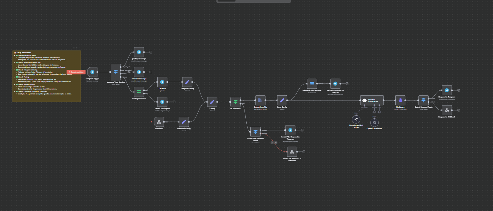

## AI Agent Documenter


An intelligent n8n workflow designed to automate the documentation generation of user-provided `workflow.json` files via Telegram or webhook inputs, leveraging AI language models (OpenAI and OpenRouter). It converts raw n8n workflow JSON into clear, succinct, structured markdown documentation including workflow explanation and a README guide.



---

### 💡 Why Use AI Agent Documenter?

- Automatically generates detailed workflow documentation from raw n8n JSON configs.
- Supports input via Telegram file upload or external webhook POST requests.
- Integrates multiple AI chat models (OpenAI GPT-4.1-mini and OpenRouter) for enhanced language understanding.
- Provides user-friendly markdown outputs tailored for both beginners and advanced users.
- Sends real-time status updates and final documentation back through Telegram or webhook responses.

---

### ⚡ Who Is This For?

- n8n workflow developers needing quick, automated documentation from complex workflows.
- Teams managing n8n workflow repositories requiring consistent README files.
- Automation and AI enthusiasts looking to combine messaging platforms and AI for operational tasks.
- Technical writers aiming to accelerate producing accurate technical documentation.
- DevOps engineers who want seamless validation and testing of deployed workflows.

---

### ❓ What Problem Does It Solve?

Manual creation of documentation for n8n workflows can be tedious, inconsistent, and error-prone. This automation transforms raw workflow JSON into standardized, comprehensive documentation. It removes guesswork by providing stepwise explanations of each node, triggers, credentials, and flow logic with human-readable clarity. The workflow ensures quick generation and delivery directly through Telegram or webhooks — empowering users to focus on developing automation instead of writing docs.

---

### 🔧 How This Workflow Works

1. **Trigger:** The workflow starts when it receives a message/file via Telegram or an HTTP POST request through a webhook.
2. **Message Routing:** It analyzes message types—greeting, file upload, user join/leave events—and routes accordingly.
3. **File Presence Check:** Validates the presence of a file in the Telegram message; if missing, prompts user to upload again.
4. **File Retrieval:** Downloads the uploaded file using Telegram API if from Telegram, or extracts from webhook binary data.
5. **File Type Validation:** Checks if the file is JSON (required for n8n workflow JSON).
6. **File Extraction:** Extracts JSON content from the file binary payload.
7. **Configuration Setup:** Sets session info such as chat ID, username, reference source (Telegram/webhook), and original filename.
8. **AI Agent:** Passes the extracted JSON to an AI Agent node using OpenRouter chat model to produce two markdown documents:
   - Detailed Workflow Documentation
   - README guide including usage instructions and troubleshooting.
9. **Output Routing:** Routes the AI agent's outputs depending on source (Telegram or webhook).
10. **Respond:** Sends the generated markdown README file back to the user via Telegram file message or webhook response with appropriate metadata.
11. **Error Handling:** If input is invalid or missing, sends polite error messages and instructions for resubmission.

---

### 🔐 Setup Instructions

- ✅ **Step 1: Credentials Setup**
  - Configure Telegram API credentials in n8n to enable bot interactions.
  - Register and add OpenRouter/OpenAI API credentials for language model integration — GPT-4.1-mini model.
- ✅ **Step 2: Import and Deploy Workflow**
  - Import this JSON workflow into your n8n instance.
  - Ensure webhook URL is correctly set and exposed (public endpoint) if using webhook input.
- ✅ **Step 3: Telegram Bot Preparation**
  - Add your Telegram bot token in the Telegram API credential node.
  - Start chatting or add the bot to groups to enable communication.
- ✅ **Step 4: Testing the Workflow**
  - Send a valid `workflow.json` file (the raw n8n workflow export) as a file upload in Telegram chat with the bot.
  - Alternatively, POST a valid JSON file to the webhook endpoint.
- ✅ **Step 5: Review and Retrieve Output**
  - Monitor Telegram bot messages for status or error prompts.
  - Download the README markdown generated and validate correctness.
- ✅ **Step 6: Optional Customizations**
  - Modify the AI Agent Documenter node system instructions or prompt text to tailor documentation style or focal points.

---

### 📅 Payload

| Key       | Definition                                                           |
| --------- | -------------------------------------------------------------------- |
| sessionId | Unique identifier for the session/chat (Telegram chat ID or webhook) |
| file      | Binary content of the uploaded workflow.json file                    |

**Example JSON Payload:**

```json
{
  "sessionId": 123456789,
  "file": "<binary:workflow.json>"
}
```

**Example cURL Test:**

```bash
curl -X POST https://your-n8n-domain.com/webhook/18b8fd88-434b-4394-b36c-fa2ccc5c7c53 \
  -F file=@workflow.json \
  -H "Content-Type: multipart/form-data"
```

---

### 🔨 Tools/Node Used

- **Telegram Trigger:** Listens for messages, uploads, and commands via Telegram bot.
- **Telegram Node (Get a file / Send messages):** Retrieves files and interacts with users via chat messages.
- **Webhook Node:** Accepts external POST requests with JSON workflow files for documentation generation.
- **Extract from File:** Converts binary file content into JSON data for processing.
- **If Node (is JSON file?):** Validates uploaded file extension to ensure correct workflow format.
- **Set Node (Config, Docs Config):** Stores session and file metadata for context passing.
- **Switch Node:** Routes flow based on input origin (Telegram vs webhook) or message type.
- **AI Agent Documenter (Langchain agent node):** Core node that processes JSON workflow using LLM and generates markdown docs.
- **Markdown Node (Convert to File):** Converts AI response text output to downloadable markdown files.
- **Respond to Webhook & Respond to Telegram Nodes:** Deliver final README docs to users by appropriate channel.
- **Welcome / Goodbye Messages, Error Handlers:** Provide user-friendly communication on state changes and invalid inputs.

---

### ⚙️ Reactive & Proactive Behavior

- **Reactive:** Responds dynamically to user-uploaded JSON files or webhook submissions.
- **Proactive:** Sends friendly messages to guide users to upload files or indicates errors in real time.
- **Adaptive:** Differentiates behavior depending on invocation source (Telegram or webhook).
- **AI-Powered Processing:** Uses language models to dynamically interpret and narrate workflow internals into human-readable form.

### 🐞 Error Handling

- Detects missing file uploads and prompts users to re-upload.
- Checks file extension and validity to reject non-JSON files politely.
- Sends explicit error messages back to Telegram or webhook clients with error codes (e.g., HTTP 400).
- Maintains fallback paths to inform users about invalid inputs or disconnections.

---

### 🧩 Requirements

- n8n instance with network access to Telegram API and OpenAI/OpenRouter endpoints.
- Valid Telegram bot token and chat permissions.
- Active credentials for OpenAI API (GPT-4.1-mini) or OpenRouter API.
- Accessible webhook endpoint (public URL or tunnel) if webhook usage intended.
- User familiarity with uploading JSON files via Telegram or HTTP clients.

---

### 📚 Resources

- [n8n Official Documentation](https://docs.n8n.io)
- [Telegram Bot API](https://core.telegram.org/bots/api)
- [OpenRouter API](https://docs.openrouter.ai)

---

### 🐞 Troubleshooting

- **File Not Processed:** Ensure the uploaded file is a valid exported n8n workflow JSON file.
- **No Response:** Check Telegram bot token and webhook connectivity.
- **Invalid File Error:** Confirm file extension is `.json` and content is proper JSON.
- **AI Agent Timeout:** Verify API credentials and quotas for OpenAI/OpenRouter.
- **Webhook Not Triggered:** Confirm endpoint URL correctness and server accessibility.
- **Message Threading Issues:** Validate correct message_thread_id settings for group chats.
- **File Download Failures:** Confirm Telegram file_id correctness and Telegram API limits.
- **Incomplete Documentation:** Adjust prompt customization or increase AI model parameters if available.
- **Credential Failures:** Re-authenticate Telegram or AI service credentials in n8n.
- **Unexpected Workflow Behavior:** Use n8n execution logs and debug mode for tracing.
