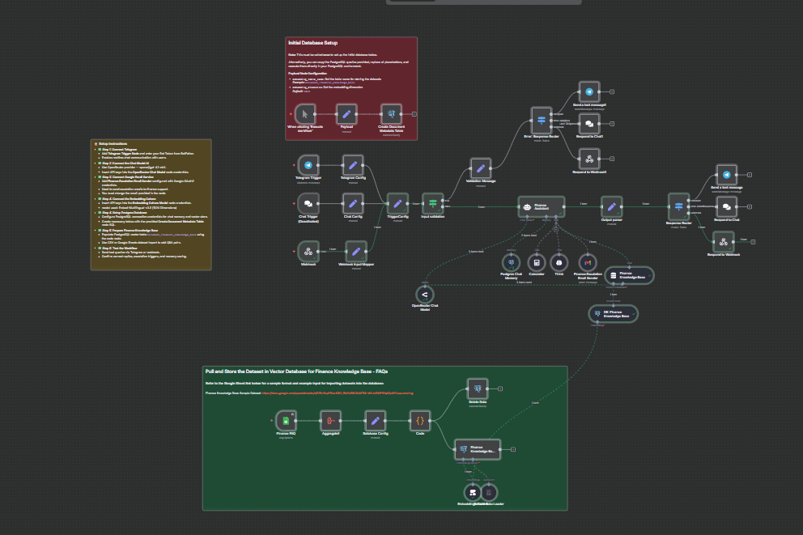

## Payroll Chatbot


The **Payroll Chatbot** workflow is designed as a finance-focused conversational AI assistant specialized in handling payroll and finance inquiries. It processes incoming chat messages, classifies them, finds answers from a finance FAQ knowledge base, and escalates unanswered queries via email. The solution integrates AI language models, vector search databases, chat memory, and communication platforms like Telegram and webhook interfaces, orchestrated within the n8n automation environment.



---

### 💡 Why Use Payroll Chatbot?

- Automates finance-related query handling for internal teams or customers.
- Provides instant, friendly responses based on a curated finance FAQ knowledge base.
- Automatically escalates complex or unanswerable finance queries by sending well-structured email notifications.
- Supports multiple input channels: Telegram chat, webhooks, and internal chat workflows.
- Maintains conversation context with PostgreSQL chat memory for relevant ongoing dialogues.
- Leverages AI tools including OpenRouter Chat Model and Cohere embeddings for semantic search and precise classification.

---

### ⚡ Who Is This For?

- Finance departments seeking to automate payroll inquiry responses.
- Teams wanting to augment support with AI-powered FAQ retrieval and escalation.
- Developers or business analysts looking to integrate conversational AI in financial systems.
- Users who need a ready n8n workflow combining AI language models and vector databases for finance.

---

### ❓ What Problem Does It Solve?

This workflow solves the challenge of efficiently responding to finance and payroll-related queries by:

- Classifying incoming messages as either finance-related or not.
- Providing precise answers by searching a vectorized finance knowledge base.
- If no direct answer is found, automatically escalating by sending an email to finance support.
- Maintaining conversation history for context-aware interactions.
- Reducing manual workload on finance teams by automating common repetitive tasks.

---

### 🔧 How This Workflow Works

1. **Trigger Incoming Message:**
   - Messages arrive via Telegram, webhook, or chat interface and pass through configuration nodes setting necessary variables such as sessionId, message, and source reference.
2. **Input Validation:**
   - Checks if essential inputs like sessionId and message exist; if missing, routes to error response.
3. **AI Message Classification (Finance Assistant Node):**
   - The core LangChain AI Agent node first calls the **Think Tool** (internal reasoning).
   - Then calls the **Finance FAQ Tool** to query the vectorized FAQ knowledge base.
   - Finally classifies the message as `finance_query` or `other`.
4. **Finance FAQ Vector Search:**
   - Uses PostgreSQL vector embeddings and Cohere models to semantically retrieve answers from the `document_finances_knowledge_base` table.
5. **Response Generation:**
   - If an answer is found, formats a friendly reply.
   - If not found and user email is present, triggers the **Finance Escalation Email Sender** tool to email finance support with a detailed HTML escalation block.
   - If no user email, politely asks user for their email.
6. **Response Routing:**
   - Routes AI-generated replies back to the user via the appropriate channel (Telegram message, chat interface, or webhook response).
7. **Chat Memory Storage:**
   - Stores ongoing conversation history in PostgreSQL to retain context for future messages.
8. **Finance Knowledge Base Dataset Management:**
   - Includes nodes and code for importing and storing finance FAQ data within PostgreSQL vector table.
   - Supports updates from Google Sheets or CSV datasets.

---

### 🔐 Setup Instructions

- ✅ **Step 1: Connect Telegram**
  - Configure the **Telegram Trigger Node** with your Bot Token from BotFather.
  - Enables receiving realtime chat messages.
- ✅ **Step 2: Connect OpenRouter Chat Model**
  - Use OpenRouter provider (e.g., GPT-4.1-mini).
  - Set API keys in the **OpenRouter Chat Model** node credentials.
- ✅ **Step 3: Configure Finance Escalation Email Sender**
  - Setup Gmail OAuth2 credentials in the **Finance Escalation Email Sender** node.
  - Change recipient email to your finance support email (default: finance@nms.ph).
- ✅ **Step 4: Configure Embeddings Model**
  - Insert Cohere API key into the **Embeddings Cohere** node credentials.
  - Model: embed-multilingual-v3.0 (1024 dimensions).
- ✅ **Step 5: Setup PostgreSQL Database**
  - Configure PostgreSQL credentials (PROD).
  - Run the table creation SQL in **Create Document Metadata Table** node once.
  - Ensure tables exist for vector store and chat memory.
- ✅ **Step 6: Import Finance Knowledge Base**
  - Use the **Finance FAQ** Google Sheets trigger node for FAQ updates.
  - Use the **Code** node to process dataset and insert into PostgreSQL vector store (`document_finances_knowledge_base`).
- ✅ **Step 7: Test the Workflow**
  - Send test queries via Telegram or webhook.
  - Observe correct responses, escalation emails, and chat memory entries.

---

### 📅 Payload

| Key       | Definition                                                                        |
| --------- | --------------------------------------------------------------------------------- |
| sessionId | Unique identifier for user session (e.g., from Telegram chat id or webhook input) |
| prompt    | The user’s query or prompt text                                                   |

**Example JSON Payload:**

```json
{
  "sessionId": "telegram:123456789",
  "prompt": "What is the payroll cutoff date this month?"
}
```

**Example cURL Test:**

```bash
curl -X POST https://YOUR_N8N_INSTANCE/webhook/c95ee520-5d39-47f1-8e76-d44fd496fa84 \
-H "Content-Type: application/json" \
-d '{"sessionId":"webhook-session-001","prompt":"When is the next payroll date?"}'
```

---

### 🔨 Tools/Node Used

- **Telegram Trigger / Telegram Node:** For chat message input and output via Telegram Bot API.
- **Webhook:** To accept external HTTP POST requests as input queries.
- **OpenRouter Chat Model:** AI language model for natural language understanding and generation.
- **LangChain Agent (Finance Assistant):** Orchestrates AI tools and workflow logic for classifying and responding.
- **Calculator Tool:** Embedded AI tool to perform computations if needed.
- **Finance Knowledge Base Tool:** Vector store search tool querying PostgreSQL for relevant FAQ answers.
- **Postgres Chat Memory:** Persists conversational context for better dialogue experience.
- **Embeddings Cohere Model:** Generates vector embeddings of text for semantic similarity matching.
- **Finance Escalation Email Sender:** Sends escalation emails with composed HTML content.
- **Code Node:** Processes input FAQ datasets before storing them.
- **Set Nodes:** Manage data assignments and configuration variables.
- **Switch Nodes:** Route response messages depending on input source.
- **Validation & Response Nodes:** Verify inputs and format outputs to communicate with requesters.

---

### ⚙️ Reactive & Proactive Behavior

- **Reactive:** Responds immediately to incoming user messages via chat or webhook.
- **Proactive:** Automatically escalates unsolved finance queries to support via email.
- **Memory Aware:** Uses PostgreSQL chat memory to recall recent chat history improving interaction quality.

### 🐞 Error Handling

- Input validation ensures required fields (`sessionId`, `message`) are present.
- Invalid input triggers user-friendly error messages with instructions.
- Nodes include retry mechanisms (e.g., Google Sheets trigger retries on failure).
- Output strictness ensures only valid JSON responses emitted.
- Errors in AI classification or email sending handled gracefully with fallback responses.

---

### 🧩 Requirements

- n8n environment with version supporting LangChain nodes and latest community nodes.
- Telegram Bot with API token.
- OpenRouter API Key for chat language model.
- Gmail OAuth2 credentials for email sending.
- Cohere API Key for embeddings.
- PostgreSQL database instance configured for chat memory and vector store.
- Google Sheets API OAuth credentials (for finance FAQ updates).
- Proper permissions to create tables and execute queries on PostgreSQL.
- Dataset of finance FAQs formatted per sample spreadsheet.

---

### 📚 Resources

- [n8n Documentation](https://docs.n8n.io/)
- [LangChain Official](https://langchain.com/)
- [OpenRouter Chat Models](https://openrouter.ai)
- [Cohere Embeddings](https://cohere.ai/)
- [Telegram Bot API](https://core.telegram.org/bots/api)
- [PostgreSQL Vector Extension Documentation](https://www.postgresql.org/docs/current/uuid-ossp.html)
- Finance Knowledge Base Sample Dataset: https://docs.google.com/spreadsheets/d/126vRupYNvolN83_fffoYu56G9sMTM-kNLkzBMY61qKI/edit?usp=sharing

---

### 🐞 Troubleshooting

- **Telegram trigger not firing:** Verify Bot Token, webhook URLs, and bot permissions.
- **No AI responses or errors:** Check OpenRouter API key validity and node credentials.
- **Emails not sent:** Confirm Gmail OAuth2 credentials and recipient email addresses.
- **No results from FAQ search:** Ensure embeddings generation and vector store insertion ran successfully.
- **Failed database connections:** Validate PostgreSQL credentials and database availability.
- **Escalation emails sent without user email:** Confirm user prompt includes email or adjust escalation logic.
- **Duplicate or missing chat memory:** Verify Postgres chat memory table structure and node configurations.
- **Google Sheets trigger fails:** Validate Google OAuth credentials and sheet access permissions.
- **Workflow execution fails on SQL:** Check queries and ensure `embedding_table_name` is correctly set.
- **JSON output errors:** Ensure strict JSON output formats are respected within AI responses.
