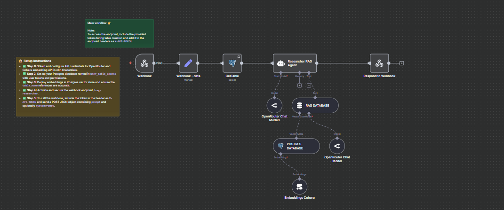

## Researcher RAG Agent


The **Researcher RAG Agent** is an n8n AI-powered workflow designed to serve as a strict retrieval agent for answering user queries against a Retrieval-Augmented Generation (RAG) database. It exposes a webhook endpoint that accepts prompts and API tokens, queries a specified Postgres database based on user token authorizations, and returns exact matches from a RAG knowledge base without generating conversational or paraphrased answers.



---

### 💡 Why Use Researcher RAG Agent?

- Enables secure, token-based access to factual information stored in a RAG database.
- Provides precise, verbatim answers with no generative or conversational responses.
- Integrates seamlessly with Postgres for permissions and document retrieval.
- Uses state-of-the-art OpenRouter chat and vector store models for retrieval.
- Automates multi-step query validation, data fetching, and response with AI tools.

---

### ⚡ Who Is This For?

- Teams needing a secure, exact-answer knowledge retrieval service.
- Developers building AI-augmented internal research or FAQ tools.
- Organizations leveraging RAG databases with fine-grained user access control.
- Users seeking reliable retrieval responses without conversational noise.
- Data engineers integrating AI with Postgres vector embeddings.

---

### ❓ What Problem Does It Solve?

It solves the challenge of securely and reliably providing factual, verbatim answers from large datasets. Unlike typical chatbots that generate conversational text, this workflow enforces strict retrieval-only rules to avoid misinformation or irrelevant text, ensuring trustworthy and consistent responses for internal knowledge workflows.

---

### 🔧 How This Workflow Works

1. **Webhook Trigger:**  
   Accepts incoming POST requests at the `rag-researcher` endpoint with user payload containing a prompt and API token.
2. **Extract Data:**  
   Extracts the user’s `prompt`, `systemPrompt`, and `x-api-token` header from the incoming request.
3. **Validate Token and User Access:**  
   Queries the `user_table_access` Postgres table to verify permissions by matching the token and retrieving the associated database table allowed for the user.
4. **Initialize Researcher RAG Agent:**  
   Configured as a strict retrieval agent that:
   - Queries the `RAG_DATABASE` tool with the full prompt.
   - Uses vector embedding search on the permitted Postgres vector store.
   - Returns only exact verbatim text responses or an empty string if no results.
5. **Vector Store Retrieval:**  
   `POSTRES DATABASE` node connects to the selected Postgres vector storage using embeddings generated by Cohere’s multilingual model.
6. **Response Generation:**  
   The retrieval agent processes results ensuring output constraints and returns the final text.
7. **Send Response:**  
   Outputs the precise response to the original webhook request.

---

### 🔐 Setup Instructions

- ✅ **Step 1:** Obtain and configure API credentials for OpenRouter and Cohere embedding API in n8n Credentials.
- ✅ **Step 2:** Set up your Postgres database named in `user_table_access` with user tokens and permissions.
- ✅ **Step 3:** Deploy embeddings in Postgres vector store and ensure the `table_name` references are accurate.
- ✅ **Step 4:** Activate and secure the webhook endpoint `/rag-researcher`.
- ✅ **Step 5:** To call the webhook, include the token in the header as `X-API-TOKEN` and send a POST JSON object containing `prompt` and optionally `systemPrompt`.
- ✅ **Step 6:** Test using curl or other HTTP clients (example below).

---

### 📅 Payload

| Key          | Definition                                                                |
| ------------ | ------------------------------------------------------------------------- |
| x-api-token  | Header token for authorization to access data.                            |
| prompt       | User’s query string to search in the RAG database.                        |
| systemPrompt | Optional system instruction for context (not used to generate responses). |

**Example JSON Payload:**

```json
{
  "prompt": "What are the key features of the product?",
  "systemPrompt": "Provide exact factual information only"
}
```

**Example cURL Test:**

```bash
curl -X POST https://your-n8n-instance.com/webhook/rag-researcher \
-H "Content-Type: application/json" \
-H "X-API-TOKEN: your_user_token_here" \
-d '{"prompt":"List the latest updates on the project","systemPrompt":"Strict retrieval"}'
```

---

### 🔨 Tools/Node Used

- **Webhook:** Entry point for requests.
- **Set node (`Webhook - data`):** Extracts and assigns headers and body data into workflow variables.
- **Postgres node (`GetTable`):** Validates token against user permissions, fetches accessible RAG table info.
- **Agent node (`Researcher RAG Agent`):** Core logic enforcing retrieval-only policy.
- **LangChain OpenRouter Chat Models:** Language model integration for controlled chat and vector store processing.
- **LangChain Vector Store nodes:** Perform vector similarity search in Postgres.
- **Cohere Embeddings:** Multilingual embeddings to vectorize queries and documents.
- **Respond to Webhook:** Sends retrieved answer as HTTP response.

---

### ⚙️ Reactive & Proactive Behavior

- **Reactive:** Listens for incoming HTTP POST webhook requests.
- **Proactive:** Automatically queries database and vector stores based on user inputs and tokens, generating safe, retrieval-only responses.

### 🐞 Error Handling

- If token validation fails, no output from agent - workflow ends silently or with an empty response.
- Agent returns empty string if query matches are empty or errors occur.
- The workflow restricts conversational or generative outputs entirely by design.

---

### 🧩 Requirements

- n8n environment with access to:
  - OpenRouter API credentials.
  - Cohere API credentials.
  - A Postgres database with user access control and vector store tables.
- Proper API token distribution to authorized users.
- Webhook URL accessible to clients securely.

---

### 📚 Resources

- [n8n Documentation](https://docs.n8n.io/)
- [OpenRouter API](https://docs.openrouter.ai/)
- [Cohere Embeddings API](https://docs.cohere.ai/)
- [PostgreSQL Official Docs](https://www.postgresql.org/docs/)
- [LangChain n8n Integration](https://n8n.io/integrations/community/langchain)

---

### 🐞 Troubleshooting

- Ensure the `X-API-TOKEN` header is correctly sent in requests.
- Validate that `user_table_access` contains correct tokens and table_name mappings.
- Check credential validity for OpenRouter and Cohere in n8n.
- Confirm Postgres vector store tables are up-to-date with embeddings.
- Review workflow execution logs for node-specific errors.
- Verify webhook URL and permissions for external access.
- Make sure system prompt or prompt fields are correctly formatted.
- Confirm that the agent’s rules prohibit unwanted generated text.
- Test with known queries to verify exact result matches.
- Monitor for timeouts or slow responses; consider scaling resources.
