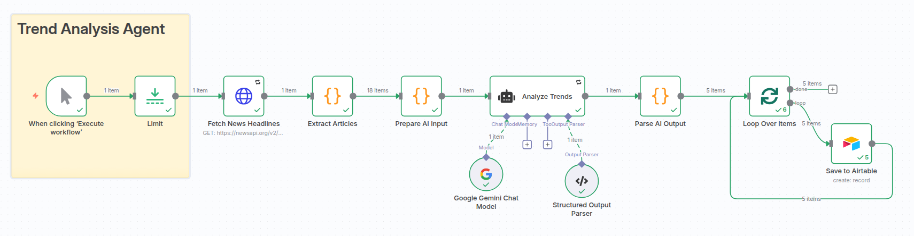
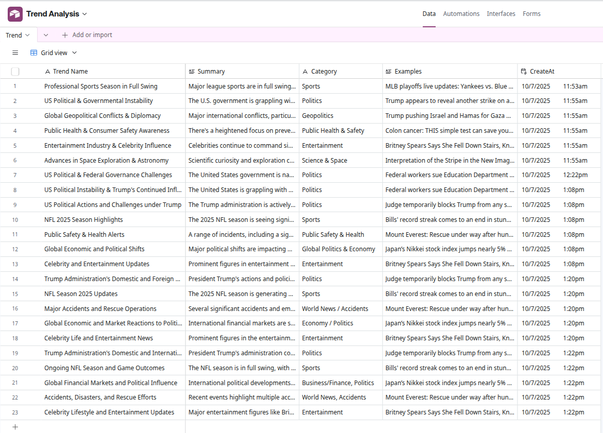

#  Trend Analysis Agent (n8n + Gemini)

##  Description & Purpose
The **Trend Analysis Agent** automatically scans real-time global headlines to identify and summarize emerging trends before they hit the mainstream.  
Built with **n8n**, it fetches live data from **NewsAPI**, processes it through **Google Gemini**, and outputs structured, actionable insights directly to **Airtable** for tracking and analysis.

This agent helps marketers, analysts, and content creators stay ahead of trending conversations across industries and categories.

---

##  Workflow Overview



The flow includes the following key stages:
1. Fetch real-time news headlines via **NewsAPI**
2. Clean and structure the data in **JavaScript Function nodes**
3. Analyze trends with **Gemini AI (via Structured Output Parser)**
4. Parse JSON output and loop through results
5. Store structured insights in **Airtable**

---

##  Why Use This Agent
- Detect emerging global or niche trends automatically.  
- Eliminate manual research across multiple sources.  
- Generate structured data ready for dashboards, reports, or AI content workflows.  
- Integrate with Airtable, Slack, Notion, or analytics systems for instant visibility.

---

##  Target Users
- **Marketing Teams:** Identify viral topics early for campaigns.  
- **Content Creators & Journalists:** Find trending storylines.  
- **Data & Research Analysts:** Track global issue evolution.  
- **AI/Automation Engineers:** Reuse the workflow for other monitoring purposes.

---

##  Problem It Solves
Manual trend tracking across multiple media channels is time-consuming and inconsistent.  
This agent automates the full cycle — **collect → analyze → structure → store** — ensuring teams get daily, reliable trend updates in one place.

---

##  How It Works

| Step | Node | Description |
|------|------|-------------|
| 1 | **Trigger / Schedule** | Manual or scheduled start (e.g., daily at 8 AM). |
| 2 | **HTTP Request (NewsAPI)** | Fetches latest headlines (limit configurable). |
| 3 | **Function Nodes** | Clean and merge article titles/descriptions. |
| 4 | **AI Agent (Gemini)** | Analyzes text and identifies top 5 emerging trends using structured JSON output. |
| 5 | **Function Node (Parser)** | Converts Gemini’s JSON array into separate n8n items. |
| 6 | **Loop Over Items** | Iterates through each trend. |
| 7 | **Airtable Create Record** | Saves structured data (trend name, summary, category, examples). |

---

##  Setup Instructions

1. **Clone or import** the workflow JSON into your n8n instance.  
2. Obtain and configure:
   - **NewsAPI Key** → [https://newsapi.org/register](https://newsapi.org/register)  
   - **Google Gemini API Key** (through n8n’s Gemini integration)  
   - **Airtable API Token** and Base ID.  
3. Create your **Airtable Base** with fields:  
   - `Trend Name` (Text)  
   - `Summary` (Long Text)  
   - `Category` (Single Select)  
   - `Examples` (Long Text)  
4. Map Airtable fields in the **Create Record** node:  
   ```js
   Trend Name: {{$json["trendName"]}}
   Summary: {{$json["summary"]}}
   Category: {{$json["category"]}}
   Examples: {{$json["examples"]}}
   ```
   
5. Run the workflow manually or schedule automatic execution.

##  Payload & Node Usage

### Gemini AI Output (Structured JSON Example):
```json
[
  {
    "trendName": "AI Regulation Momentum",
    "summary": "Governments worldwide are accelerating AI governance frameworks.",
    "category": "Technology / Policy",
    "examples": "EU AI Act; US AI safety standards; OpenAI partnership announcements"
  }
]
```
Each item from this JSON array becomes one Airtable record.

##  Reactive & Proactive Behavior

| Behavior Type | Description |
|----------------|-------------|
| **Reactive** | Responds to trigger (manual or schedule) to fetch and analyze the latest headlines. |
| **Proactive** | Can be extended to automatically send daily trend digests to Slack, Telegram, or Email. |

##  Requirements & Dependencies

- n8n v1.60+

- Google Gemini API Access

- NewsAPI Key

- Airtable Base & Token

- (Optional) Slack or Email integration for alerts

##  Troubleshooting

| Issue | Cause | Fix |
|--------|--------|------|
| **Empty Airtable rows** | Gemini output not valid JSON | Ensure the Structured Output Parser is connected correctly. |
| **“Cannot read property X”** | Undefined field in AI output | Use optional chaining (`$json["field"] || ""`) to prevent runtime errors. |
| **Workflow runs but no new records** | API rate limit or no new headlines returned | Check your NewsAPI free-tier request limits or adjust query keywords. |
| **Invalid JSON error** | Model returned Markdown or plain text | Add the instruction: **“Return ONLY valid JSON”** in your AI Agent prompt. |

##  Example Use Cases

- “Daily Global Trend Digest” dashboard in Airtable  
- “Content Idea Generator” pipeline using top trends  
- “Market Intelligence Feed” for a marketing team  

---

##  Resources

- [n8n Documentation](https://docs.n8n.io)  
- [NewsAPI Docs](https://newsapi.org/docs)  
- [Google Gemini AI](https://ai.google.dev)  
- [Airtable API](https://airtable.com/developers/web/api/introduction)

---

**Author:** _AI Automation Engineer – Ranilo Pastidio_
